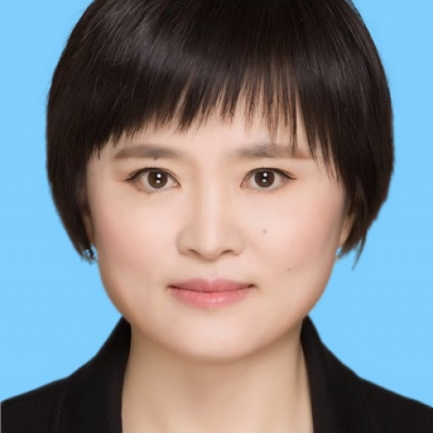

<!-- AUTO-GENERATED-BY: work/generate_obsidian_profiles.py -->

<!-- TEMPLATE: D:\workspace\信息收集整理\医生画像仓库\模板\医生画像模板.md -->

# 刘俊茹

## 基础信息

| 字段 | 内容 |
|---|---|
| 姓名 | 刘俊茹 |
| 医院 | 中山大学附属第一医院 |
| 科室 | 血液内科 |
| 职称/身份 | 主任医师 |
| 来源链接 | [官网原文](https://www.fahsysu.org.cn/node/775) |
| 采集日期 | 2026-08-13 |

## 简介/擅长

具有扎实的内科学和血液学基础，熟练地掌握了血液系统疾病如白血病、多发性骨髓瘤、淋巴瘤、各种类型贫血等的诊治，积累了较丰富的经验。 研究方向：多发性骨髓瘤的诊治 主要教育和工作经历：2007年毕业于中山大学获医学博士学位后留院工作至今。 社会兼职：广东省医学会血液病学分会委员兼秘书 论著：以第一作者发表论著15篇，其中SCI收录5篇。 专著：《血液系统疑难病例精析及诊断思路》 其他主要工作成绩（比如获奖情况）：

## 教育与进修经历

- 研究方向：多发性骨髓瘤的诊治 主要教育和工作经历：2007年毕业于中山大学获医学博士学位后留院工作至今。

## 论文与学术产出

- 社会兼职：广东省医学会血液病学分会委员兼秘书 论著：以第一作者发表论著15篇，其中SCI收录5篇。

## 可包装亮点

- 社会兼职：广东省医学会血液病学分会委员兼秘书 论著：以第一作者发表论著15篇，其中SCI收录5篇。
- 专著：《血液系统疑难病例精析及诊断思路》 其他主要工作成绩（比如获奖情况）：

## 重点疾病/人群标签

- 慢性病：
- 肿瘤：瘤、淋巴瘤、白血病、疑难
- 生殖疾病：
- 免疫/风湿：
- 术后恢复/康复：
- 疑难重症：瘤、淋巴瘤、白血病、疑难

## 证据摘录

> 只摘录官网公开信息中的短句或关键字段，不复制大段原文。

- 官网身份字段：主任医师
- 官网简介/擅长：具有扎实的内科学和血液学基础，熟练地掌握了血液系统疾病如白血病、多发性骨髓瘤、淋巴瘤、各种类型贫血等的诊治，积累了较丰富的经验。 研究方向：多发性骨髓瘤的诊治 主要教育和工作经历：2007年毕业于中山大学获医学博士学位后留院工作至今。 社会兼职：广东省医学会血液病学分会委员兼秘书 论著：以第一作者发表论著15篇，其中SCI收录5篇。 专著：《血液系统疑难病例精析及诊断思路》 其他主要工作成绩（比如获奖情况）：
- 官网亮眼经历线索：社会兼职：广东省医学会血液病学分会委员兼秘书 论著：以第一作者发表论著15篇，其中SCI收录5篇。 专著：《血液系统疑难病例精析及诊断思路》 其他主要工作成绩（比如获奖情况）：
- 来源链接：https://www.fahsysu.org.cn/node/775

## BD 画像摘要

刘俊茹医生可作为肿瘤、疑难重症方向的基础画像候选。后续 BD 使用应继续以官网来源和人工复核为准，不添加疗效承诺或无来源包装。

## 合规边界

- 仅使用医院官网、官方公众号、官方小程序等公开渠道。
- 不采集私人电话、私人微信、家庭住址、患者隐私或非公开排班信息。
- 不写“保证治愈”“疗效第一”“包治疑难杂症”等无法由官网证明的表述。
