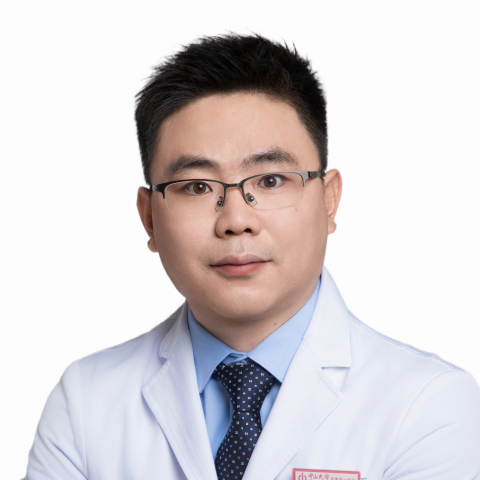

<!-- AUTO-GENERATED-BY: work/generate_obsidian_profiles.py -->

<!-- TEMPLATE: D:\workspace\信息收集整理\医生画像仓库\模板\医生画像模板.md -->

# 刘刚

## 基础信息

| 字段 | 内容 |
|---|---|
| 姓名 | 刘刚 |
| 医院 | 中山大学附属第一医院 |
| 科室 | 神经二科（脑血管病专科） |
| 职称/身份 | 主任医师 |
| 来源链接 | [官网原文](https://www.fahsysu.org.cn/node/20863) |
| 采集日期 | 2026-08-13 |

## 简介/擅长

（1）脑血管病的预防、诊断和治疗； （2）肌张力障碍如眼睑痉挛、梅杰综合征、口下颌肌张力障碍、痉挛性斜颈、书写痉挛、肢体肌张力障碍、全身型肌张力障碍、震颤、慢性偏头痛、抽动障碍、流涎症、手足多汗症、神经病理性疼痛如三叉神经痛或疱疹后神经痛等疾病的诊断和治疗，尤其是肉毒毒素局部注射上述疾病及脑深部电刺激术（DBS）治疗肌张力障碍； （3）面肌痉挛和面瘫的诊断和治疗及手术咨询； （4）痉挛性截瘫的诊断、治疗及巴氯芬鞘内注射手术治疗咨询。 教育和工作经历： 2025/1 – 至今，中山大学，附属第一医院，主任医师 2020/1 – 至今，中山大学，附属第一医院，副主任医师 2016/12 – 2019/12，中山大学，附属第一医院，主治医师 2014/7 – 2016/12，中山大学，附属第一医院，医师 2009/7 – 2011/7，江苏省苏北人民医院，医师 社会兼职： 担任中国神经科学学会神经毒素分会委员； 中国医师协会神经修复学专业委员会青年学组委员； 中国人体健康科技促进会神经变性病专业委员会常务委员； 广东省医疗行业学会神经内科管理分会运动障碍学组组长； 广东省医学会神经病学分会神经影像学组副组长等学术任职 科研情...

## 科研项目与成果

- 广东省医学会神经病学分会神经影像学组副组长等学术任职 科研情况： 主持国家自然科学基金3项（面上项目2项、青年基金1项），广东省自然科学基金2项（面上项目1项、博士启动项目1项），粤港澳大湾区脑科学与类脑研究中心开放性课题1项；
- 广州市重点研发计划1项，作为研究骨干参与国家重点研发计划2项，并参与多项国家级科研项目。

## 论文与学术产出

- 作为第一或最后通讯作者在Brain、Movement Disorders、Stroke等杂志上共发表SCI文章24篇。

## 可包装亮点

- 教育和工作经历： 2025/1 – 至今，中山大学，附属第一医院，主任医师 2020/1 – 至今，中山大学，附属第一医院，副主任医师 2016/12 – 2019/12，中山大学，附属第一医院，主治医师 2014/7 – 2016/12，中山大学，附属第一医院，医师 2009/7 – 2011/7，江苏省苏北人民医院，医师 社会兼职： 担任中国神经科学学…
- 中国医师协会神经修复学专业委员会青年学组委员；
- 中国人体健康科技促进会神经变性病专业委员会常务委员；
- 广东省医疗行业学会神经内科管理分会运动障碍学组组长；

## 重点疾病/人群标签

- 慢性病：慢性、疼痛
- 肿瘤：
- 生殖疾病：
- 免疫/风湿：
- 术后恢复/康复：慢性、疼痛
- 疑难重症：

## 证据摘录

> 只摘录官网公开信息中的短句或关键字段，不复制大段原文。

- 官网身份字段：主任医师
- 官网简介/擅长：（1）脑血管病的预防、诊断和治疗； （2）肌张力障碍如眼睑痉挛、梅杰综合征、口下颌肌张力障碍、痉挛性斜颈、书写痉挛、肢体肌张力障碍、全身型肌张力障碍、震颤、慢性偏头痛、抽动障碍、流涎症、手足多汗症、神经病理性疼痛如三叉神经痛或疱疹后神经痛等疾病的诊断和治疗，尤其是肉毒毒素局部注射上述疾病及脑深部电刺激术（DBS）治疗肌张力障碍； （3）面肌痉挛和面瘫的诊断和治疗及手术咨询； （4）痉挛性截瘫的诊断、治疗及巴氯芬鞘内注射手术治疗咨询…
- 官网亮眼经历线索：教育和工作经历： 2025/1 – 至今，中山大学，附属第一医院，主任医师 2020/1 – 至今，中山大学，附属第一医院，副主任医师 2016/12 – 2019/12，中山大学，附属第一医院，主治医师 2014/7 – 2016/12，中山大学，附属第一医院，医师 2009/7 – 2011/7，江苏省苏北人民医院，医师 社会兼职： 担任中国神经科学学会神经毒素分会委员； 中国医师协会神经修复学专业委员会青年学组委员； 中国人体健…
- 来源链接：https://www.fahsysu.org.cn/node/20863

## BD 画像摘要

刘刚医生可作为慢性病、术后恢复/康复方向的基础画像候选。后续 BD 使用应继续以官网来源和人工复核为准，不添加疗效承诺或无来源包装。

## 合规边界

- 仅使用医院官网、官方公众号、官方小程序等公开渠道。
- 不采集私人电话、私人微信、家庭住址、患者隐私或非公开排班信息。
- 不写“保证治愈”“疗效第一”“包治疑难杂症”等无法由官网证明的表述。
