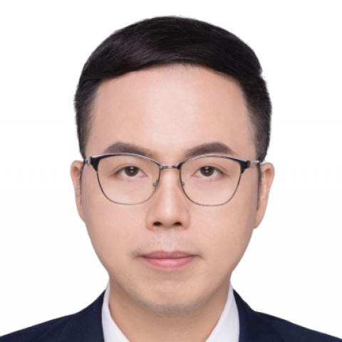

<!-- AUTO-GENERATED-BY: work/generate_obsidian_profiles.py -->

<!-- TEMPLATE: D:\workspace\信息收集整理\医生画像仓库\模板\医生画像模板.md -->

# 刘嘉辉

## 基础信息

| 字段 | 内容 |
|---|---|
| 姓名 | 刘嘉辉 |
| 医院 | 中山大学附属第一医院 |
| 科室 | 中医科 |
| 职称/身份 | 副主任医师 |
| 来源链接 | [官网原文](https://www.fahsysu.org.cn/node/29052) |
| 采集日期 | 2026-08-13 |

## 简介/擅长

肿瘤、结节息肉、乙肝临床治愈与肝硬化的调治； 儿童体质调养。 师承广东省名中医张诗军、邝卫红教授。 （1）以“扶正固本”为基础，在肿瘤的防治、术后减少复发及改善放化疗、靶免治疗的毒副作用方面，积累了丰富临床经验； （2）在乙肝的临床治愈与逆转肝纤维化、早期肝硬化的个体化治疗具有良好的疗效； （3）亚健康病（失眠、疲劳等）及代谢性病（高尿酸、高血脂、脂肪肝、超重）的调养。 研究方向： （1）肿瘤的中医防治与康复管理，尤其是肝癌、肺癌、乳腺癌及胃肠道肿瘤的综合调治； （2）结节息肉的中医防治，结节息肉体质调养； （3）中西医结合促进慢乙肝的临床治愈，逆转肝硬化，降低肝癌发生率； （4）名老中医诊疗思想传承与用药经验研究。 主要教育和工作经历： 2012.07至今，中山大学附属第一医院，住院医师，主治医师，副主任医师，硕士生导师 2017.09至2020.08，广州中医药大学，博士学位 2005.09至2012.06，广州中医药大学，本硕连读 社会兼职： 中山大学附属第一医院中医专科联盟秘书； 广东省中西医结合学会肝病专业委员会常委及秘书； 广东省中医药学会综合医院中医药工作委员会常委及秘书； 国际医学教育联盟(AMEE)S...

## 教育与进修经历

- 主要教育和工作经历： 2012.07至今，中山大学附属第一医院，住院医师，主治医师，副主任医师，硕士生导师 2017.09至2020.08，广州中医药大学，博士学位 2005.09至2012.06，广州中医药大学，本硕连读 社会兼职： 中山大学附属第一医院中医专科联盟秘书；

## 科研项目与成果

- 论著： 主持国家自然科学基金、广东省自然科学基金、广东省中医药管理局基金等多项课题，发表了多篇期刊论文。

## 论文与学术产出

- 论著： 主持国家自然科学基金、广东省自然科学基金、广东省中医药管理局基金等多项课题，发表了多篇期刊论文。
- 专著： 人民卫生出版社高校创新教材《疼痛护理学》副主编；

## 可包装亮点

- 主要教育和工作经历： 2012.07至今，中山大学附属第一医院，住院医师，主治医师，副主任医师，硕士生导师 2017.09至2020.08，广州中医药大学，博士学位 2005.09至2012.06，广州中医药大学，本硕连读 社会兼职： 中山大学附属第一医院中医专科联盟秘书；
- 广东省中西医结合学会肝病专业委员会常委及秘书；
- 广东省中医药学会综合医院中医药工作委员会常委及秘书；
- 论著： 主持国家自然科学基金、广东省自然科学基金、广东省中医药管理局基金等多项课题，发表了多篇期刊论文。

## 重点疾病/人群标签

- 慢性病：代谢、肿瘤、化疗、肺癌、肝癌、乳腺癌、术后、康复、疼痛
- 肿瘤：代谢、肿瘤、化疗、肺癌、肝癌、乳腺癌、术后、康复、疼痛
- 生殖疾病：
- 免疫/风湿：
- 术后恢复/康复：代谢、肿瘤、化疗、肺癌、肝癌、乳腺癌、术后、康复、疼痛
- 疑难重症：

## 证据摘录

> 只摘录官网公开信息中的短句或关键字段，不复制大段原文。

- 官网身份字段：副主任医师
- 官网简介/擅长：肿瘤、结节息肉、乙肝临床治愈与肝硬化的调治； 儿童体质调养。 师承广东省名中医张诗军、邝卫红教授。 （1）以“扶正固本”为基础，在肿瘤的防治、术后减少复发及改善放化疗、靶免治疗的毒副作用方面，积累了丰富临床经验； （2）在乙肝的临床治愈与逆转肝纤维化、早期肝硬化的个体化治疗具有良好的疗效； （3）亚健康病（失眠、疲劳等）及代谢性病（高尿酸、高血脂、脂肪肝、超重）的调养。 研究方向： （1）肿瘤的中医防治与康复管理，尤其是肝癌、肺癌、乳…
- 官网亮眼经历线索：主要教育和工作经历： 2012.07至今，中山大学附属第一医院，住院医师，主治医师，副主任医师，硕士生导师 2017.09至2020.08，广州中医药大学，博士学位 2005.09至2012.06，广州中医药大学，本硕连读 社会兼职： 中山大学附属第一医院中医专科联盟秘书； 广东省中西医结合学会肝病专业委员会常委及秘书； 广东省中医药学会综合医院中医药工作委员会常委及秘书； 论著： 主持国家自然科学基金、广东省自然科学基金、广东省中医…
- 来源链接：https://www.fahsysu.org.cn/node/29052

## BD 画像摘要

刘嘉辉医生可作为慢性病、肿瘤、术后恢复/康复方向的基础画像候选。后续 BD 使用应继续以官网来源和人工复核为准，不添加疗效承诺或无来源包装。

## 合规边界

- 仅使用医院官网、官方公众号、官方小程序等公开渠道。
- 不采集私人电话、私人微信、家庭住址、患者隐私或非公开排班信息。
- 不写“保证治愈”“疗效第一”“包治疑难杂症”等无法由官网证明的表述。
