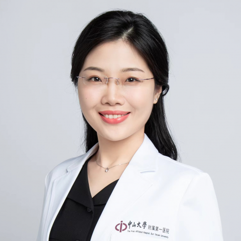

<!-- AUTO-GENERATED-BY: work/generate_obsidian_profiles.py -->

<!-- TEMPLATE: D:\workspace\信息收集整理\医生画像仓库\模板\医生画像模板.md -->

# 刘家欣

## 基础信息

| 字段 | 内容 |
|---|---|
| 姓名 | 刘家欣 |
| 医院 | 中山大学附属第一医院 |
| 科室 | 麻醉科 |
| 职称/身份 | 副主任医师 |
| 来源链接 | [官网原文](https://www.fahsysu.org.cn/node/39253) |
| 采集日期 | 2026-08-13 |

## 简介/擅长

各专科手术的麻醉与围术期管理：1）慢性疾病如高血压、糖尿病、肥胖、心脏病、慢性阻塞性肺病、恶性肿瘤等病人的术前准备与检查。 2）不同年龄如儿童、老年人，特殊生理状态如孕产妇的术前准备与麻醉建议。 3）困难气道、脊柱畸形等病人的麻醉评估。 4）复杂手术和衰弱病人的围术期管理建议，包括术前准备、药物调整、麻醉风险、术后镇痛和重要脏器功能支持等。 本科、硕士与博士就读于中山大学。 临床医学（麻醉学）博士，阿联酋海湾医科大学（Gulf Medical University）医学教育学硕士，美国纽约州立大学石溪分校（Stony Brook University）访问学者。 2005年入职中山大学附属第一医院麻醉科，从事临床医疗工作，擅长各手术专科患者的围术期管理，参与完成心脏、大血管、脑科、器官移植、急诊抢救、困难气道、新生儿和高龄患者麻醉数百例。 国际医学教育联盟（AMEE）Associate Fellow，国家和广东省住院医师规范化培训认证考官，广东省研究型医院学会麻醉学专业委员会委员，Anesthesiology and Perioperative Science杂志 Editorial Fellow。 获广东省柯麟医学教...

## 教育与进修经历

- 临床医学（麻醉学）博士，阿联酋海湾医科大学（Gulf Medical University）医学教育学硕士，美国纽约州立大学石溪分校（Stony Brook University）访问学者。
- 国际医学教育联盟（AMEE）Associate Fellow，国家和广东省住院医师规范化培训认证考官，广东省研究型医院学会麻醉学专业委员会委员，Anesthesiology and Perioperative Science杂志 Editorial Fellow。
- 获广东省柯麟医学教育基金会临床医学专业优秀中青年教师奖、中山一院优秀教师、毕业后医学教育先进工作者、优秀住培管理工作者。

## 科研项目与成果

- 获广东省柯麟医学教育基金会临床医学专业优秀中青年教师奖、中山一院优秀教师、毕业后医学教育先进工作者、优秀住培管理工作者。

## 论文与学术产出

- 国际医学教育联盟（AMEE）Associate Fellow，国家和广东省住院医师规范化培训认证考官，广东省研究型医院学会麻醉学专业委员会委员，Anesthesiology and Perioperative Science杂志 Editorial Fellow。

## 可包装亮点

- 临床医学（麻醉学）博士，阿联酋海湾医科大学（Gulf Medical University）医学教育学硕士，美国纽约州立大学石溪分校（Stony Brook University）访问学者。
- 国际医学教育联盟（AMEE）Associate Fellow，国家和广东省住院医师规范化培训认证考官，广东省研究型医院学会麻醉学专业委员会委员，Anesthesiology and Perioperative Science杂志 Editorial Fellow。
- 获广东省柯麟医学教育基金会临床医学专业优秀中青年教师奖、中山一院优秀教师、毕业后医学教育先进工作者、优秀住培管理工作者。

## 重点疾病/人群标签

- 慢性病：高血压、糖尿病、慢性、肿瘤、术后、功能障碍、复杂
- 肿瘤：高血压、糖尿病、慢性、肿瘤、术后、功能障碍、复杂
- 生殖疾病：
- 免疫/风湿：
- 术后恢复/康复：高血压、糖尿病、慢性、肿瘤、术后、功能障碍、复杂
- 疑难重症：高血压、糖尿病、慢性、肿瘤、术后、功能障碍、复杂

## 证据摘录

> 只摘录官网公开信息中的短句或关键字段，不复制大段原文。

- 官网身份字段：副主任医师
- 官网简介/擅长：各专科手术的麻醉与围术期管理：1）慢性疾病如高血压、糖尿病、肥胖、心脏病、慢性阻塞性肺病、恶性肿瘤等病人的术前准备与检查。 2）不同年龄如儿童、老年人，特殊生理状态如孕产妇的术前准备与麻醉建议。 3）困难气道、脊柱畸形等病人的麻醉评估。 4）复杂手术和衰弱病人的围术期管理建议，包括术前准备、药物调整、麻醉风险、术后镇痛和重要脏器功能支持等。 本科、硕士与博士就读于中山大学。 临床医学（麻醉学）博士，阿联酋海湾医科大学（Gulf Med…
- 官网亮眼经历线索：临床医学（麻醉学）博士，阿联酋海湾医科大学（Gulf Medical University）医学教育学硕士，美国纽约州立大学石溪分校（Stony Brook University）访问学者。 国际医学教育联盟（AMEE）Associate Fellow，国家和广东省住院医师规范化培训认证考官，广东省研究型医院学会麻醉学专业委员会委员，Anesthesiology and Perioperative Science杂志 Editoria…
- 来源链接：https://www.fahsysu.org.cn/node/39253

## BD 画像摘要

刘家欣医生可作为慢性病、肿瘤、术后恢复/康复、疑难重症方向的基础画像候选。后续 BD 使用应继续以官网来源和人工复核为准，不添加疗效承诺或无来源包装。

## 合规边界

- 仅使用医院官网、官方公众号、官方小程序等公开渠道。
- 不采集私人电话、私人微信、家庭住址、患者隐私或非公开排班信息。
- 不写“保证治愈”“疗效第一”“包治疑难杂症”等无法由官网证明的表述。
