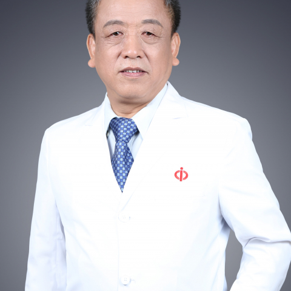

<!-- AUTO-GENERATED-BY: work/generate_obsidian_profiles.py -->

<!-- TEMPLATE: D:\workspace\信息收集整理\医生画像仓库\模板\医生画像模板.md -->

# 刘小林

## 基础信息

| 字段 | 内容 |
|---|---|
| 姓名 | 刘小林 |
| 医院 | 中山大学附属第一医院 |
| 科室 | 显微创伤外手科 |
| 职称/身份 | 主任医师/教授 |
| 来源链接 | [官网原文](https://www.fahsysu.org.cn/node/5636) |
| 采集日期 | 2026-08-13 |

## 简介/擅长

一直从事显微外科、手外科、整型外科的临床医疗工作。 在周围神经损伤、手外伤的诊治、痉挛性脑性瘫痪的显微外科与矫形外科的治疗具有较丰富的经验。 主要研究方向： 1. 痉挛性脑性瘫痪的临床治疗 2. 周围神经损伤后的临床治疗与修复 3. 手外伤的处理 社会兼职 1．中华医学会显微外科分会主任委员 2．中华显微外科杂志总编 3．中国再生医学与组织工程学会常委 获奖情况 1. 作为主要参与者的研究课题"雪旺细胞源运动神经元营养因子"研究，获广东省科技进步三等奖； 2. 作为主要参与者的研究课题"痉挛性脑瘫的系列研究"获广东省卫生厅科技进步三等奖； 3. 2014年，获广东省科技进步一等奖，获奖课题“周围神经修复材料系列研究” 论 著 近五年在核心期刊发表论文50余篇，其中SCI收录30余篇 专 著 参与编著专著3本

## 科研项目与成果

- 主要研究方向： 1. 痉挛性脑性瘫痪的临床治疗 2. 周围神经损伤后的临床治疗与修复 3. 手外伤的处理 社会兼职 1．中华医学会显微外科分会主任委员 2．中华显微外科杂志总编 3．中国再生医学与组织工程学会常委 获奖情况 1. 作为主要参与者的研究课题"雪旺细胞源运动神经元营养因子"研究，获广东省科技进步三等奖；
- 2. 作为主要参与者的研究课题"痉挛性脑瘫的系列研究"获广东省卫生厅科技进步三等奖；
- 3. 2014年，获广东省科技进步一等奖，获奖课题“周围神经修复材料系列研究” 论 著 近五年在核心期刊发表论文50余篇，其中SCI收录30余篇 专 著 参与编著专著3本

## 论文与学术产出

- 3. 2014年，获广东省科技进步一等奖，获奖课题“周围神经修复材料系列研究” 论 著 近五年在核心期刊发表论文50余篇，其中SCI收录30余篇 专 著 参与编著专著3本

## 可包装亮点

- 主要研究方向： 1. 痉挛性脑性瘫痪的临床治疗 2. 周围神经损伤后的临床治疗与修复 3. 手外伤的处理 社会兼职 1．中华医学会显微外科分会主任委员 2．中华显微外科杂志总编 3．中国再生医学与组织工程学会常委 获奖情况 1. 作为主要参与者的研究课题"雪旺细胞源运动神经元营养因子"研究，获广东省科技进步三等奖；
- 2. 作为主要参与者的研究课题"痉挛性脑瘫的系列研究"获广东省卫生厅科技进步三等奖；
- 3. 2014年，获广东省科技进步一等奖，获奖课题“周围神经修复材料系列研究” 论 著 近五年在核心期刊发表论文50余篇，其中SCI收录30余篇 专 著 参与编著专著3本

## 重点疾病/人群标签

- 慢性病：
- 肿瘤：
- 生殖疾病：
- 免疫/风湿：
- 术后恢复/康复：营养
- 疑难重症：

## 证据摘录

> 只摘录官网公开信息中的短句或关键字段，不复制大段原文。

- 官网身份字段：主任医师/教授
- 官网简介/擅长：一直从事显微外科、手外科、整型外科的临床医疗工作。 在周围神经损伤、手外伤的诊治、痉挛性脑性瘫痪的显微外科与矫形外科的治疗具有较丰富的经验。 主要研究方向： 1. 痉挛性脑性瘫痪的临床治疗 2. 周围神经损伤后的临床治疗与修复 3. 手外伤的处理 社会兼职 1．中华医学会显微外科分会主任委员 2．中华显微外科杂志总编 3．中国再生医学与组织工程学会常委 获奖情况 1. 作为主要参与者的研究课题"雪旺细胞源运动神经元营养因子"研究，获广…
- 官网亮眼经历线索：主要研究方向： 1. 痉挛性脑性瘫痪的临床治疗 2. 周围神经损伤后的临床治疗与修复 3. 手外伤的处理 社会兼职 1．中华医学会显微外科分会主任委员 2．中华显微外科杂志总编 3．中国再生医学与组织工程学会常委 获奖情况 1. 作为主要参与者的研究课题"雪旺细胞源运动神经元营养因子"研究，获广东省科技进步三等奖； 2. 作为主要参与者的研究课题"痉挛性脑瘫的系列研究"获广东省卫生厅科技进步三等奖； 3. 2014年，获广东省科技进步…
- 来源链接：https://www.fahsysu.org.cn/node/5636

## BD 画像摘要

刘小林医生可作为术后恢复/康复方向的基础画像候选。后续 BD 使用应继续以官网来源和人工复核为准，不添加疗效承诺或无来源包装。

## 合规边界

- 仅使用医院官网、官方公众号、官方小程序等公开渠道。
- 不采集私人电话、私人微信、家庭住址、患者隐私或非公开排班信息。
- 不写“保证治愈”“疗效第一”“包治疑难杂症”等无法由官网证明的表述。
