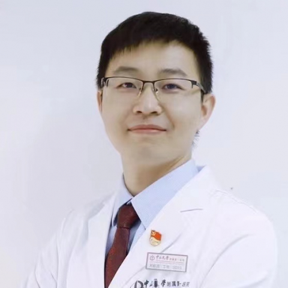

<!-- AUTO-GENERATED-BY: work/generate_obsidian_profiles.py -->

<!-- TEMPLATE: D:\workspace\信息收集整理\医生画像仓库\模板\医生画像模板.md -->

# 刘振国

## 基础信息

| 字段 | 内容 |
|---|---|
| 姓名 | 刘振国 |
| 医院 | 中山大学附属第一医院 |
| 科室 | 胸外科 |
| 职称/身份 | 主任医师 |
| 来源链接 | [官网原文](https://www.fahsysu.org.cn/node/25478) |
| 采集日期 | 2026-08-13 |

## 简介/擅长

专注于肺小结节、磨玻璃结节及肺癌的精准微创外科诊疗与消融治疗，年均肺结节手术500余例，以手术精细、康复快、疗效佳深受患者信赖。 在肺癌、食管癌、纵隔肿瘤等胸部肿瘤的胸腔镜及机器人微创手术方面具有丰富经验。 2022年被评为“广东医院最强科室之实力中青年医生”。 主要研究方向： 1. 肺小结节/磨玻璃结节/肺癌的微创外科治疗与消融治疗； 2. 肺转移瘤、胸腺肿瘤等的临床与基础研究 主要教育和工作经历： 本科毕业于南方医科大学（原第一军医大学）临床医学系； 硕士、博士毕业于中山大学胸外科专业。 2009年至今于中山大学附属第一医院胸外科工作。 科研及论著： 以第一或通讯作者发表SCI论文20余篇，其中在 J Thorac Cardiovasc Surg , Ann Thorac Surg 等国际胸外科期刊发表多篇原创研究； 主持国家自然科学基金、广东省自然科学基金、教育部产学研基金等科研项目； 参编《临床解剖学·胸部分册》、《奈特外科学彩色图谱·解剖与手术入路》中译本、《实用外科医嘱手册》等医学专著

## 教育与进修经历

- 2. 肺转移瘤、胸腺肿瘤等的临床与基础研究 主要教育和工作经历： 本科毕业于南方医科大学（原第一军医大学）临床医学系；
- 硕士、博士毕业于中山大学胸外科专业。

## 科研项目与成果

- 科研及论著： 以第一或通讯作者发表SCI论文20余篇，其中在 J Thorac Cardiovasc Surg , Ann Thorac Surg 等国际胸外科期刊发表多篇原创研究；
- 主持国家自然科学基金、广东省自然科学基金、教育部产学研基金等科研项目；

## 论文与学术产出

- 科研及论著： 以第一或通讯作者发表SCI论文20余篇，其中在 J Thorac Cardiovasc Surg , Ann Thorac Surg 等国际胸外科期刊发表多篇原创研究；
- 参编《临床解剖学·胸部分册》、《奈特外科学彩色图谱·解剖与手术入路》中译本、《实用外科医嘱手册》等医学专著

## 可包装亮点

- 专注于肺小结节、磨玻璃结节及肺癌的精准微创外科诊疗与消融治疗，年均肺结节手术500余例，以手术精细、康复快、疗效佳深受患者信赖。
- 医疗特长：专注于肺小结节、磨玻璃结节及肺癌的精准微创外科诊疗与消融治疗，年均肺结节手术500余例，以手术精细、康复快、疗效佳深受患者信赖。
- 科研及论著： 以第一或通讯作者发表SCI论文20余篇，其中在 J Thorac Cardiovasc Surg , Ann Thorac Surg 等国际胸外科期刊发表多篇原创研究；
- 主持国家自然科学基金、广东省自然科学基金、教育部产学研基金等科研项目；

## 重点疾病/人群标签

- 慢性病：
- 肿瘤：肿瘤、癌、瘤、肺癌、康复
- 生殖疾病：
- 免疫/风湿：
- 术后恢复/康复：肿瘤、癌、瘤、肺癌、康复
- 疑难重症：

## 证据摘录

> 只摘录官网公开信息中的短句或关键字段，不复制大段原文。

- 官网身份字段：主任医师
- 官网简介/擅长：专注于肺小结节、磨玻璃结节及肺癌的精准微创外科诊疗与消融治疗，年均肺结节手术500余例，以手术精细、康复快、疗效佳深受患者信赖。 在肺癌、食管癌、纵隔肿瘤等胸部肿瘤的胸腔镜及机器人微创手术方面具有丰富经验。 2022年被评为“广东医院最强科室之实力中青年医生”。 主要研究方向： 1. 肺小结节/磨玻璃结节/肺癌的微创外科治疗与消融治疗； 2. 肺转移瘤、胸腺肿瘤等的临床与基础研究 主要教育和工作经历： 本科毕业于南方医科大学（原第一军…
- 官网亮眼经历线索：专注于肺小结节、磨玻璃结节及肺癌的精准微创外科诊疗与消融治疗，年均肺结节手术500余例，以手术精细、康复快、疗效佳深受患者信赖。 医疗特长：专注于肺小结节、磨玻璃结节及肺癌的精准微创外科诊疗与消融治疗，年均肺结节手术500余例，以手术精细、康复快、疗效佳深受患者信赖。 科研及论著： 以第一或通讯作者发表SCI论文20余篇，其中在 J Thorac Cardiovasc Surg , Ann Thorac Surg 等国际胸外科期刊发表…
- 来源链接：https://www.fahsysu.org.cn/node/25478

## BD 画像摘要

刘振国医生可作为肿瘤、术后恢复/康复方向的基础画像候选。后续 BD 使用应继续以官网来源和人工复核为准，不添加疗效承诺或无来源包装。

## 合规边界

- 仅使用医院官网、官方公众号、官方小程序等公开渠道。
- 不采集私人电话、私人微信、家庭住址、患者隐私或非公开排班信息。
- 不写“保证治愈”“疗效第一”“包治疑难杂症”等无法由官网证明的表述。
