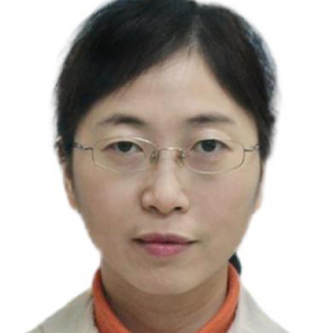

<!-- AUTO-GENERATED-BY: work/generate_obsidian_profiles.py -->

<!-- TEMPLATE: D:\workspace\信息收集整理\医生画像仓库\模板\医生画像模板.md -->

# 刘立群

## 基础信息

| 字段 | 内容 |
|---|---|
| 姓名 | 刘立群 |
| 医院 | 中山大学附属第一医院 |
| 科室 | 产科 |
| 职称/身份 | 副主任医师 |
| 来源链接 | [官网原文](https://www.fahsysu.org.cn/node/31955) |
| 采集日期 | 2026-08-13 |

## 简介/擅长

一直从事妇产科专业临床工作20多年，具有扎实的专业知识和丰富的临床经验，擅长危急重症孕产妇抢救、围产医学、高危妊娠管理、难产处理、复发性流产、宫颈机能不全等的诊治，在月经不调等内分泌紊乱、围绝经期综合征、更年期激素替代、妊娠合并子宫内膜异位症、妊娠合并子宫肌瘤、妊娠合并卵巢肿瘤等疾病的诊治具有丰富的临床经验，熟练产科各类手术：复杂剖宫产术； 难产接生（钳产、吸引产、臀位阴道分娩接生）； 宫颈环扎术等。 其他情况： 为中山大学附属第一医院东院产科负责人，主持产科工作10年，东院作为黄埔区孕产妇重症救治中心，为黄埔区孕产妇救治工作做出了突出的贡献。 社会兼职： 广东省医师协会围产医学分会委员 广东省健康管理协会母胎医学专业委员会委员 广东省医学教育协会妇产科学专业委员会委员 广东省临床医学协会产科专委会委员 在国内外刊物上发表论文十多篇

## 论文与学术产出

- 社会兼职： 广东省医师协会围产医学分会委员 广东省健康管理协会母胎医学专业委员会委员 广东省医学教育协会妇产科学专业委员会委员 广东省临床医学协会产科专委会委员 在国内外刊物上发表论文十多篇

## 可包装亮点

- 社会兼职： 广东省医师协会围产医学分会委员 广东省健康管理协会母胎医学专业委员会委员 广东省医学教育协会妇产科学专业委员会委员 广东省临床医学协会产科专委会委员 在国内外刊物上发表论文十多篇

## 重点疾病/人群标签

- 慢性病：
- 肿瘤：肿瘤、瘤、卵巢、月经、重症、复杂、高危
- 生殖疾病：肿瘤、瘤、卵巢、月经、重症、复杂、高危
- 免疫/风湿：
- 术后恢复/康复：
- 疑难重症：肿瘤、瘤、卵巢、月经、重症、复杂、高危

## 证据摘录

> 只摘录官网公开信息中的短句或关键字段，不复制大段原文。

- 官网身份字段：副主任医师
- 官网简介/擅长：一直从事妇产科专业临床工作20多年，具有扎实的专业知识和丰富的临床经验，擅长危急重症孕产妇抢救、围产医学、高危妊娠管理、难产处理、复发性流产、宫颈机能不全等的诊治，在月经不调等内分泌紊乱、围绝经期综合征、更年期激素替代、妊娠合并子宫内膜异位症、妊娠合并子宫肌瘤、妊娠合并卵巢肿瘤等疾病的诊治具有丰富的临床经验，熟练产科各类手术：复杂剖宫产术； 难产接生（钳产、吸引产、臀位阴道分娩接生）； 宫颈环扎术等。 其他情况： 为中山大学附属第一医…
- 官网亮眼经历线索：社会兼职： 广东省医师协会围产医学分会委员 广东省健康管理协会母胎医学专业委员会委员 广东省医学教育协会妇产科学专业委员会委员 广东省临床医学协会产科专委会委员 在国内外刊物上发表论文十多篇
- 来源链接：https://www.fahsysu.org.cn/node/31955

## BD 画像摘要

刘立群医生可作为肿瘤、生殖疾病、疑难重症方向的基础画像候选。后续 BD 使用应继续以官网来源和人工复核为准，不添加疗效承诺或无来源包装。

## 合规边界

- 仅使用医院官网、官方公众号、官方小程序等公开渠道。
- 不采集私人电话、私人微信、家庭住址、患者隐私或非公开排班信息。
- 不写“保证治愈”“疗效第一”“包治疑难杂症”等无法由官网证明的表述。
