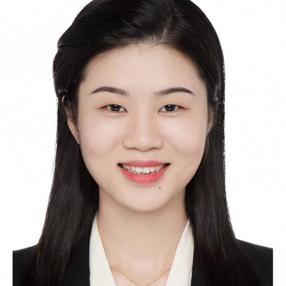

<!-- AUTO-GENERATED-BY: work/generate_obsidian_profiles.py -->

<!-- TEMPLATE: D:\workspace\信息收集整理\医生画像仓库\模板\医生画像模板.md -->

# 匡夏颖

## 基础信息

| 字段 | 内容 |
|---|---|
| 姓名 | 匡夏颖 |
| 医院 | 中山大学附属第一医院 |
| 科室 | 乳腺外科 |
| 职称/身份 | 副主任医师 |
| 来源链接 | [官网原文](https://www.fahsysu.org.cn/node/31358) |
| 采集日期 | 2026-08-13 |

## 简介/擅长

乳腺癌等恶性肿瘤的手术治疗和综合治疗 遗传性乳腺癌的诊断和治疗、乳腺癌相关遗传咨询和生育评估 高风险健康人群的风险评估和全程健康管理 各类乳腺良性疾病的诊治，如乳腺肿物的微创手术等 主要教育和工作经历： 2005-2010 武汉大学 临床医学 本科 2010-2015 复旦大学 肿瘤学 博士（硕博连读） 2015-2018 中山大学附属第一医院 甲状腺乳腺外科 住院医师 2019-2022 中山大学附属第一医院 甲状腺乳腺外科 主治医师 2023-至今 中山大学附属第一医院 乳腺外科 副主任医师 社会兼职和获奖情况： 广东省临床医学学会泛家族遗传性肿瘤防控专业委员会 广东省预防医学会乳腺癌防治专业委员会委员 《中国普通外科杂志》编委 2018年代表医院获国家卫健委改善医疗服务案例中南赛区分主题冠军、总决赛银奖、全国十佳 2019年乳腺肿瘤学科精英辩论赛全国总决赛亚军 2022年第六届CSCO “35 under 35”优秀青年肿瘤医生 2022年广东省科普讲解大赛一等奖，“广州市优秀科学使者”称号 科研情况： 主持国家自然科学基金、广东省自然科学基金、广州市科技局基础研究基金等多个国家级和省部级项目 首设我院乳腺疾病与...

## 可包装亮点

- 乳腺癌等恶性肿瘤的手术治疗和综合治疗 遗传性乳腺癌的诊断和治疗、乳腺癌相关遗传咨询和生育评估 高风险健康人群的风险评估和全程健康管理 各类乳腺良性疾病的诊治，如乳腺肿物的微创手术等 医疗特长： 乳腺癌等恶性肿瘤的手术治疗和综合治疗 遗传性乳腺癌的诊断和治疗、乳腺癌相关遗传咨询和生育评估 高风险健康人群的风险评估和全程健康管理 各类乳腺良性疾病的诊治，如乳腺…

## 重点疾病/人群标签

- 慢性病：
- 肿瘤：肿瘤、肠癌、乳腺癌
- 生殖疾病：
- 免疫/风湿：
- 术后恢复/康复：
- 疑难重症：

## 证据摘录

> 只摘录官网公开信息中的短句或关键字段，不复制大段原文。

- 官网身份字段：副主任医师
- 官网简介/擅长：乳腺癌等恶性肿瘤的手术治疗和综合治疗 遗传性乳腺癌的诊断和治疗、乳腺癌相关遗传咨询和生育评估 高风险健康人群的风险评估和全程健康管理 各类乳腺良性疾病的诊治，如乳腺肿物的微创手术等 主要教育和工作经历： 2005-2010 武汉大学 临床医学 本科 2010-2015 复旦大学 肿瘤学 博士（硕博连读） 2015-2018 中山大学附属第一医院 甲状腺乳腺外科 住院医师 2019-2022 中山大学附属第一医院 甲状腺乳腺外科 主治医…
- 官网亮眼经历线索：乳腺癌等恶性肿瘤的手术治疗和综合治疗 遗传性乳腺癌的诊断和治疗、乳腺癌相关遗传咨询和生育评估 高风险健康人群的风险评估和全程健康管理 各类乳腺良性疾病的诊治，如乳腺肿物的微创手术等 医疗特长： 乳腺癌等恶性肿瘤的手术治疗和综合治疗 遗传性乳腺癌的诊断和治疗、乳腺癌相关遗传咨询和生育评估 高风险健康人群的风险评估和全程健康管理 各类乳腺良性疾病的诊治，如乳腺肿物的微创手术等 主要教育和工作经历： 2005-2010 武汉大学 临床医学…
- 来源链接：https://www.fahsysu.org.cn/node/31358

## BD 画像摘要

匡夏颖医生可作为肿瘤方向的基础画像候选。后续 BD 使用应继续以官网来源和人工复核为准，不添加疗效承诺或无来源包装。

## 合规边界

- 仅使用医院官网、官方公众号、官方小程序等公开渠道。
- 不采集私人电话、私人微信、家庭住址、患者隐私或非公开排班信息。
- 不写“保证治愈”“疗效第一”“包治疑难杂症”等无法由官网证明的表述。
