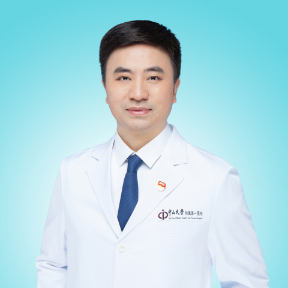

<!-- AUTO-GENERATED-BY: work/generate_obsidian_profiles.py -->

<!-- TEMPLATE: D:\workspace\信息收集整理\医生画像仓库\模板\医生画像模板.md -->

# 匡铭

## 基础信息

| 字段 | 内容 |
|---|---|
| 姓名 | 匡铭 |
| 医院 | 中山大学附属第一医院 |
| 科室 | 肝外科 |
| 职称/身份 | 主任医师/教授 |
| 来源链接 | [官网原文](https://www.fahsysu.org.cn/node/650) |
| 采集日期 | 2026-08-13 |

## 简介/擅长

肝胆胰脾外科疾病的诊疗，特别是肝胆胰肿瘤的微创治疗，包括腹腔镜/机器人下肝癌切除、胰腺癌切除、肝癌射频/微波/冷冻消融、纳米刀胰腺癌消融，二步法肝切除等。 尤其在肿瘤消融治疗领域有深厚造诣，荣获2017年亚太肿瘤消融年会“杰出贡献奖”。 主持多项全国多中心肝胆胰肿瘤临床研究，其中精准防治肝癌消融后复发转移的关键技术创新和临床转化研究，获2019年度广东省科技进步奖一等奖。 研究方向： 肿瘤微创治疗； 精准防治肝癌消融后复发转移。 社会兼职： 中国医师协会毕业后医学教育专业委员会外科专委会副主任委员，中国医师协会外科医师分会肝脏外科医师委员会常委，中国抗癌协会肿瘤微创治疗专业委员会肿瘤外科微创分会副主任委员，中国抗癌协会肝癌专业委员会委员，广东省医学会精准医学与分子诊断分会主任委员，广东省医学会肝癌分会副主任委员，广东省医师协会外科学分会副主任委员， 广东省医师协会外科学分会机器人手术组组长，国际外科学院（ICS）普通外科 Fellow， 美国外科协会（ACS）会员，国际肝胆胰协会（IHPBA）会员。 教育部高等学校教学指导 委员会临床实践教学指导分委员会委员，教育部临床医学专业认证工作委员会委员，广东省医师协会毕业后医...

## 教育与进修经历

- 1998年中山医科大学临床医学系七年制毕业，2004年中山大学外科学博士毕业，师从黄洁夫教授，擅长肝胆胰脾外科疾病的诊治：原发性肝癌、转移性肝癌、肝血管瘤、肝内外胆管结石、胆道感染、肝门部胆管癌、中下段胆管癌、胰腺肿瘤、门脉高压症和脾脏疾病，对肝胆胰脾复杂病、疑难病、肝胆道再次手术具有丰富的临床经验。
- 社会兼职： 中国医师协会毕业后医学教育专业委员会外科专委会副主任委员，中国医师协会外科医师分会肝脏外科医师委员会常委，中国抗癌协会肿瘤微创治疗专业委员会肿瘤外科微创分会副主任委员，中国抗癌协会肝癌专业委员会委员，广东省医学会精准医学与分子诊断分会主任委员，广东省医学会肝癌分会副主任委员，广东省医师协会外科学分会副主任委员， 广东省医师协会外科学分会机器人手术组组长，国际外科学院（ICS）普通外科 Fellow， 美国外科协会（ACS）会员，国际肝胆胰协会（IHPBA）会员。
- 教育部高等学校教学指导 委员会临床实践教学指导分委员会委员，教育部临床医学专业认证工作委员会委员，广东省医师协会毕业后医学教育工作委员会主任委员。

## 科研项目与成果

- 论著： 注重肝癌复发转移相关的基础与临床研究，近年在 Ann Oncol，Nature Communication， Hepatology，Radiology，Clinical cancer research，Cancer Letters 等国际权威杂志发表 SCI 论著 100 余篇，主持国家及省部级重点项目等 10 项基金。

## 论文与学术产出

- 论著： 注重肝癌复发转移相关的基础与临床研究，近年在 Ann Oncol，Nature Communication， Hepatology，Radiology，Clinical cancer research，Cancer Letters 等国际权威杂志发表 SCI 论著 100 余篇，主持国家及省部级重点项目等 10 项基金。
- 担任《中华普通外科学文献》、 《中华消化外科杂志》、《中华肝胆外科手术学杂志》等多个专业杂志编委，是 ClinicalCancer Research，British Journal of Surgery，International Journal of Cancer，Journal of GastrointestinalSurgery，European Radiology，Liver Transplantation 等国际著名专 业期刊的审稿专家。
- 专著： 1.主编《肝胆胰外科并发症》 2.参著国际专著《Image-guided Tumor Ablation》Springer（2013） 3.参著国际专著《Radiofrequency Ablation for Small Hepatocellular Carcinoma》（2015） 其他主要工作成绩（比如获奖情况）： 2019年 广东省科技进步奖一等奖 2018年 中华医学科学技术奖二等奖 2018年 “南粤优秀教师” 2017年 亚洲肿瘤消融年会最高奖项“杰出成就奖”

## 可包装亮点

- 1998年中山医科大学临床医学系七年制毕业，2004年中山大学外科学博士毕业，师从黄洁夫教授，擅长肝胆胰脾外科疾病的诊治：原发性肝癌、转移性肝癌、肝血管瘤、肝内外胆管结石、胆道感染、肝门部胆管癌、中下段胆管癌、胰腺肿瘤、门脉高压症和脾脏疾病，对肝胆胰脾复杂病、疑难病、肝胆道再次手术具有丰富的临床经验。
- 擅长经皮、腹腔镜、开腹行射频、微波、酒精、冷冻等消融治疗肝癌，三维导航系统规划下联合术中B超引导对原发性肝癌进行精准肝切除等新技术。
- 尤其在肿瘤消融治疗领域有深厚造诣，荣获2017年亚太肿瘤消融年会“杰出贡献奖”。
- 主持多项全国多中心肝胆胰肿瘤临床研究，其中精准防治肝癌消融后复发转移的关键技术创新和临床转化研究，获2019年度广东省科技进步奖一等奖。

## 重点疾病/人群标签

- 慢性病：
- 肿瘤：
- 生殖疾病：
- 免疫/风湿：
- 术后恢复/康复：
- 疑难重症：

## 证据摘录

> 只摘录官网公开信息中的短句或关键字段，不复制大段原文。

- 官网身份字段：主任医师/教授
- 官网简介/擅长：肝胆胰脾外科疾病的诊疗，特别是肝胆胰肿瘤的微创治疗，包括腹腔镜/机器人下肝癌切除、胰腺癌切除、肝癌射频/微波/冷冻消融、纳米刀胰腺癌消融，二步法肝切除等。 尤其在肿瘤消融治疗领域有深厚造诣，荣获2017年亚太肿瘤消融年会“杰出贡献奖”。 主持多项全国多中心肝胆胰肿瘤临床研究，其中精准防治肝癌消融后复发转移的关键技术创新和临床转化研究，获2019年度广东省科技进步奖一等奖。 研究方向： 肿瘤微创治疗； 精准防治肝癌消融后复发转移。 社会…
- 官网亮眼经历线索：1998年中山医科大学临床医学系七年制毕业，2004年中山大学外科学博士毕业，师从黄洁夫教授，擅长肝胆胰脾外科疾病的诊治：原发性肝癌、转移性肝癌、肝血管瘤、肝内外胆管结石、胆道感染、肝门部胆管癌、中下段胆管癌、胰腺肿瘤、门脉高压症和脾脏疾病，对肝胆胰脾复杂病、疑难病、肝胆道再次手术具有丰富的临床经验。 擅长经皮、腹腔镜、开腹行射频、微波、酒精、冷冻等消融治疗肝癌，三维导航系统规划下联合术中B超引导对原发性肝癌进行精准肝切除等新技术…
- 异常提示：同名待甄别
- 来源链接：https://www.fahsysu.org.cn/node/650

## BD 画像摘要

匡铭医生可作为中山大学附属第一医院肝外科的基础医生资料入库。当前重点方向以总底表标签为准，官网未展示的信息保持空白。

## 合规边界

- 仅使用医院官网、官方公众号、官方小程序等公开渠道。
- 不采集私人电话、私人微信、家庭住址、患者隐私或非公开排班信息。
- 不写“保证治愈”“疗效第一”“包治疑难杂症”等无法由官网证明的表述。
