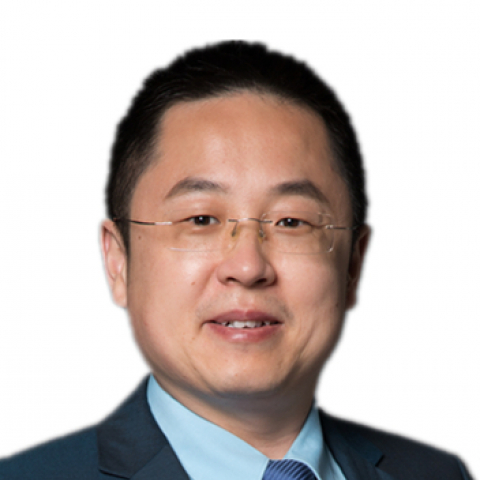

<!-- AUTO-GENERATED-BY: work/generate_obsidian_profiles.py -->

<!-- TEMPLATE: D:\workspace\信息收集整理\医生画像仓库\模板\医生画像模板.md -->

# 单臻

## 基础信息

| 字段 | 内容 |
|---|---|
| 姓名 | 单臻 |
| 医院 | 中山大学附属第一医院 |
| 科室 | 甲状腺外科 |
| 职称/身份 | 副主任医师 |
| 来源链接 | [官网原文](https://www.fahsysu.org.cn/node/25543) |
| 采集日期 | 2026-08-13 |

## 简介/擅长

甲状腺、乳腺疾病规范化诊疗。 1.常见甲状腺肿瘤的治疗； 2.乳腺疾病微创手术治疗； 3.乳腺肿瘤及良性疾病的外科及综合治疗。 其他情况： 主要教育和工作经历： 毕业于中山大学临床医学（七年制）专业 中山大学附属第一医院甲状腺乳腺外科博士 美国RUSH医学中心博士后 科研业绩： 获得国家自然科学基金、广州市“珠江新星”、中山大学附属第一医院“柯麟新星”等多项人才项目资助。 社会兼职： 广东省健康管理学会干细胞与再生医学专业委员会，常务委员

## 教育与进修经历

- 其他情况： 主要教育和工作经历： 毕业于中山大学临床医学（七年制）专业 中山大学附属第一医院甲状腺乳腺外科博士 美国RUSH医学中心博士后 科研业绩： 获得国家自然科学基金、广州市“珠江新星”、中山大学附属第一医院“柯麟新星”等多项人才项目资助。

## 科研项目与成果

- 其他情况： 主要教育和工作经历： 毕业于中山大学临床医学（七年制）专业 中山大学附属第一医院甲状腺乳腺外科博士 美国RUSH医学中心博士后 科研业绩： 获得国家自然科学基金、广州市“珠江新星”、中山大学附属第一医院“柯麟新星”等多项人才项目资助。

## 可包装亮点

- 其他情况： 主要教育和工作经历： 毕业于中山大学临床医学（七年制）专业 中山大学附属第一医院甲状腺乳腺外科博士 美国RUSH医学中心博士后 科研业绩： 获得国家自然科学基金、广州市“珠江新星”、中山大学附属第一医院“柯麟新星”等多项人才项目资助。
- 社会兼职： 广东省健康管理学会干细胞与再生医学专业委员会，常务委员

## 重点疾病/人群标签

- 慢性病：
- 肿瘤：肿瘤
- 生殖疾病：
- 免疫/风湿：
- 术后恢复/康复：
- 疑难重症：

## 证据摘录

> 只摘录官网公开信息中的短句或关键字段，不复制大段原文。

- 官网身份字段：副主任医师
- 官网简介/擅长：甲状腺、乳腺疾病规范化诊疗。 1.常见甲状腺肿瘤的治疗； 2.乳腺疾病微创手术治疗； 3.乳腺肿瘤及良性疾病的外科及综合治疗。 其他情况： 主要教育和工作经历： 毕业于中山大学临床医学（七年制）专业 中山大学附属第一医院甲状腺乳腺外科博士 美国RUSH医学中心博士后 科研业绩： 获得国家自然科学基金、广州市“珠江新星”、中山大学附属第一医院“柯麟新星”等多项人才项目资助。 社会兼职： 广东省健康管理学会干细胞与再生医学专业委员会，常务…
- 官网亮眼经历线索：其他情况： 主要教育和工作经历： 毕业于中山大学临床医学（七年制）专业 中山大学附属第一医院甲状腺乳腺外科博士 美国RUSH医学中心博士后 科研业绩： 获得国家自然科学基金、广州市“珠江新星”、中山大学附属第一医院“柯麟新星”等多项人才项目资助。 社会兼职： 广东省健康管理学会干细胞与再生医学专业委员会，常务委员
- 来源链接：https://www.fahsysu.org.cn/node/25543

## BD 画像摘要

单臻医生可作为肿瘤方向的基础画像候选。后续 BD 使用应继续以官网来源和人工复核为准，不添加疗效承诺或无来源包装。

## 合规边界

- 仅使用医院官网、官方公众号、官方小程序等公开渠道。
- 不采集私人电话、私人微信、家庭住址、患者隐私或非公开排班信息。
- 不写“保证治愈”“疗效第一”“包治疑难杂症”等无法由官网证明的表述。
