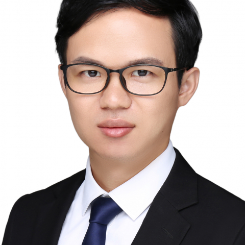

<!-- AUTO-GENERATED-BY: work/generate_obsidian_profiles.py -->

<!-- TEMPLATE: D:\workspace\信息收集整理\医生画像仓库\模板\医生画像模板.md -->

# 卢贵华

## 基础信息

| 字段 | 内容 |
|---|---|
| 姓名 | 卢贵华 |
| 医院 | 中山大学附属第一医院 |
| 科室 | 心内一科 |
| 职称/身份 | 副主任医师 |
| 来源链接 | [官网原文](https://www.fahsysu.org.cn/node/25427) |
| 采集日期 | 2026-08-13 |

## 简介/擅长

冠心病、心律失常、高血压、心力衰竭的精准化、个体化治疗。 专注于房颤、房扑、室性早搏、室速、室上性心动过速等的导管消融治疗（包括射频消融、脉冲消融），及心动过缓/房室传导阻滞的起搏治疗（传统心脏起搏器、无导线心脏起搏器、ICD及CRT-D）及左心耳封堵手术等。 每年完成数百例心脏微创介入手术。 精通心血管慢性病的规范化管理。 曾在香港伊利沙伯医院研修心脏电生理介入技术（任副顾问医生）。 医学博士，硕士研究生导师； 国家心律失常介入和心脏起搏治疗资质专家。 受邀出席亚太心律学年会（2024年香港、2025年日本）、美国心律学年会（2026年芝加哥）、心脏再同步化治疗研讨会（2025年韩国）、香港心律学年会，参与学术讨论及病例分享。 研究方向： 复杂快速型心律失常的导管消融（包括持续性房颤、非典型房扑、室早/室速、复杂室上速等的鉴别诊断和消融）； 缓慢型心律失常的起搏治疗（生理性起搏、无导线起搏）、猝死预防（心电循环记录仪植入、ICD植入）及心衰心脏再同步治疗（CRT-D）、心肌收缩力调节器（CCM）治疗； 心力衰竭的药物优化治疗； 不明原因晕厥的诊治。 主要教育和工作经历： 2010年9月至2015年6月于中山大学附属第...

## 教育与进修经历

- 主要教育和工作经历： 2010年9月至2015年6月于中山大学附属第一医院硕博连读，获博士学位（心血管内科方向）。
- 毕业后留院工作至今；

## 科研项目与成果

- 论著、基金、专利、软件著作权：近年来在《Frontiers in Medicine》、《Int J Mol Sci》、《J Cardiovasc Dev Dis》、《Am J Transl Res》、《Biochem Biophys Res Commun》、《Med Sci Monit》、《中华心脏与心律电子杂志》等专业杂志发表论著20余篇。

## 论文与学术产出

- 论著、基金、专利、软件著作权：近年来在《Frontiers in Medicine》、《Int J Mol Sci》、《J Cardiovasc Dev Dis》、《Am J Transl Res》、《Biochem Biophys Res Commun》、《Med Sci Monit》、《中华心脏与心律电子杂志》等专业杂志发表论著20余篇。

## 可包装亮点

- 擅长冠心病、心律失常、高血压、心力衰竭的精准化、个体化治疗。
- 医疗特长：擅长冠心病、心律失常、高血压、心力衰竭的精准化、个体化治疗。
- 曾在香港伊利沙伯医院研修心脏电生理介入技术（任副顾问医生）。
- 受邀出席亚太心律学年会（2024年香港、2025年日本）、美国心律学年会（2026年芝加哥）、心脏再同步化治疗研讨会（2025年韩国）、香港心律学年会，参与学术讨论及病例分享。

## 重点疾病/人群标签

- 慢性病：高血压、冠心病、心力衰竭、心衰、慢性、感染、重症、复杂
- 肿瘤：
- 生殖疾病：
- 免疫/风湿：高血压、冠心病、心力衰竭、心衰、慢性、感染、重症、复杂
- 术后恢复/康复：
- 疑难重症：高血压、冠心病、心力衰竭、心衰、慢性、感染、重症、复杂

## 证据摘录

> 只摘录官网公开信息中的短句或关键字段，不复制大段原文。

- 官网身份字段：副主任医师
- 官网简介/擅长：冠心病、心律失常、高血压、心力衰竭的精准化、个体化治疗。 专注于房颤、房扑、室性早搏、室速、室上性心动过速等的导管消融治疗（包括射频消融、脉冲消融），及心动过缓/房室传导阻滞的起搏治疗（传统心脏起搏器、无导线心脏起搏器、ICD及CRT-D）及左心耳封堵手术等。 每年完成数百例心脏微创介入手术。 精通心血管慢性病的规范化管理。 曾在香港伊利沙伯医院研修心脏电生理介入技术（任副顾问医生）。 医学博士，硕士研究生导师； 国家心律失常介入和心…
- 官网亮眼经历线索：擅长冠心病、心律失常、高血压、心力衰竭的精准化、个体化治疗。 医疗特长：擅长冠心病、心律失常、高血压、心力衰竭的精准化、个体化治疗。 曾在香港伊利沙伯医院研修心脏电生理介入技术（任副顾问医生）。 受邀出席亚太心律学年会（2024年香港、2025年日本）、美国心律学年会（2026年芝加哥）、心脏再同步化治疗研讨会（2025年韩国）、香港心律学年会，参与学术讨论及病例分享。
- 来源链接：https://www.fahsysu.org.cn/node/25427

## BD 画像摘要

卢贵华医生可作为慢性病、免疫/风湿/感染、疑难重症方向的基础画像候选。后续 BD 使用应继续以官网来源和人工复核为准，不添加疗效承诺或无来源包装。

## 合规边界

- 仅使用医院官网、官方公众号、官方小程序等公开渠道。
- 不采集私人电话、私人微信、家庭住址、患者隐私或非公开排班信息。
- 不写“保证治愈”“疗效第一”“包治疑难杂症”等无法由官网证明的表述。
