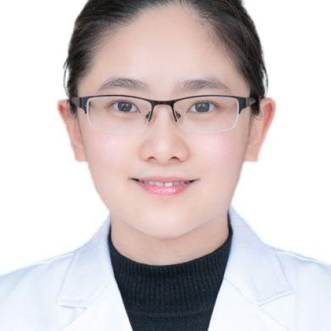

<!-- AUTO-GENERATED-BY: work/generate_obsidian_profiles.py -->

<!-- TEMPLATE: D:\workspace\信息收集整理\医生画像仓库\模板\医生画像模板.md -->

# 古芳

## 基础信息

| 字段 | 内容 |
|---|---|
| 姓名 | 古芳 |
| 医院 | 中山大学附属第一医院 |
| 科室 | 生殖医学中心 |
| 职称/身份 | 副主任医师 |
| 来源链接 | [官网原文](https://www.fahsysu.org.cn/node/26415) |
| 采集日期 | 2026-08-13 |

## 简介/擅长

2010年从中山大学临床医学（本硕连读）专业毕业后一直在我院妇产科和生殖中心工作至今。 2017年获博士学位。 曾赴美国印第安纳大学、香港中文大学及比利时布鲁塞尔生殖中心进修学习。 擅长月经病、复发性子宫内膜息肉和不孕症的诊治以及辅助生殖技术治疗。 研究方向： 月经病、子宫内膜息肉、辅助生殖技术 主要教育和工作经历： 2010年从中山大学临床医学（本硕连读）专业毕业后一直在我院妇产科和生殖中心工作至今。 2017年获博士学位。 曾赴美国印第安纳大学、香港中文大学及比利时布鲁塞尔生殖中心进行短期的进修学习。 社会兼职： 全国妇幼健康研究会生殖内分泌专业委员会委员； 广东省医师协会生殖医学分会青年组副组长； 广东省临床医学会生殖医学青委会副主任委员； 《Human Reproduction Update 中文版》青年编委。 专著： 以第一作者身份在Fertility & Sterility及Human Reproduction等权威杂志上发表论文8篇 其他主要工作成绩（比如获奖情况）： 获2011年中山大学医科青年教师授课大赛（全英组）一等奖 获2011年中山大学青年教师授课大赛总决赛全英组二等奖 获2019年中山一院十佳...

## 教育与进修经历

- 2010年从中山大学临床医学（本硕连读）专业毕业后一直在我院妇产科和生殖中心工作至今。
- 2017年获博士学位。
- 曾赴美国印第安纳大学、香港中文大学及比利时布鲁塞尔生殖中心进修学习。
- 医疗特长： 2010年从中山大学临床医学（本硕连读）专业毕业后一直在我院妇产科和生殖中心工作至今。

## 论文与学术产出

- 专著： 以第一作者身份在Fertility & Sterility及Human Reproduction等权威杂志上发表论文8篇 其他主要工作成绩（比如获奖情况）： 获2011年中山大学医科青年教师授课大赛（全英组）一等奖 获2011年中山大学青年教师授课大赛总决赛全英组二等奖 获2019年中山一院十佳优秀教师

## 可包装亮点

- 曾赴美国印第安纳大学、香港中文大学及比利时布鲁塞尔生殖中心进修学习。
- 曾赴美国印第安纳大学、香港中文大学及比利时布鲁塞尔生殖中心进行短期的进修学习。
- 社会兼职： 全国妇幼健康研究会生殖内分泌专业委员会委员；

## 重点疾病/人群标签

- 慢性病：
- 肿瘤：
- 生殖疾病：生殖、不孕、辅助生殖、月经
- 免疫/风湿：
- 术后恢复/康复：
- 疑难重症：

## 证据摘录

> 只摘录官网公开信息中的短句或关键字段，不复制大段原文。

- 官网身份字段：副主任医师
- 官网简介/擅长：2010年从中山大学临床医学（本硕连读）专业毕业后一直在我院妇产科和生殖中心工作至今。 2017年获博士学位。 曾赴美国印第安纳大学、香港中文大学及比利时布鲁塞尔生殖中心进修学习。 擅长月经病、复发性子宫内膜息肉和不孕症的诊治以及辅助生殖技术治疗。 研究方向： 月经病、子宫内膜息肉、辅助生殖技术 主要教育和工作经历： 2010年从中山大学临床医学（本硕连读）专业毕业后一直在我院妇产科和生殖中心工作至今。 2017年获博士学位。 曾赴美…
- 官网亮眼经历线索：曾赴美国印第安纳大学、香港中文大学及比利时布鲁塞尔生殖中心进修学习。 曾赴美国印第安纳大学、香港中文大学及比利时布鲁塞尔生殖中心进修学习。 曾赴美国印第安纳大学、香港中文大学及比利时布鲁塞尔生殖中心进行短期的进修学习。 社会兼职： 全国妇幼健康研究会生殖内分泌专业委员会委员；
- 来源链接：https://www.fahsysu.org.cn/node/26415

## BD 画像摘要

古芳医生可作为生殖疾病方向的基础画像候选。后续 BD 使用应继续以官网来源和人工复核为准，不添加疗效承诺或无来源包装。

## 合规边界

- 仅使用医院官网、官方公众号、官方小程序等公开渠道。
- 不采集私人电话、私人微信、家庭住址、患者隐私或非公开排班信息。
- 不写“保证治愈”“疗效第一”“包治疑难杂症”等无法由官网证明的表述。
