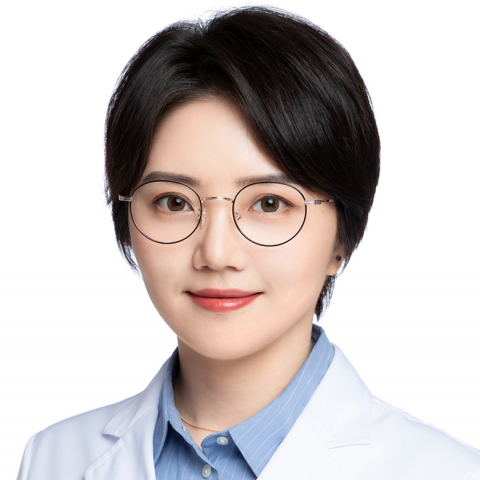

<!-- AUTO-GENERATED-BY: work/generate_obsidian_profiles.py -->

<!-- TEMPLATE: D:\workspace\信息收集整理\医生画像仓库\模板\医生画像模板.md -->

# 史雅薇

## 基础信息

| 字段 | 内容 |
|---|---|
| 姓名 | 史雅薇 |
| 医院 | 中山大学附属第一医院 |
| 科室 | 乳腺外科 |
| 职称/身份 | 副主任医师 |
| 来源链接 | [官网原文](https://www.fahsysu.org.cn/node/25781) |
| 采集日期 | 2026-08-13 |

## 简介/擅长

（只看乳腺） 1）乳腺癌等恶性肿瘤的手术治疗：保乳术、根治术、乳房重建术、腔镜乳腺手术等； 2）乳腺癌的综合治疗：化疗、内分泌治疗、靶向治疗等； 3）乳腺肿物的微创手术及其他乳腺良性疾病的诊治。 研究方向： 乳腺癌的发生发展及耐药的分子机制。 乳腺癌综合治疗的相关临床研究。 主要教育和工作经历： 2006年-2014年 中山大学中山医学院 临床医学（八年制） 临床医学博士 2014/07-2017-7，中山大学附属第一医院甲状腺乳腺外科，医师 2017/08-2021/06，中山大学附属第一医院甲状腺乳腺外科，主治医师 2021/06-至今，中山大学附属第一医院甲状腺乳腺外科，副主任医师 社会兼职： 广东省医学会外科学分会 青年委员 论著： 在《J EXP & CLIN CANC RES》、《LIFE SCI》、《PHYTOTHER RES》、《BIOMED PHARMACOTHER》等专业期刊发表论文十余篇。 专著： 其他主要工作成绩（比如获奖情况）： 主持国自然、省自然、省医学科学技术基金项目3项。

## 科研项目与成果

- 专著： 其他主要工作成绩（比如获奖情况）： 主持国自然、省自然、省医学科学技术基金项目3项。

## 论文与学术产出

- 主要教育和工作经历： 2006年-2014年 中山大学中山医学院 临床医学（八年制） 临床医学博士 2014/07-2017-7，中山大学附属第一医院甲状腺乳腺外科，医师 2017/08-2021/06，中山大学附属第一医院甲状腺乳腺外科，主治医师 2021/06-至今，中山大学附属第一医院甲状腺乳腺外科，副主任医师 社会兼职： 广东省医学会外科学分会 青年委员 论著： 在《J EXP & CLIN CANC RES》、《LIFE SCI》、《PHYTOTHER RES》、《BIOMED PHARMACOTHER…

## 可包装亮点

- 主要教育和工作经历： 2006年-2014年 中山大学中山医学院 临床医学（八年制） 临床医学博士 2014/07-2017-7，中山大学附属第一医院甲状腺乳腺外科，医师 2017/08-2021/06，中山大学附属第一医院甲状腺乳腺外科，主治医师 2021/06-至今，中山大学附属第一医院甲状腺乳腺外科，副主任医师 社会兼职： 广东省医学会外科学分会 青…
- 专著： 其他主要工作成绩（比如获奖情况）： 主持国自然、省自然、省医学科学技术基金项目3项。

## 重点疾病/人群标签

- 慢性病：
- 肿瘤：肿瘤、化疗、靶向、乳腺癌
- 生殖疾病：
- 免疫/风湿：
- 术后恢复/康复：
- 疑难重症：

## 证据摘录

> 只摘录官网公开信息中的短句或关键字段，不复制大段原文。

- 官网身份字段：副主任医师
- 官网简介/擅长：（只看乳腺） 1）乳腺癌等恶性肿瘤的手术治疗：保乳术、根治术、乳房重建术、腔镜乳腺手术等； 2）乳腺癌的综合治疗：化疗、内分泌治疗、靶向治疗等； 3）乳腺肿物的微创手术及其他乳腺良性疾病的诊治。 研究方向： 乳腺癌的发生发展及耐药的分子机制。 乳腺癌综合治疗的相关临床研究。 主要教育和工作经历： 2006年-2014年 中山大学中山医学院 临床医学（八年制） 临床医学博士 2014/07-2017-7，中山大学附属第一医院甲状腺乳腺外…
- 官网亮眼经历线索：主要教育和工作经历： 2006年-2014年 中山大学中山医学院 临床医学（八年制） 临床医学博士 2014/07-2017-7，中山大学附属第一医院甲状腺乳腺外科，医师 2017/08-2021/06，中山大学附属第一医院甲状腺乳腺外科，主治医师 2021/06-至今，中山大学附属第一医院甲状腺乳腺外科，副主任医师 社会兼职： 广东省医学会外科学分会 青年委员 论著： 在《J EXP & CLIN CANC RES》、《LIFE S…
- 来源链接：https://www.fahsysu.org.cn/node/25781

## BD 画像摘要

史雅薇医生可作为肿瘤方向的基础画像候选。后续 BD 使用应继续以官网来源和人工复核为准，不添加疗效承诺或无来源包装。

## 合规边界

- 仅使用医院官网、官方公众号、官方小程序等公开渠道。
- 不采集私人电话、私人微信、家庭住址、患者隐私或非公开排班信息。
- 不写“保证治愈”“疗效第一”“包治疑难杂症”等无法由官网证明的表述。
