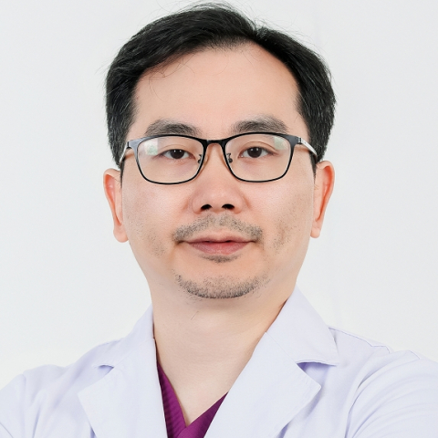

<!-- AUTO-GENERATED-BY: work/generate_obsidian_profiles.py -->

<!-- TEMPLATE: D:\workspace\信息收集整理\医生画像仓库\模板\医生画像模板.md -->

# 吉利

## 基础信息

| 字段 | 内容 |
|---|---|
| 姓名 | 吉利 |
| 医院 | 中山大学附属第一医院 |
| 科室 | 口内修复科 |
| 职称/身份 | 副主任医师 |
| 来源链接 | [官网原文](https://www.fahsysu.org.cn/node/31338) |
| 采集日期 | 2026-08-13 |

## 简介/擅长

青少年及成年人牙齿矫正，正颌正畸联合治疗，颜面部美学治疗，儿童的早期矫治，功能矫治，隐形矫正，球托舒适化矫正，舌侧矫正，颞下颌关节病治疗，睡眠呼吸暂停及低通气综合征治疗（不看拔牙、补牙、口腔外科及洁牙） 主要教育工作经历： 2006年研究生毕业于武汉大学，2006年7月于中山大学附属第一医院工作至今。 社会兼职： 广东省民营牙科协会副会长 广东省民营牙科协会口腔医疗器材与创新分会主任委员 中华口腔正畸学会专业会员 中华口腔医学会会员 世界牙科正畸学会会员 RW国际正畸学会会员 广东省口腔医学会颞下颌关节病学及 广东省整形美容学会委员 科研情况： 主持多项省部级基金，发表论文十余篇

## 教育与进修经历

- 擅长青少年及成年人牙齿矫正，正颌正畸联合治疗，颜面部美学治疗，儿童的早期矫治，功能矫治，隐形矫正，球托舒适化矫正，舌侧矫正，颞下颌关节病治疗，睡眠呼吸暂停及低通气综合征治疗（不看拔牙、补牙、口腔外科及洁牙） 医疗特长： 擅长青少年及成年人牙齿矫正，正颌正畸联合治疗，颜面部美学治疗，儿童的早期矫治，功能矫治，隐形矫正，球托舒适化矫正，舌侧矫正，颞下颌关节病治疗，睡眠呼吸暂停及低通气综合征治疗（不看拔牙、补牙、口腔外科及洁牙） 主要教育工作经历： 2006年研究生毕业于武汉大学，2006年7月于中山大学附属第一医院工…

## 科研项目与成果

- 社会兼职： 广东省民营牙科协会副会长 广东省民营牙科协会口腔医疗器材与创新分会主任委员 中华口腔正畸学会专业会员 中华口腔医学会会员 世界牙科正畸学会会员 RW国际正畸学会会员 广东省口腔医学会颞下颌关节病学及 广东省整形美容学会委员 科研情况： 主持多项省部级基金，发表论文十余篇

## 论文与学术产出

- 社会兼职： 广东省民营牙科协会副会长 广东省民营牙科协会口腔医疗器材与创新分会主任委员 中华口腔正畸学会专业会员 中华口腔医学会会员 世界牙科正畸学会会员 RW国际正畸学会会员 广东省口腔医学会颞下颌关节病学及 广东省整形美容学会委员 科研情况： 主持多项省部级基金，发表论文十余篇

## 可包装亮点

- 社会兼职： 广东省民营牙科协会副会长 广东省民营牙科协会口腔医疗器材与创新分会主任委员 中华口腔正畸学会专业会员 中华口腔医学会会员 世界牙科正畸学会会员 RW国际正畸学会会员 广东省口腔医学会颞下颌关节病学及 广东省整形美容学会委员 科研情况： 主持多项省部级基金，发表论文十余篇

## 重点疾病/人群标签

- 慢性病：
- 肿瘤：
- 生殖疾病：
- 免疫/风湿：
- 术后恢复/康复：
- 疑难重症：

## 证据摘录

> 只摘录官网公开信息中的短句或关键字段，不复制大段原文。

- 官网身份字段：副主任医师
- 官网简介/擅长：青少年及成年人牙齿矫正，正颌正畸联合治疗，颜面部美学治疗，儿童的早期矫治，功能矫治，隐形矫正，球托舒适化矫正，舌侧矫正，颞下颌关节病治疗，睡眠呼吸暂停及低通气综合征治疗（不看拔牙、补牙、口腔外科及洁牙） 主要教育工作经历： 2006年研究生毕业于武汉大学，2006年7月于中山大学附属第一医院工作至今。 社会兼职： 广东省民营牙科协会副会长 广东省民营牙科协会口腔医疗器材与创新分会主任委员 中华口腔正畸学会专业会员 中华口腔医学会会员…
- 官网亮眼经历线索：社会兼职： 广东省民营牙科协会副会长 广东省民营牙科协会口腔医疗器材与创新分会主任委员 中华口腔正畸学会专业会员 中华口腔医学会会员 世界牙科正畸学会会员 RW国际正畸学会会员 广东省口腔医学会颞下颌关节病学及 广东省整形美容学会委员 科研情况： 主持多项省部级基金，发表论文十余篇
- 来源链接：https://www.fahsysu.org.cn/node/31338

## BD 画像摘要

吉利医生可作为中山大学附属第一医院口内修复科的基础医生资料入库。当前重点方向以总底表标签为准，官网未展示的信息保持空白。

## 合规边界

- 仅使用医院官网、官方公众号、官方小程序等公开渠道。
- 不采集私人电话、私人微信、家庭住址、患者隐私或非公开排班信息。
- 不写“保证治愈”“疗效第一”“包治疑难杂症”等无法由官网证明的表述。
