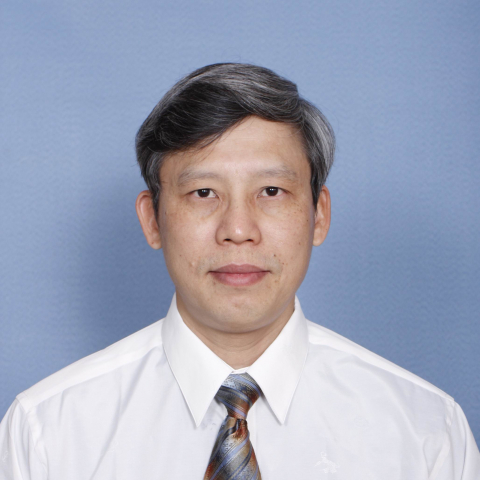

<!-- AUTO-GENERATED-BY: work/generate_obsidian_profiles.py -->

<!-- TEMPLATE: D:\workspace\信息收集整理\医生画像仓库\模板\医生画像模板.md -->

# 吕伟明

## 基础信息

| 字段 | 内容 |
|---|---|
| 姓名 | 吕伟明 |
| 医院 | 中山大学附属第一医院 |
| 科室 | 甲状腺外科 |
| 职称/身份 | 主任医师/教授 |
| 来源链接 | [官网原文](https://www.fahsysu.org.cn/node/724) |
| 采集日期 | 2026-08-13 |

## 简介/擅长

对甲状腺和乳腺疾病有着丰富的诊疗经验，尤其擅长甲状腺癌和乳腺癌的早期发现和诊断、甲状腺癌根治术、甲状腺癌中央组淋巴结清扫和乳腺癌的各类根治、保乳以及保乳整形手术，在乳腺癌化疗、内分泌治疗和生物治疗等综合治疗方面积累了丰富的临床经验。 研究方向： 甲状腺癌淋巴结转移机制； 甲状腺癌术中神经监测技术的改进； 乳腺癌术后乳房重建。 主要教育和工作经历： 1987年毕业于中山医科大学，取得外科学学士学位，同年留院工作。 1995年毕业于中山医科大学获外科学博士学历。 1998年晋升为副教授、副主任医师、硕士研究生导师。 分别于2000年和2003年到欧洲医疗中心进行为期三个月的进修学习。 2007年到美国各大医疗中心进行为期一个月的访问交流。 2007年晋升为教授、主任医师、博士研究生导师。 2005年-2016年担任中山一院大外科行政副主任、手术室主任。 2017年1月起任中山大学附属第一医院甲状腺乳腺外科主任。 近年来主持和参与了国家级、省部级科研基金十余项，在国际国内各级杂志共发表论文50余篇，参编专著7部，包括《甲状腺外科学》、《普通外科学》、《外科鉴别诊断学》、《微创血管外科学》等大型医学参考书，参与了《卢瑟福血管外...

## 教育与进修经历

- 主要教育和工作经历： 1987年毕业于中山医科大学，取得外科学学士学位，同年留院工作。
- 1995年毕业于中山医科大学获外科学博士学历。
- 分别于2000年和2003年到欧洲医疗中心进行为期三个月的进修学习。

## 科研项目与成果

- 近年来主持和参与了国家级、省部级科研基金十余项，在国际国内各级杂志共发表论文50余篇，参编专著7部，包括《甲状腺外科学》、《普通外科学》、《外科鉴别诊断学》、《微创血管外科学》等大型医学参考书，参与了《卢瑟福血管外科学》（第七版）等多部国外论著的编译工作。

## 论文与学术产出

- 近年来主持和参与了国家级、省部级科研基金十余项，在国际国内各级杂志共发表论文50余篇，参编专著7部，包括《甲状腺外科学》、《普通外科学》、《外科鉴别诊断学》、《微创血管外科学》等大型医学参考书，参与了《卢瑟福血管外科学》（第七版）等多部国外论著的编译工作。

## 可包装亮点

- 1998年晋升为副教授、副主任医师、硕士研究生导师。
- 分别于2000年和2003年到欧洲医疗中心进行为期三个月的进修学习。
- 2007年到美国各大医疗中心进行为期一个月的访问交流。
- 2007年晋升为教授、主任医师、博士研究生导师。

## 重点疾病/人群标签

- 慢性病：
- 肿瘤：癌、化疗、乳腺癌、术后、康复
- 生殖疾病：
- 免疫/风湿：
- 术后恢复/康复：癌、化疗、乳腺癌、术后、康复
- 疑难重症：

## 证据摘录

> 只摘录官网公开信息中的短句或关键字段，不复制大段原文。

- 官网身份字段：主任医师/教授
- 官网简介/擅长：对甲状腺和乳腺疾病有着丰富的诊疗经验，尤其擅长甲状腺癌和乳腺癌的早期发现和诊断、甲状腺癌根治术、甲状腺癌中央组淋巴结清扫和乳腺癌的各类根治、保乳以及保乳整形手术，在乳腺癌化疗、内分泌治疗和生物治疗等综合治疗方面积累了丰富的临床经验。 研究方向： 甲状腺癌淋巴结转移机制； 甲状腺癌术中神经监测技术的改进； 乳腺癌术后乳房重建。 主要教育和工作经历： 1987年毕业于中山医科大学，取得外科学学士学位，同年留院工作。 1995年毕业于中山医…
- 官网亮眼经历线索：1998年晋升为副教授、副主任医师、硕士研究生导师。 分别于2000年和2003年到欧洲医疗中心进行为期三个月的进修学习。 2007年到美国各大医疗中心进行为期一个月的访问交流。 2007年晋升为教授、主任医师、博士研究生导师。
- 来源链接：https://www.fahsysu.org.cn/node/724

## BD 画像摘要

吕伟明医生可作为肿瘤、术后恢复/康复方向的基础画像候选。后续 BD 使用应继续以官网来源和人工复核为准，不添加疗效承诺或无来源包装。

## 合规边界

- 仅使用医院官网、官方公众号、官方小程序等公开渠道。
- 不采集私人电话、私人微信、家庭住址、患者隐私或非公开排班信息。
- 不写“保证治愈”“疗效第一”“包治疑难杂症”等无法由官网证明的表述。
