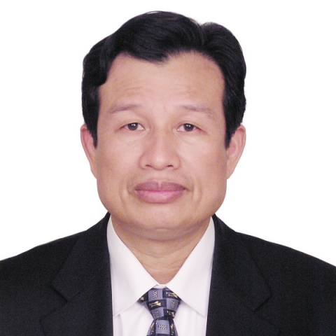

<!-- AUTO-GENERATED-BY: work/generate_obsidian_profiles.py -->

<!-- TEMPLATE: D:\workspace\信息收集整理\医生画像仓库\模板\医生画像模板.md -->

# 吴壮宏

## 基础信息

| 字段 | 内容 |
|---|---|
| 姓名 | 吴壮宏 |
| 医院 | 中山大学附属第一医院 |
| 科室 | 甲状腺外科 |
| 职称/身份 | 副教授 |
| 来源链接 | [官网原文](https://www.fahsysu.org.cn/node/728) |
| 采集日期 | 2026-08-13 |

## 简介/擅长

1.乳腺癌的早期诊断和精准治疗。 包括乳腺癌根治术、保乳、保腋窝和乳房重建手术，以及术后化疗、内分泌、靶向、免疫等综合治疗； 2.甲状腺良恶性肿瘤的治疗。 包括甲状腺癌根治术、颈部中央区、侧颈区淋巴结清扫，以及术后内分泌治疗。 其他情况： 主要教育和工作经历： 1983年毕业于中山医科大学医学系，获学士学位，同年留院一直在乳腺甲状腺外科工作至今，历任住院医师、主治医师、1998年晋升为副主任医师、副教授，2000-2014年担任乳腺甲状腺外科行政副主任，经常参加国内外关于乳腺癌和甲状腺疾病临床治疗的学术交流。 社会兼职： 广东省医学会乳腺病分会常务委员 广东省医师协会乳腺专科医师分会常务委员 广东省抗癌协会乳腺癌专业委员会委员 广州市抗癌协会乳腺癌专业委员会副主任委员 研究方向： 乳腺癌保乳手术和前哨淋巴结活检 甲状腺癌的早期诊断和治疗 专著： 门诊外科疾病的诊断与治疗 广东科技出版社（参编）1998年10月 甲状腺外科 人民卫生出版社（参编） 2005年9月 血管外科手术图谱 人民卫生出版社（编译）2010年6月 各级医学杂志发表学术论文30余篇。

## 教育与进修经历

- 其他情况： 主要教育和工作经历： 1983年毕业于中山医科大学医学系，获学士学位，同年留院一直在乳腺甲状腺外科工作至今，历任住院医师、主治医师、1998年晋升为副主任医师、副教授，2000-2014年担任乳腺甲状腺外科行政副主任，经常参加国内外关于乳腺癌和甲状腺疾病临床治疗的学术交流。

## 论文与学术产出

- 社会兼职： 广东省医学会乳腺病分会常务委员 广东省医师协会乳腺专科医师分会常务委员 广东省抗癌协会乳腺癌专业委员会委员 广州市抗癌协会乳腺癌专业委员会副主任委员 研究方向： 乳腺癌保乳手术和前哨淋巴结活检 甲状腺癌的早期诊断和治疗 专著： 门诊外科疾病的诊断与治疗 广东科技出版社（参编）1998年10月 甲状腺外科 人民卫生出版社（参编） 2005年9月 血管外科手术图谱 人民卫生出版社（编译）2010年6月 各级医学杂志发表学术论文30余篇。

## 可包装亮点

- 1.乳腺癌的早期诊断和精准治疗。
- 医疗特长： 1.乳腺癌的早期诊断和精准治疗。
- 其他情况： 主要教育和工作经历： 1983年毕业于中山医科大学医学系，获学士学位，同年留院一直在乳腺甲状腺外科工作至今，历任住院医师、主治医师、1998年晋升为副主任医师、副教授，2000-2014年担任乳腺甲状腺外科行政副主任，经常参加国内外关于乳腺癌和甲状腺疾病临床治疗的学术交流。
- 社会兼职： 广东省医学会乳腺病分会常务委员 广东省医师协会乳腺专科医师分会常务委员 广东省抗癌协会乳腺癌专业委员会委员 广州市抗癌协会乳腺癌专业委员会副主任委员 研究方向： 乳腺癌保乳手术和前哨淋巴结活检 甲状腺癌的早期诊断和治疗 专著： 门诊外科疾病的诊断与治疗 广东科技出版社（参编）1998年10月 甲状腺外科 人民卫生出版社（参编） 2005年9月…

## 重点疾病/人群标签

- 慢性病：
- 肿瘤：肿瘤、癌、化疗、靶向、乳腺癌、免疫、术后
- 生殖疾病：
- 免疫/风湿：肿瘤、癌、化疗、靶向、乳腺癌、免疫、术后
- 术后恢复/康复：肿瘤、癌、化疗、靶向、乳腺癌、免疫、术后
- 疑难重症：

## 证据摘录

> 只摘录官网公开信息中的短句或关键字段，不复制大段原文。

- 官网身份字段：副教授
- 官网简介/擅长：1.乳腺癌的早期诊断和精准治疗。 包括乳腺癌根治术、保乳、保腋窝和乳房重建手术，以及术后化疗、内分泌、靶向、免疫等综合治疗； 2.甲状腺良恶性肿瘤的治疗。 包括甲状腺癌根治术、颈部中央区、侧颈区淋巴结清扫，以及术后内分泌治疗。 其他情况： 主要教育和工作经历： 1983年毕业于中山医科大学医学系，获学士学位，同年留院一直在乳腺甲状腺外科工作至今，历任住院医师、主治医师、1998年晋升为副主任医师、副教授，2000-2014年担任乳腺甲…
- 官网亮眼经历线索：1.乳腺癌的早期诊断和精准治疗。 医疗特长： 1.乳腺癌的早期诊断和精准治疗。 其他情况： 主要教育和工作经历： 1983年毕业于中山医科大学医学系，获学士学位，同年留院一直在乳腺甲状腺外科工作至今，历任住院医师、主治医师、1998年晋升为副主任医师、副教授，2000-2014年担任乳腺甲状腺外科行政副主任，经常参加国内外关于乳腺癌和甲状腺疾病临床治疗的学术交流。 社会兼职： 广东省医学会乳腺病分会常务委员 广东省医师协会乳腺专科医师…
- 来源链接：https://www.fahsysu.org.cn/node/728

## BD 画像摘要

吴壮宏医生可作为肿瘤、免疫/风湿/感染、术后恢复/康复方向的基础画像候选。后续 BD 使用应继续以官网来源和人工复核为准，不添加疗效承诺或无来源包装。

## 合规边界

- 仅使用医院官网、官方公众号、官方小程序等公开渠道。
- 不采集私人电话、私人微信、家庭住址、患者隐私或非公开排班信息。
- 不写“保证治愈”“疗效第一”“包治疑难杂症”等无法由官网证明的表述。
