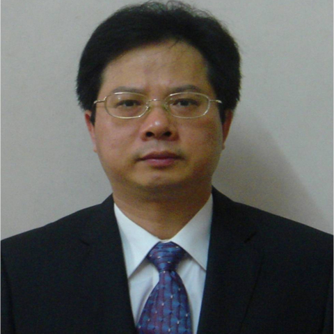

<!-- AUTO-GENERATED-BY: work/generate_obsidian_profiles.py -->

<!-- TEMPLATE: D:\workspace\信息收集整理\医生画像仓库\模板\医生画像模板.md -->

# 吴素华

## 基础信息

| 字段 | 内容 |
|---|---|
| 姓名 | 吴素华 |
| 医院 | 中山大学附属第一医院 |
| 科室 | 心内六科（CCU） |
| 职称/身份 | 主任医师/教授 |
| 来源链接 | [官网原文](https://www.fahsysu.org.cn/node/942) |
| 采集日期 | 2026-08-13 |

## 简介/擅长

曾在著名的美国Cedars-Sinai医学中心研修, 擅长心房颤动、室性早搏、室上速、房扑、室速等的导管消融治疗，左心耳封堵，病窦综合征/房室传导阻滞等缓慢型心律失常的起搏器治疗，心力衰竭和冠心病的综合治疗(包括CRT，CRT-D，CCM和导管介入治疗)，心脏性猝死的预防（包括ICD）以及心血管危重症的抢救治疗。 对心律失常、心力衰竭、冠心病、心肌病、晕厥和高血压病等心血管病诊治经验丰富。 主要教育和工作经历： 获中山大学（医科）临床医学博士学位，曾在世界著名的美国 Cedars-Sinai /UCLA 医学中心进行心律失常的临床研究。 国家首批心律失常介入和冠心病介入资质专家，国家心血管专科医师培训导师和准入考官。 擅长心律失常（包括心房颤动、室性早搏、室上性心动过速、心房扑动、室性心动过速等）的导管消融治疗，左心耳封堵，病窦综合征/房室传导阻滞等缓慢型心律失常的起搏器治疗，心力衰竭的综合治疗(包括CRT，CRT-D，CCM等)，心脏性猝死的预防（包括ICD），以及心血管危重症的抢救治疗，岭南名医。 是国内最早接触和使用非接触三维标测治疗室性早搏/室性心动过速的专家之一，国内最早使用冷冻球囊对心房颤动进行肺静脉和左心...

## 教育与进修经历

- 主要教育和工作经历： 获中山大学（医科）临床医学博士学位，曾在世界著名的美国 Cedars-Sinai /UCLA 医学中心进行心律失常的临床研究。
- 国家首批心律失常介入和冠心病介入资质专家，国家心血管专科医师培训导师和准入考官。
- 是国内最早接触和使用非接触三维标测治疗室性早搏/室性心动过速的专家之一，国内最早使用冷冻球囊对心房颤动进行肺静脉和左心耳电隔离的专家之一，率先在华南地区开展了心房颤动冷冻球囊消融联合左心耳封堵优化组合一站式微创手术，中山大学首位全球标准认证的左心耳封堵手术培训导师，完成了国内首例房颤冷冻球囊消融+(WATCHMAN)左心耳封堵+Micra无导线起搏器植入一站三式微创手术。
- 在包括《J Am Coll Cardiol》《PLOS Med》《Circ AE》《Thorax》《Heart Rhythm》《Heart》《JAHA》和《中华心血管病杂志》等专业杂志发表关于心律失常和冠心病等的研究论文几十篇，主持国家自然科学基金、教育部留学回国人员基金和省部级基金多项，广东省和广州市卫生系列高级职称评审委员会专家，岭南名医。

## 科研项目与成果

- 在包括《J Am Coll Cardiol》《PLOS Med》《Circ AE》《Thorax》《Heart Rhythm》《Heart》《JAHA》和《中华心血管病杂志》等专业杂志发表关于心律失常和冠心病等的研究论文几十篇，主持国家自然科学基金、教育部留学回国人员基金和省部级基金多项，广东省和广州市卫生系列高级职称评审委员会专家，岭南名医。

## 论文与学术产出

- 在包括《J Am Coll Cardiol》《PLOS Med》《Circ AE》《Thorax》《Heart Rhythm》《Heart》《JAHA》和《中华心血管病杂志》等专业杂志发表关于心律失常和冠心病等的研究论文几十篇，主持国家自然科学基金、教育部留学回国人员基金和省部级基金多项，广东省和广州市卫生系列高级职称评审委员会专家，岭南名医。

## 可包装亮点

- 曾在著名的美国Cedars-Sinai医学中心研修, 擅长心房颤动、室性早搏、室上速、房扑、室速等的导管消融治疗，左心耳封堵，病窦综合征/房室传导阻滞等缓慢型心律失常的起搏器治疗，心力衰竭和冠心病的综合治疗(包括CRT，CRT-D，CCM和导管介入治疗)，心脏性猝死的预防（包括ICD）以及心血管危重症的抢救治疗。
- 医疗特长： 曾在著名的美国Cedars-Sinai医学中心研修, 擅长心房颤动、室性早搏、室上速、房扑、室速等的导管消融治疗，左心耳封堵，病窦综合征/房室传导阻滞等缓慢型心律失常的起搏器治疗，心力衰竭和冠心病的综合治疗(包括CRT，CRT-D，CCM和导管介入治疗)，心脏性猝死的预防（包括ICD）以及心血管危重症的抢救治疗。
- 主要教育和工作经历： 获中山大学（医科）临床医学博士学位，曾在世界著名的美国 Cedars-Sinai /UCLA 医学中心进行心律失常的临床研究。
- 擅长心律失常（包括心房颤动、室性早搏、室...

## 重点疾病/人群标签

- 慢性病：高血压、冠心病、心力衰竭、危重
- 肿瘤：
- 生殖疾病：
- 免疫/风湿：
- 术后恢复/康复：
- 疑难重症：高血压、冠心病、心力衰竭、危重

## 证据摘录

> 只摘录官网公开信息中的短句或关键字段，不复制大段原文。

- 官网身份字段：主任医师/教授
- 官网简介/擅长：曾在著名的美国Cedars-Sinai医学中心研修, 擅长心房颤动、室性早搏、室上速、房扑、室速等的导管消融治疗，左心耳封堵，病窦综合征/房室传导阻滞等缓慢型心律失常的起搏器治疗，心力衰竭和冠心病的综合治疗(包括CRT，CRT-D，CCM和导管介入治疗)，心脏性猝死的预防（包括ICD）以及心血管危重症的抢救治疗。 对心律失常、心力衰竭、冠心病、心肌病、晕厥和高血压病等心血管病诊治经验丰富。 主要教育和工作经历： 获中山大学（医科）临床…
- 官网亮眼经历线索：曾在著名的美国Cedars-Sinai医学中心研修, 擅长心房颤动、室性早搏、室上速、房扑、室速等的导管消融治疗，左心耳封堵，病窦综合征/房室传导阻滞等缓慢型心律失常的起搏器治疗，心力衰竭和冠心病的综合治疗(包括CRT，CRT-D，CCM和导管介入治疗)，心脏性猝死的预防（包括ICD）以及心血管危重症的抢救治疗。 医疗特长： 曾在著名的美国Cedars-Sinai医学中心研修, 擅长心房颤动、室性早搏、室上速、房扑、室速等的导管消融治…
- 来源链接：https://www.fahsysu.org.cn/node/942

## BD 画像摘要

吴素华医生可作为慢性病、疑难重症方向的基础画像候选。后续 BD 使用应继续以官网来源和人工复核为准，不添加疗效承诺或无来源包装。

## 合规边界

- 仅使用医院官网、官方公众号、官方小程序等公开渠道。
- 不采集私人电话、私人微信、家庭住址、患者隐私或非公开排班信息。
- 不写“保证治愈”“疗效第一”“包治疑难杂症”等无法由官网证明的表述。
