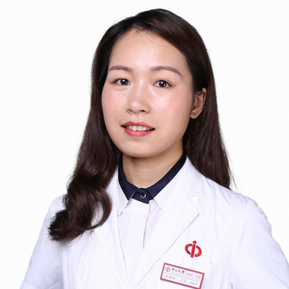

<!-- AUTO-GENERATED-BY: work/generate_obsidian_profiles.py -->

<!-- TEMPLATE: D:\workspace\信息收集整理\医生画像仓库\模板\医生画像模板.md -->

# 吴艳琴

## 基础信息

| 字段 | 内容 |
|---|---|
| 姓名 | 吴艳琴 |
| 医院 | 中山大学附属第一医院 |
| 科室 | 肿瘤介入科 |
| 职称/身份 | 副主任医师 |
| 来源链接 | [官网原文](https://www.fahsysu.org.cn/node/35812) |
| 采集日期 | 2026-08-13 |

## 简介/擅长

目前主要从事肿瘤微创介入治疗，涵盖原发性及转移性肝癌、肺癌、胆管癌、胰腺癌及盆腔肿瘤、骨转移瘤等多种肿瘤的介入诊疗（包括动脉灌注化疗与栓塞、氩氦刀冷冻、射频、微波消融、粒子与支架植入、输液港植入、穿刺活检等），及肿瘤分子靶向与免疫治疗。 教育及工作经历： 2017年获中山大学医学博士学位，同年就职于中山大学附属第一医院肿瘤介入科，从事肿瘤介入方面工作。 曾荣获2023年度“中山大学附属第一医院本科教学优秀教师”称号，并在2024年“中山大学附属第一医院青年教师授课大赛”中荣获一等奖。 社会任职： 现 任 亚洲冷冻治疗学会第七届委员会委员、广东省健康管理协会脂肪肝多学科诊治专业会委员及广东省中西结合医学肿瘤介入治疗专业委员会委员。 科研情况： 主要研究方向为肝癌综合治疗的临床与基础研究。 近年以第一作者在 JAMA oncology、Radiol Med、J Cancer Res Clin 等 高质量 SCI杂志上发表论文13篇， 单篇 最高影响因子为24.79。 主持国家自然科学基金青年项目1项及省部级项目3项， 参与国家级及省部级项目多项。 曾参与获得广东省科技进步奖二等奖及中国抗癌协会科技奖二等奖。 论著： [1]...

## 教育与进修经历

- 教育及工作经历： 2017年获中山大学医学博士学位，同年就职于中山大学附属第一医院肿瘤介入科，从事肿瘤介入方面工作。

## 科研项目与成果

- 科研情况： 主要研究方向为肝癌综合治疗的临床与基础研究。
- 主持国家自然科学基金青年项目1项及省部级项目3项， 参与国家级及省部级项目多项。

## 论文与学术产出

- 近年以第一作者在 JAMA oncology、Radiol Med、J Cancer Res Clin 等 高质量 SCI杂志上发表论文13篇， 单篇 最高影响因子为24.79。

## 可包装亮点

- 曾荣获2023年度“中山大学附属第一医院本科教学优秀教师”称号，并在2024年“中山大学附属第一医院青年教师授课大赛”中荣获一等奖。
- 社会任职： 现 任 亚洲冷冻治疗学会第七届委员会委员、广东省健康管理协会脂肪肝多学科诊治专业会委员及广东省中西结合医学肿瘤介入治疗专业委员会委员。
- 近年以第一作者在 JAMA oncology、Radiol Med、J Cancer Res Clin 等 高质量 SCI杂志上发表论文13篇， 单篇 最高影响因子为24.79。
- 主持国家自然科学基金青年项目1项及省部级项目3项， 参与国家级及省部级项目多项。

## 重点疾病/人群标签

- 慢性病：
- 肿瘤：肿瘤、癌、瘤、化疗、靶向、肺癌、肝癌、免疫、多学科
- 生殖疾病：
- 免疫/风湿：肿瘤、癌、瘤、化疗、靶向、肺癌、肝癌、免疫、多学科
- 术后恢复/康复：
- 疑难重症：肿瘤、癌、瘤、化疗、靶向、肺癌、肝癌、免疫、多学科

## 证据摘录

> 只摘录官网公开信息中的短句或关键字段，不复制大段原文。

- 官网身份字段：副主任医师
- 官网简介/擅长：目前主要从事肿瘤微创介入治疗，涵盖原发性及转移性肝癌、肺癌、胆管癌、胰腺癌及盆腔肿瘤、骨转移瘤等多种肿瘤的介入诊疗（包括动脉灌注化疗与栓塞、氩氦刀冷冻、射频、微波消融、粒子与支架植入、输液港植入、穿刺活检等），及肿瘤分子靶向与免疫治疗。 教育及工作经历： 2017年获中山大学医学博士学位，同年就职于中山大学附属第一医院肿瘤介入科，从事肿瘤介入方面工作。 曾荣获2023年度“中山大学附属第一医院本科教学优秀教师”称号，并在2024年“中…
- 官网亮眼经历线索：曾荣获2023年度“中山大学附属第一医院本科教学优秀教师”称号，并在2024年“中山大学附属第一医院青年教师授课大赛”中荣获一等奖。 社会任职： 现 任 亚洲冷冻治疗学会第七届委员会委员、广东省健康管理协会脂肪肝多学科诊治专业会委员及广东省中西结合医学肿瘤介入治疗专业委员会委员。 近年以第一作者在 JAMA oncology、Radiol Med、J Cancer Res Clin 等 高质量 SCI杂志上发表论文13篇， 单篇 最高…
- 来源链接：https://www.fahsysu.org.cn/node/35812

## BD 画像摘要

吴艳琴医生可作为肿瘤、免疫/风湿/感染、疑难重症方向的基础画像候选。后续 BD 使用应继续以官网来源和人工复核为准，不添加疗效承诺或无来源包装。

## 合规边界

- 仅使用医院官网、官方公众号、官方小程序等公开渠道。
- 不采集私人电话、私人微信、家庭住址、患者隐私或非公开排班信息。
- 不写“保证治愈”“疗效第一”“包治疑难杂症”等无法由官网证明的表述。
