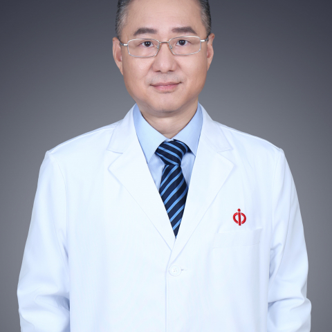

<!-- AUTO-GENERATED-BY: work/generate_obsidian_profiles.py -->

<!-- TEMPLATE: D:\workspace\信息收集整理\医生画像仓库\模板\医生画像模板.md -->

# 吴钟凯

## 基础信息

| 字段 | 内容 |
|---|---|
| 姓名 | 吴钟凯 |
| 医院 | 中山大学附属第一医院 |
| 科室 | 心脏外科 |
| 职称/身份 | 主任医师/教授 |
| 来源链接 | [官网原文](https://www.fahsysu.org.cn/node/949) |
| 采集日期 | 2026-08-13 |

## 简介/擅长

吴钟凯教授是一直在临床一线工作的心脏外科医生，临床经验丰富。 每年主刀手术150-230例，临床医疗效果达到国内先进水平。 医德医风优良，从医25年来，无投诉和医疗纠纷。 在冠心病外科、瓣膜外科、复杂先心病外科和大动脉外科均有很深造诣。 特别是各种复杂先心病手术、高难度冠脉搭桥手术、不停跳冠脉搭桥手术、左心室巨大室壁瘤切除左心室成型术和改良保留瓣下结构二尖瓣置换术有深入研究和知名度。 高难度冠脉搭桥会诊手术均获得成功。 在大学、医院领导支持下和社会慈善机构的帮助下，创立‘爱济童心’慈善基金，资助贫困地区和贫困家庭的先心病患者手术。 是国家杰出青年科学基金获得者、第十一届广州十大杰出青年、享受国务院特殊津贴专家、广东省高等学校珠江学者特聘教授。 研究方向： 一直从事术中心肌保护和肺高压中肺血管重构机制的研究，主持多项国际合作项目。 并获得国家重点基础研究发展计划（973计划）分课题、国家杰出青年科学基金、广东省高等学校高层次人才项目、中山大学临床医学研究5010计划等资助。 主要教育和工作经历： 1988－1993：中山大学第一附属医院普通外科和心胸外科住院医生； 1993－2001：中山大学第一附属医院心胸外科主治医生...

## 教育与进修经历

- 1997年5月－2002年12月：芬兰坦佩雷大学医院心脏外科临床进修医生、研究员；

## 科研项目与成果

- 在大学、医院领导支持下和社会慈善机构的帮助下，创立‘爱济童心’慈善基金，资助贫困地区和贫困家庭的先心病患者手术。
- 是国家杰出青年科学基金获得者、第十一届广州十大杰出青年、享受国务院特殊津贴专家、广东省高等学校珠江学者特聘教授。
- 研究方向： 一直从事术中心肌保护和肺高压中肺血管重构机制的研究，主持多项国际合作项目。
- 并获得国家重点基础研究发展计划（973计划）分课题、国家杰出青年科学基金、广东省高等学校高层次人才项目、中山大学临床医学研究5010计划等资助。

## 可包装亮点

- 并获得国家重点基础研究发展计划（973计划）分课题、国家杰出青年科学基金、广东省高等学校高层次人才项目、中山大学临床医学研究5010计划等资助。
- 2001－2004：中山大学第一附属医院心胸外科副教授、副主任医师、硕士生导师;
- 1997年5月－2002年12月：芬兰坦佩雷大学医院心脏外科临床进修医生、研究员；
- 2005年12月至今：中山大学第一附属医院心外科博士生导师 2007年12月至今：中山大学第一附属医院心外科教授、主任医师。

## 重点疾病/人群标签

- 慢性病：糖尿病、冠心病、瘤、感染、术后、重症、复杂
- 肿瘤：糖尿病、冠心病、瘤、感染、术后、重症、复杂
- 生殖疾病：
- 免疫/风湿：糖尿病、冠心病、瘤、感染、术后、重症、复杂
- 术后恢复/康复：糖尿病、冠心病、瘤、感染、术后、重症、复杂
- 疑难重症：糖尿病、冠心病、瘤、感染、术后、重症、复杂

## 证据摘录

> 只摘录官网公开信息中的短句或关键字段，不复制大段原文。

- 官网身份字段：主任医师/教授
- 官网简介/擅长：吴钟凯教授是一直在临床一线工作的心脏外科医生，临床经验丰富。 每年主刀手术150-230例，临床医疗效果达到国内先进水平。 医德医风优良，从医25年来，无投诉和医疗纠纷。 在冠心病外科、瓣膜外科、复杂先心病外科和大动脉外科均有很深造诣。 特别是各种复杂先心病手术、高难度冠脉搭桥手术、不停跳冠脉搭桥手术、左心室巨大室壁瘤切除左心室成型术和改良保留瓣下结构二尖瓣置换术有深入研究和知名度。 高难度冠脉搭桥会诊手术均获得成功。 在大学、医院领…
- 官网亮眼经历线索：并获得国家重点基础研究发展计划（973计划）分课题、国家杰出青年科学基金、广东省高等学校高层次人才项目、中山大学临床医学研究5010计划等资助。 2001－2004：中山大学第一附属医院心胸外科副教授、副主任医师、硕士生导师; 1997年5月－2002年12月：芬兰坦佩雷大学医院心脏外科临床进修医生、研究员； 2005年12月至今：中山大学第一附属医院心外科博士生导师 2007年12月至今：中山大学第一附属医院心外科教授、主任医师。
- 来源链接：https://www.fahsysu.org.cn/node/949

## BD 画像摘要

吴钟凯医生可作为慢性病、肿瘤、免疫/风湿/感染、术后恢复/康复、疑难重症方向的基础画像候选。后续 BD 使用应继续以官网来源和人工复核为准，不添加疗效承诺或无来源包装。

## 合规边界

- 仅使用医院官网、官方公众号、官方小程序等公开渠道。
- 不采集私人电话、私人微信、家庭住址、患者隐私或非公开排班信息。
- 不写“保证治愈”“疗效第一”“包治疑难杂症”等无法由官网证明的表述。
