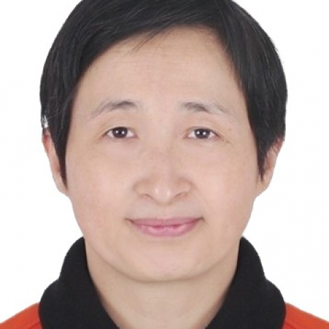

<!-- AUTO-GENERATED-BY: work/generate_obsidian_profiles.py -->

<!-- TEMPLATE: D:\workspace\信息收集整理\医生画像仓库\模板\医生画像模板.md -->

# 周晖

## 基础信息

| 字段 | 内容 |
|---|---|
| 姓名 | 周晖 |
| 医院 | 中山大学附属第一医院 |
| 科室 | 皮肤科 |
| 职称/身份 | 副主任医师 |
| 来源链接 | [官网原文](https://www.fahsysu.org.cn/node/5747) |
| 采集日期 | 2026-08-13 |

## 简介/擅长

①皮肤科常见病、多发病诊治； ②色素性皮肤病诊治：特别在婴幼儿白癜风与节段型白癜风的中西医结合治疗、中西药物联合308光疗、点阵激光、微针、自体表皮移植等白癜风综合治疗及白癜风预防复发方面较有心得； ③ 特应性皮炎及其共病的中西医结合多学科诊疗，目前负责结节性痒疹的国际多中心、随机、安慰剂对照、双盲研究； ④遗传性血管性水肿、法布雷病、神经纤维瘤病等疑难罕见皮肤病的诊治。 研究方向： ①免疫性皮肤病； ②色素性皮肤病； ③疑难罕见皮肤病 主要教育和工作经历：2000年本科毕业于中山医科大学，2016年获博士学位。 社会兼职：广东省中西医结合学会皮肤性病专业委员会副主委、中国白癜风研究联盟常务委员、广东省药学会皮肤病专家委员会常务委员、广东省医学教育协会皮肤美容专业委员会常务委员、中国医疗保健国际交流促进会皮肤医学分会委员、广东省健康管理学会变态反应专业委员会委员、广东省医学会皮肤性病学分会治疗学组委员、欧洲医学教育联盟副研究员（Associate fellow of AMEE） 论著：(第一作者或通讯作者论文或论文摘登) An unusual presentation of cutaneous lupus erythe...

## 教育与进修经历

- ③疑难罕见皮肤病 主要教育和工作经历：2000年本科毕业于中山医科大学，2016年获博士学位。

## 论文与学术产出

- 社会兼职：广东省中西医结合学会皮肤性病专业委员会副主委、中国白癜风研究联盟常务委员、广东省药学会皮肤病专家委员会常务委员、广东省医学教育协会皮肤美容专业委员会常务委员、中国医疗保健国际交流促进会皮肤医学分会委员、广东省健康管理学会变态反应专业委员会委员、广东省医学会皮肤性病学分会治疗学组委员、欧洲医学教育联盟副研究员（Associate fellow of AMEE） 论著：(第一作者或通讯作者论文或论文摘登) An unusual presentation of cutaneous lupus erythema…

## 可包装亮点

- ③ 特应性皮炎及其共病的中西医结合多学科诊疗，目前负责结节性痒疹的国际多中心、随机、安慰剂对照、双盲研究；
- ④遗传性血管性水肿、法布雷病、神经纤维瘤病等疑难罕见皮肤病的诊治。

## 重点疾病/人群标签

- 慢性病：
- 肿瘤：肿瘤、瘤、靶向、免疫、疑难、多学科、罕见
- 生殖疾病：
- 免疫/风湿：肿瘤、瘤、靶向、免疫、疑难、多学科、罕见
- 术后恢复/康复：
- 疑难重症：肿瘤、瘤、靶向、免疫、疑难、多学科、罕见

## 证据摘录

> 只摘录官网公开信息中的短句或关键字段，不复制大段原文。

- 官网身份字段：副主任医师
- 官网简介/擅长：①皮肤科常见病、多发病诊治； ②色素性皮肤病诊治：特别在婴幼儿白癜风与节段型白癜风的中西医结合治疗、中西药物联合308光疗、点阵激光、微针、自体表皮移植等白癜风综合治疗及白癜风预防复发方面较有心得； ③ 特应性皮炎及其共病的中西医结合多学科诊疗，目前负责结节性痒疹的国际多中心、随机、安慰剂对照、双盲研究； ④遗传性血管性水肿、法布雷病、神经纤维瘤病等疑难罕见皮肤病的诊治。 研究方向： ①免疫性皮肤病； ②色素性皮肤病； ③疑难罕见皮肤…
- 官网亮眼经历线索：③ 特应性皮炎及其共病的中西医结合多学科诊疗，目前负责结节性痒疹的国际多中心、随机、安慰剂对照、双盲研究； ④遗传性血管性水肿、法布雷病、神经纤维瘤病等疑难罕见皮肤病的诊治。 ③ 特应性皮炎及其共病的中西医结合多学科诊疗，目前负责结节性痒疹的国际多中心、随机、安慰剂对照、双盲研究； ④遗传性血管性水肿、法布雷病、神经纤维瘤病等疑难罕见皮肤病的诊治。
- 来源链接：https://www.fahsysu.org.cn/node/5747

## BD 画像摘要

周晖医生可作为肿瘤、免疫/风湿/感染、疑难重症方向的基础画像候选。后续 BD 使用应继续以官网来源和人工复核为准，不添加疗效承诺或无来源包装。

## 合规边界

- 仅使用医院官网、官方公众号、官方小程序等公开渠道。
- 不采集私人电话、私人微信、家庭住址、患者隐私或非公开排班信息。
- 不写“保证治愈”“疗效第一”“包治疑难杂症”等无法由官网证明的表述。
