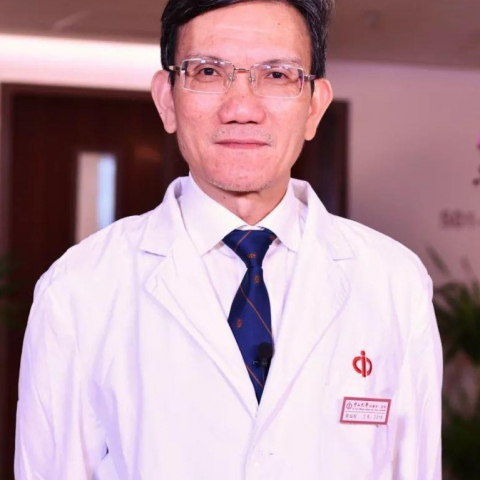

<!-- AUTO-GENERATED-BY: work/generate_obsidian_profiles.py -->

<!-- TEMPLATE: D:\workspace\信息收集整理\医生画像仓库\模板\医生画像模板.md -->

# 周灿权

## 基础信息

| 字段 | 内容 |
|---|---|
| 姓名 | 周灿权 |
| 医院 | 中山大学附属第一医院 |
| 科室 | 生殖医学中心 |
| 职称/身份 | 主任医师/教授 |
| 来源链接 | [官网原文](https://www.fahsysu.org.cn/node/605) |
| 采集日期 | 2026-08-13 |

## 简介/擅长

## 教育与进修经历

- 研究方向：生殖医学、辅助生殖技术、生殖内分泌 主要教育和工作经历： 主要教育 1977-1983年中山医学院学士学位 1985-1988年中山医科大学生殖生理学硕士 1996年澳大利亚新南威尔士大学进修 2005-2006年德国波恩大学访问学者 主要工作经历 1996年-2001年 中山大学附属第一医院 副教授 1997年-2004年 中山大学附属第一医院妇产科学科主任 1998年-2009年 中山大学附属第一医院生殖医学专科主任 2002年至今 中山大学附属第一医院教授 2005年至今 中山大学附属第一医院 妇…

## 科研项目与成果

- 国家重点实验室评选专家、生殖医学国家重点实验室建设期学术委员会委员、广东省医学重点专科（生殖医学）学科带头人、《中国实用妇科与产科杂志》副主编、《中华妇产科杂志》和《生殖医学》杂志的编委等。

## 论文与学术产出

- 国家重点实验室评选专家、生殖医学国家重点实验室建设期学术委员会委员、广东省医学重点专科（生殖医学）学科带头人、《中国实用妇科与产科杂志》副主编、《中华妇产科杂志》和《生殖医学》杂志的编委等。
- 论著： 国内核心期刊发表文章一百余篇。

## 可包装亮点

- 1989年作为团队骨干成员协同创建了我院的生殖医学中心和体外受精－胚胎移植研究室，中心以此为基础在辅助生殖技术、生殖内分泌领域展开了一系列的工作，在国内较早建立了体外受精－胚胎移植技术并在国内率先建立了单精子卵母细胞浆内显微注射技术和胚胎植入前遗传学诊断技术，率先应用经阴道超声引导下的减胎术处理早期多胎妊娠。
- 参与指导了国内众多的生殖中心的建设，作为卫生部或卫生厅专家对国内众多中心进行了技术评审。
- 多年来的工作，在系列辅助生殖技术及其复杂问题的处理、生殖内分泌疾病如多囊卵巢综合征的诊治以及生殖中心的建设和管理等方面积累了丰富的经验。
- 1989年作为团队骨干成员协同创建了我院的生殖医学中心和体外受精－胚胎移植研究室，中心以此为基础在辅助生殖技术、生殖内分泌领域展开了一系列的工作，在国内较早建立了体外受精－胚胎移植技术并在国内率先建立了单精子卵母细胞浆内显微注射技术和胚胎植入前遗传学诊断技术，率先应用经阴道超声引导下的减胎术处...

## 重点疾病/人群标签

- 慢性病：
- 肿瘤：
- 生殖疾病：生殖、卵巢、辅助生殖、胚胎、多囊、复杂
- 免疫/风湿：
- 术后恢复/康复：
- 疑难重症：生殖、卵巢、辅助生殖、胚胎、多囊、复杂

## 证据摘录

> 只摘录官网公开信息中的短句或关键字段，不复制大段原文。

- 官网身份字段：主任医师/教授
- 官网亮眼经历线索：1989年作为团队骨干成员协同创建了我院的生殖医学中心和体外受精－胚胎移植研究室，中心以此为基础在辅助生殖技术、生殖内分泌领域展开了一系列的工作，在国内较早建立了体外受精－胚胎移植技术并在国内率先建立了单精子卵母细胞浆内显微注射技术和胚胎植入前遗传学诊断技术，率先应用经阴道超声引导下的减胎术处理早期多胎妊娠。 参与指导了国内众多的生殖中心的建设，作为卫生部或卫生厅专家对国内众多中心进行了技术评审。 多年来的工作，在系列辅助生殖技术及其…
- 来源链接：https://www.fahsysu.org.cn/node/605

## BD 画像摘要

周灿权医生可作为生殖疾病、疑难重症方向的基础画像候选。后续 BD 使用应继续以官网来源和人工复核为准，不添加疗效承诺或无来源包装。

## 合规边界

- 仅使用医院官网、官方公众号、官方小程序等公开渠道。
- 不采集私人电话、私人微信、家庭住址、患者隐私或非公开排班信息。
- 不写“保证治愈”“疗效第一”“包治疑难杂症”等无法由官网证明的表述。
