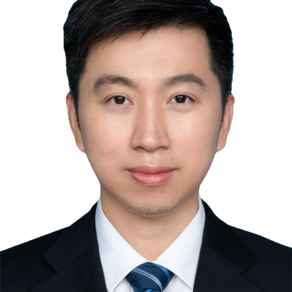

<!-- AUTO-GENERATED-BY: work/generate_obsidian_profiles.py -->

<!-- TEMPLATE: D:\workspace\信息收集整理\医生画像仓库\模板\医生画像模板.md -->

# 周立

## 基础信息

| 字段 | 内容 |
|---|---|
| 姓名 | 周立 |
| 医院 | 中山大学附属第一医院 |
| 科室 | 心脏外科 |
| 职称/身份 | 副主任医师 |
| 来源链接 | [官网原文](https://www.fahsysu.org.cn/node/23547) |
| 采集日期 | 2026-08-13 |

## 简介/擅长

各类心脏疾病的外科治疗，包括先天性心脏病、瓣膜病、冠心病和大血管疾病。 在瓣膜修复手术和复杂瓣膜手术方面具有丰富的经验，所在治疗组每年进行各类心脏手术300余例。 对于冠脉搭桥、微创大隐静脉获取、微创先心病手术和瓣膜手术，以及各类大血管疾病如主动脉瘤、主动脉夹层等杂交介入手术方面有较深造诣。 心脏外科副主任医师，硕士生导师，2007年毕业于中山大学医学院临床医学七年制，毕业后一直在中山一院心脏外科工作至今，2016年获博士学位。 工作期间参加各类先天性心脏病手术、瓣膜修复和置换手术、冠脉搭桥手术、微创心脏手术、大血管外科和介入手术2000余例。 近年积极开展和参与微创腔镜先心病、瓣膜手术，微创介入主动脉瓣、二尖瓣手术（TAVR、TMVR）等。 科研方面主持一项国家自然科学基金、一项省科技厅基金，发表各类SCI和核心杂志文章多篇。 社会任职： 广东省医学会心血管外科分会 委员 广东省生理学会心血管专业委员会 委员 广东省中西医结合协会心血管外科分会 委员 广东省工程学会心血管外科分会 委员

## 教育与进修经历

- 心脏外科副主任医师，硕士生导师，2007年毕业于中山大学医学院临床医学七年制，毕业后一直在中山一院心脏外科工作至今，2016年获博士学位。

## 科研项目与成果

- 科研方面主持一项国家自然科学基金、一项省科技厅基金，发表各类SCI和核心杂志文章多篇。

## 论文与学术产出

- 科研方面主持一项国家自然科学基金、一项省科技厅基金，发表各类SCI和核心杂志文章多篇。

## 可包装亮点

- 心脏外科副主任医师，硕士生导师，2007年毕业于中山大学医学院临床医学七年制，毕业后一直在中山一院心脏外科工作至今，2016年获博士学位。
- 科研方面主持一项国家自然科学基金、一项省科技厅基金，发表各类SCI和核心杂志文章多篇。
- 社会任职： 广东省医学会心血管外科分会 委员 广东省生理学会心血管专业委员会 委员 广东省中西医结合协会心血管外科分会 委员 广东省工程学会心血管外科分会 委员

## 重点疾病/人群标签

- 慢性病：冠心病、瘤、复杂
- 肿瘤：冠心病、瘤、复杂
- 生殖疾病：
- 免疫/风湿：
- 术后恢复/康复：
- 疑难重症：冠心病、瘤、复杂

## 证据摘录

> 只摘录官网公开信息中的短句或关键字段，不复制大段原文。

- 官网身份字段：副主任医师
- 官网简介/擅长：各类心脏疾病的外科治疗，包括先天性心脏病、瓣膜病、冠心病和大血管疾病。 在瓣膜修复手术和复杂瓣膜手术方面具有丰富的经验，所在治疗组每年进行各类心脏手术300余例。 对于冠脉搭桥、微创大隐静脉获取、微创先心病手术和瓣膜手术，以及各类大血管疾病如主动脉瘤、主动脉夹层等杂交介入手术方面有较深造诣。 心脏外科副主任医师，硕士生导师，2007年毕业于中山大学医学院临床医学七年制，毕业后一直在中山一院心脏外科工作至今，2016年获博士学位。 工作…
- 官网亮眼经历线索：心脏外科副主任医师，硕士生导师，2007年毕业于中山大学医学院临床医学七年制，毕业后一直在中山一院心脏外科工作至今，2016年获博士学位。 科研方面主持一项国家自然科学基金、一项省科技厅基金，发表各类SCI和核心杂志文章多篇。 社会任职： 广东省医学会心血管外科分会 委员 广东省生理学会心血管专业委员会 委员 广东省中西医结合协会心血管外科分会 委员 广东省工程学会心血管外科分会 委员
- 来源链接：https://www.fahsysu.org.cn/node/23547

## BD 画像摘要

周立医生可作为慢性病、肿瘤、疑难重症方向的基础画像候选。后续 BD 使用应继续以官网来源和人工复核为准，不添加疗效承诺或无来源包装。

## 合规边界

- 仅使用医院官网、官方公众号、官方小程序等公开渠道。
- 不采集私人电话、私人微信、家庭住址、患者隐私或非公开排班信息。
- 不写“保证治愈”“疗效第一”“包治疑难杂症”等无法由官网证明的表述。
