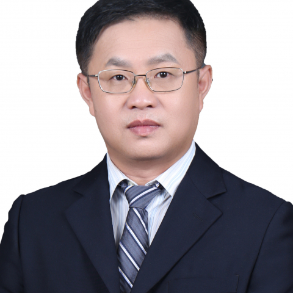

<!-- AUTO-GENERATED-BY: work/generate_obsidian_profiles.py -->

<!-- TEMPLATE: D:\workspace\信息收集整理\医生画像仓库\模板\医生画像模板.md -->

# 唐冰

## 基础信息

| 字段 | 内容 |
|---|---|
| 姓名 | 唐冰 |
| 医院 | 中山大学附属第一医院 |
| 科室 | 整形外科 |
| 职称/身份 | 主任医师/教授 |
| 来源链接 | [官网原文](https://www.fahsysu.org.cn/node/662) |
| 采集日期 | 2026-08-13 |

## 简介/擅长

从事整形、修复和瘢痕防治的临床和研究工作。 整形修复重建：烧创伤瘢痕及瘢痕疙瘩，各种慢性难愈性创面，大面积皮肤撕脱伤等。 乳房整形：假体隆胸、巨乳缩小、乳房上提、乳腺癌术后再造，男性乳腺肥大等。 腹壁整形、体型塑造术。 脂肪移植：面部吸脂塑形、脂肪移植填充及面部年轻化治疗（眼袋，除皱术）等整形美容手术。 皮肤肿瘤（良、恶性）规范治疗：基底细胞癌、鳞癌、恶性黑色素瘤、隆突性皮纤维肉瘤、脂肪瘤、血管瘤等。 研究方向：整形修复和瘢痕防治 主要教育和工作经历：本科毕业于中山医科大学临床医学系，中山大学外科学博士，美国德州大学MD Anderson肿瘤中心访问学者。 中山大学附属第一医院工作至今。 社会兼职：国家卫生应急处置指导专家； 广东省杰出青年医学人才（第一批）； 国家、广东、江苏省自然科学基金； 河北、江西、四川科技奖励评审专家； 美国整形外科学会（ASPS）和国际烧伤学会（ISBI）会员，国际烧伤学会（ISBI）会员； 广东省临床医学学会-华南名医专委员会会员。 主持多项国家级课题和中山大学5010临床课题，通讯/第一作者发表SCI文章60余篇，包括J Exp Med、Nature Communications、Cel...

## 教育与进修经历

- 研究方向：整形修复和瘢痕防治 主要教育和工作经历：本科毕业于中山医科大学临床医学系，中山大学外科学博士，美国德州大学MD Anderson肿瘤中心访问学者。

## 科研项目与成果

- 国家、广东、江苏省自然科学基金；
- 主持多项国家级课题和中山大学5010临床课题，通讯/第一作者发表SCI文章60余篇，包括J Exp Med、Nature Communications、Cell Rep Med、Advanced Science，Brit J Surg（2篇）、J Invest Dermatol (2篇）、Plast Reconstr Surg (3篇），研究成果为国际治疗指南采用。

## 论文与学术产出

- 主持多项国家级课题和中山大学5010临床课题，通讯/第一作者发表SCI文章60余篇，包括J Exp Med、Nature Communications、Cell Rep Med、Advanced Science，Brit J Surg（2篇）、J Invest Dermatol (2篇）、Plast Reconstr Surg (3篇），研究成果为国际治疗指南采用。

## 可包装亮点

- 研究方向：整形修复和瘢痕防治 主要教育和工作经历：本科毕业于中山医科大学临床医学系，中山大学外科学博士，美国德州大学MD Anderson肿瘤中心访问学者。
- 广东省杰出青年医学人才（第一批）；
- 河北、江西、四川科技奖励评审专家；
- 美国整形外科学会（ASPS）和国际烧伤学会（ISBI）会员，国际烧伤学会（ISBI）会员；

## 重点疾病/人群标签

- 慢性病：慢性、肿瘤、癌、瘤、乳腺癌、术后、康复、创面、烧伤
- 肿瘤：慢性、肿瘤、癌、瘤、乳腺癌、术后、康复、创面、烧伤
- 生殖疾病：
- 免疫/风湿：
- 术后恢复/康复：慢性、肿瘤、癌、瘤、乳腺癌、术后、康复、创面、烧伤
- 疑难重症：

## 证据摘录

> 只摘录官网公开信息中的短句或关键字段，不复制大段原文。

- 官网身份字段：主任医师/教授
- 官网简介/擅长：从事整形、修复和瘢痕防治的临床和研究工作。 整形修复重建：烧创伤瘢痕及瘢痕疙瘩，各种慢性难愈性创面，大面积皮肤撕脱伤等。 乳房整形：假体隆胸、巨乳缩小、乳房上提、乳腺癌术后再造，男性乳腺肥大等。 腹壁整形、体型塑造术。 脂肪移植：面部吸脂塑形、脂肪移植填充及面部年轻化治疗（眼袋，除皱术）等整形美容手术。 皮肤肿瘤（良、恶性）规范治疗：基底细胞癌、鳞癌、恶性黑色素瘤、隆突性皮纤维肉瘤、脂肪瘤、血管瘤等。 研究方向：整形修复和瘢痕防治 主…
- 官网亮眼经历线索：研究方向：整形修复和瘢痕防治 主要教育和工作经历：本科毕业于中山医科大学临床医学系，中山大学外科学博士，美国德州大学MD Anderson肿瘤中心访问学者。 广东省杰出青年医学人才（第一批）； 河北、江西、四川科技奖励评审专家； 美国整形外科学会（ASPS）和国际烧伤学会（ISBI）会员，国际烧伤学会（ISBI）会员；
- 来源链接：https://www.fahsysu.org.cn/node/662

## BD 画像摘要

唐冰医生可作为慢性病、肿瘤、术后恢复/康复方向的基础画像候选。后续 BD 使用应继续以官网来源和人工复核为准，不添加疗效承诺或无来源包装。

## 合规边界

- 仅使用医院官网、官方公众号、官方小程序等公开渠道。
- 不采集私人电话、私人微信、家庭住址、患者隐私或非公开排班信息。
- 不写“保证治愈”“疗效第一”“包治疑难杂症”等无法由官网证明的表述。
