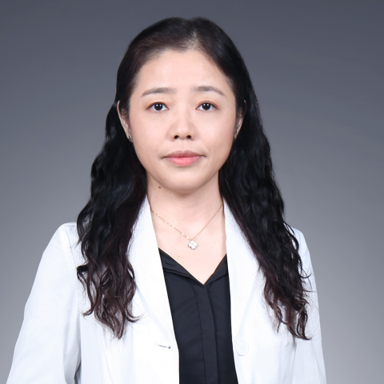

<!-- AUTO-GENERATED-BY: work/generate_obsidian_profiles.py -->

<!-- TEMPLATE: D:\workspace\信息收集整理\医生画像仓库\模板\医生画像模板.md -->

# 唐可京

## 基础信息

| 字段 | 内容 |
|---|---|
| 姓名 | 唐可京 |
| 医院 | 中山大学附属第一医院 |
| 科室 | 呼吸与危重症医学科 |
| 职称/身份 | 主任医师/教授 |
| 来源链接 | [官网原文](https://www.fahsysu.org.cn/node/799) |
| 采集日期 | 2026-08-13 |

## 简介/擅长

对呼吸系统疾病的诊治有深刻的认识和丰富的临床诊疗经验，擅长肺癌、肺部感染、慢性阻塞性肺疾病、支气管哮喘、间质性肺疾病、胸膜疾病等常见病和危重病的诊断和治疗，并对呼吸系统的疑难病、少见病有较高的诊治水平。 工作经历： 1998年中山医科大学临床医学系七年制硕士毕业后留院工作至今； 2005年获得中山大学临床医学内科学博士学位； 2006年至2007年在美国范德堡 (Vanderbilt) 大学医学中心呼吸和危重症医学部从事访问学者和博士后研究工作； 2013年至2015年在美国德州大学西南医学中心 (UTSW) Harold C. Simmons综合癌症中心从事访问学者和博士后研究工作。 研究方向： 我院“III期肺癌多学科联合规范化诊疗中心”和“肺癌诊疗一体化中心”负责人，我院肺癌多学科团队 (MDT) 互联网诊疗首席专家； 同时作为主要负责人之一成立了我院肿瘤免疫治疗不良反应MDT管理团队。 近5年作为分中心主要研究者（PI）承担了100余项国际/国内多中心肺癌临床研究； 主持肺癌横向研究课题10余项。 在The New England Journal of Medicine、Molecular Cancer、Cli...

## 教育与进修经历

- 工作经历： 1998年中山医科大学临床医学系七年制硕士毕业后留院工作至今；
- 2005年获得中山大学临床医学内科学博士学位；
- 2006年至2007年在美国范德堡 (Vanderbilt) 大学医学中心呼吸和危重症医学部从事访问学者和博士后研究工作；
- 2013年至2015年在美国德州大学西南医学中心 (UTSW) Harold C. Simmons综合癌症中心从事访问学者和博士后研究工作。

## 科研项目与成果

- 主持肺癌横向研究课题10余项。

## 论文与学术产出

- 在The New England Journal of Medicine、Molecular Cancer、Clinical Cancer Research、Cancer Letters、Chest、Respirology、中华肿瘤杂志、中华内科杂志、中华结核和呼吸杂志等核心医学期刊上发表论著100余篇。
- 主编书籍：《常见呼吸系统疾病的防治与食疗》、《广东省县级医疗机构药品处方集》；
- 参编书籍：《呼吸病学》、《危重症加强监护治疗学》、《呼吸内科学高级教程》、《现代难治病诊治学丛书—难治性呼吸系统疾病》《实用全科医师手册》、《内科症状鉴别诊断》、《内科急危重症的补液疗法》等。

## 可包装亮点

- 对呼吸系统疾病的诊治有深刻的认识和丰富的临床诊疗经验，擅长肺癌、肺部感染、慢性阻塞性肺疾病、支气管哮喘、间质性肺疾病、胸膜疾病等常见病和危重病的诊断和治疗，并对呼吸系统的疑难病、少见病有较高的诊治水平。
- 医疗特长：对呼吸系统疾病的诊治有深刻的认识和丰富的临床诊疗经验，擅长肺癌、肺部感染、慢性阻塞性肺疾病、支气管哮喘、间质性肺疾病、胸膜疾病等常见病和危重病的诊断和治疗，并对呼吸系统的疑难病、少见病有较高的诊治水平。
- 2006年至2007年在美国范德堡 (Vanderbilt) 大学医学中心呼吸和危重症医学部从事访问学者和博士后研究工作；
- 2013年至2015年在美国德州大学西南医学中心 (UTSW) Harold C. Simmons综合癌症中心从事访问学者和博士后研究工作。

## 重点疾病/人群标签

- 慢性病：慢性、肿瘤、癌、肺癌、免疫、感染、疑难、危重、急危重、难治、多学科、MDT
- 肿瘤：慢性、肿瘤、癌、肺癌、免疫、感染、疑难、危重、急危重、难治、多学科、MDT
- 生殖疾病：
- 免疫/风湿：慢性、肿瘤、癌、肺癌、免疫、感染、疑难、危重、急危重、难治、多学科、MDT
- 术后恢复/康复：
- 疑难重症：慢性、肿瘤、癌、肺癌、免疫、感染、疑难、危重、急危重、难治、多学科、MDT

## 证据摘录

> 只摘录官网公开信息中的短句或关键字段，不复制大段原文。

- 官网身份字段：主任医师/教授
- 官网简介/擅长：对呼吸系统疾病的诊治有深刻的认识和丰富的临床诊疗经验，擅长肺癌、肺部感染、慢性阻塞性肺疾病、支气管哮喘、间质性肺疾病、胸膜疾病等常见病和危重病的诊断和治疗，并对呼吸系统的疑难病、少见病有较高的诊治水平。 工作经历： 1998年中山医科大学临床医学系七年制硕士毕业后留院工作至今； 2005年获得中山大学临床医学内科学博士学位； 2006年至2007年在美国范德堡 (Vanderbilt) 大学医学中心呼吸和危重症医学部从事访问学者和博士…
- 官网亮眼经历线索：对呼吸系统疾病的诊治有深刻的认识和丰富的临床诊疗经验，擅长肺癌、肺部感染、慢性阻塞性肺疾病、支气管哮喘、间质性肺疾病、胸膜疾病等常见病和危重病的诊断和治疗，并对呼吸系统的疑难病、少见病有较高的诊治水平。 医疗特长：对呼吸系统疾病的诊治有深刻的认识和丰富的临床诊疗经验，擅长肺癌、肺部感染、慢性阻塞性肺疾病、支气管哮喘、间质性肺疾病、胸膜疾病等常见病和危重病的诊断和治疗，并对呼吸系统的疑难病、少见病有较高的诊治水平。 2006年至2007…
- 来源链接：https://www.fahsysu.org.cn/node/799

## BD 画像摘要

唐可京医生可作为慢性病、肿瘤、免疫/风湿/感染、疑难重症方向的基础画像候选。后续 BD 使用应继续以官网来源和人工复核为准，不添加疗效承诺或无来源包装。

## 合规边界

- 仅使用医院官网、官方公众号、官方小程序等公开渠道。
- 不采集私人电话、私人微信、家庭住址、患者隐私或非公开排班信息。
- 不写“保证治愈”“疗效第一”“包治疑难杂症”等无法由官网证明的表述。
