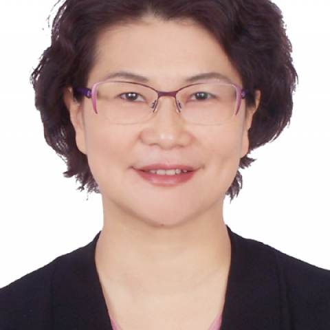

<!-- AUTO-GENERATED-BY: work/generate_obsidian_profiles.py -->

<!-- TEMPLATE: D:\workspace\信息收集整理\医生画像仓库\模板\医生画像模板.md -->

# 唐安丽

## 基础信息

| 字段 | 内容 |
|---|---|
| 姓名 | 唐安丽 |
| 医院 | 中山大学附属第一医院 |
| 科室 | 心内一科 |
| 职称/身份 | 主任医师 |
| 来源链接 | [官网原文](https://www.fahsysu.org.cn/node/920) |
| 采集日期 | 2026-08-13 |

## 简介/擅长

82年中山医科大学毕业后一直在医学院校附属医院心脏内科工作，掌握内科常见病诊治及心血管内科常见、疑难和危重病的诊治。 从事心电生理临床工作20余年，擅长心律失常、心脏起搏、临床电生理和经导管射频消融治疗。 熟悉各类型心脏起搏器植入术、快速性心律失常的射频消融治疗术。 研究方向： 主要研究心脏起搏及射频消融治疗，重点研究心律常的机制和治疗新方法。 主要负责并参与多项国内多中心心律失常的射频消融治疗研究及起搏新技术（ICD、CRT、CRT-D）开展 主要教育和工作经历： 1977-1982 中山医学院医疗系本科 1982.12－1995.12 昆明医学院附属第一医院 1995.12－现在 中山大学附属第一医院 社会兼职： 中华医学会广东省心脏起搏与心电生理分会副主任委员，中国医药生物技术协会心电学技术分会学组全国委员。 中华医学会心电生理和起搏分会起搏学组全国委员。 《中国心脏起搏与心电生理杂志》第六届编辑委员会委员。 论著： 发表第一作者心电生理和起搏相关论文20余篇，其中论著12篇，其中ＳＣＩ文章１篇， 其他主要工作成绩（比如获奖情况） ： “起搏器的应用研究与推广”曾获省级科技进步二等奖一项，院校级科研奖４项，院级优...

## 教育与进修经历

- 82年中山医科大学毕业后一直在医学院校附属医院心脏内科工作，掌握内科常见病诊治及心血管内科常见、疑难和危重病的诊治。
- 医疗特长 ： 82年中山医科大学毕业后一直在医学院校附属医院心脏内科工作，掌握内科常见病诊治及心血管内科常见、疑难和危重病的诊治。

## 科研项目与成果

- 论著： 发表第一作者心电生理和起搏相关论文20余篇，其中论著12篇，其中ＳＣＩ文章１篇， 其他主要工作成绩（比如获奖情况） ： “起搏器的应用研究与推广”曾获省级科技进步二等奖一项，院校级科研奖４项，院级优秀教师２次。

## 论文与学术产出

- 论著： 发表第一作者心电生理和起搏相关论文20余篇，其中论著12篇，其中ＳＣＩ文章１篇， 其他主要工作成绩（比如获奖情况） ： “起搏器的应用研究与推广”曾获省级科技进步二等奖一项，院校级科研奖４项，院级优秀教师２次。

## 可包装亮点

- 82年中山医科大学毕业后一直在医学院校附属医院心脏内科工作，掌握内科常见病诊治及心血管内科常见、疑难和危重病的诊治。
- 医疗特长 ： 82年中山医科大学毕业后一直在医学院校附属医院心脏内科工作，掌握内科常见病诊治及心血管内科常见、疑难和危重病的诊治。
- 主要负责并参与多项国内多中心心律失常的射频消融治疗研究及起搏新技术（ICD、CRT、CRT-D）开展 主要教育和工作经历： 1977-1982 中山医学院医疗系本科 1982.12－1995.12 昆明医学院附属第一医院 1995.12－现在 中山大学附属第一医院 社会兼职： 中华医学会广东省心脏起搏与心电生理分会副主任委员，中国医药生物技术协会心电学技术…
- 中华医学会心电生理和起搏分会起搏学组全国委员。

## 重点疾病/人群标签

- 慢性病：
- 肿瘤：
- 生殖疾病：
- 免疫/风湿：
- 术后恢复/康复：
- 疑难重症：疑难、危重

## 证据摘录

> 只摘录官网公开信息中的短句或关键字段，不复制大段原文。

- 官网身份字段：主任医师
- 官网简介/擅长：82年中山医科大学毕业后一直在医学院校附属医院心脏内科工作，掌握内科常见病诊治及心血管内科常见、疑难和危重病的诊治。 从事心电生理临床工作20余年，擅长心律失常、心脏起搏、临床电生理和经导管射频消融治疗。 熟悉各类型心脏起搏器植入术、快速性心律失常的射频消融治疗术。 研究方向： 主要研究心脏起搏及射频消融治疗，重点研究心律常的机制和治疗新方法。 主要负责并参与多项国内多中心心律失常的射频消融治疗研究及起搏新技术（ICD、CRT、CRT…
- 官网亮眼经历线索：82年中山医科大学毕业后一直在医学院校附属医院心脏内科工作，掌握内科常见病诊治及心血管内科常见、疑难和危重病的诊治。 医疗特长 ： 82年中山医科大学毕业后一直在医学院校附属医院心脏内科工作，掌握内科常见病诊治及心血管内科常见、疑难和危重病的诊治。 主要负责并参与多项国内多中心心律失常的射频消融治疗研究及起搏新技术（ICD、CRT、CRT-D）开展 主要教育和工作经历： 1977-1982 中山医学院医疗系本科 1982.12－199…
- 来源链接：https://www.fahsysu.org.cn/node/920

## BD 画像摘要

唐安丽医生可作为疑难重症方向的基础画像候选。后续 BD 使用应继续以官网来源和人工复核为准，不添加疗效承诺或无来源包装。

## 合规边界

- 仅使用医院官网、官方公众号、官方小程序等公开渠道。
- 不采集私人电话、私人微信、家庭住址、患者隐私或非公开排班信息。
- 不写“保证治愈”“疗效第一”“包治疑难杂症”等无法由官网证明的表述。
