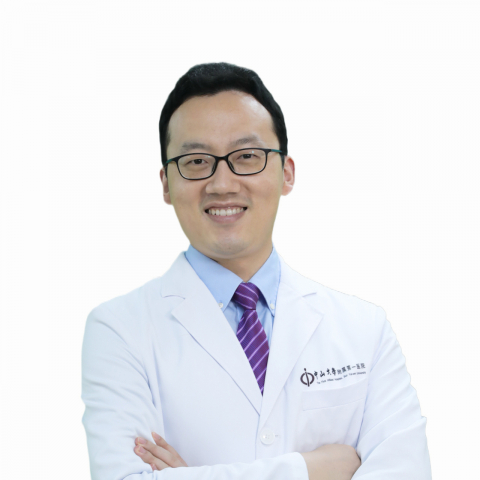

<!-- AUTO-GENERATED-BY: work/generate_obsidian_profiles.py -->

<!-- TEMPLATE: D:\workspace\信息收集整理\医生画像仓库\模板\医生画像模板.md -->

# 唐燕来

## 基础信息

| 字段 | 内容 |
|---|---|
| 姓名 | 唐燕来 |
| 医院 | 中山大学附属第一医院 |
| 科室 | 儿科二科 |
| 职称/身份 | 副主任医师 |
| 来源链接 | [官网原文](https://www.fahsysu.org.cn/node/35712) |
| 采集日期 | 2026-08-13 |

## 简介/擅长

主攻脑瘤如胶质瘤、生殖细胞肿瘤、髓母细胞瘤、室管膜瘤、松果体肿瘤等； 罕见病如神经纤维瘤、朗格罕组织细胞增生症、遗传基因病等； 肉瘤如横纹肌肉瘤、尤文肉瘤、滑膜肉瘤、高级别或未分化肉瘤、骨肉瘤等； 母细胞瘤如神经母细胞瘤、肝母细胞瘤、肾母细胞瘤、视网膜母细胞瘤等； 擅长儿童白血病、淋巴瘤及血小板减少症的诊治。 对肿瘤遗传咨询（如TP53、RB1、NF1、DICER1），靶向治疗、倍利妥免疫治疗及CART、CAR-NK细胞具有丰富研究基础。 临床医学本科、儿科学博士，2015年开始在儿童肿瘤领域工作至今 美国St. Jude儿童医院儿童脑瘤Fellow 香港大学Honorary Research Associate 澳大利亚新南威尔士大学儿童癌症研究所访问学者 悉尼儿童医院及香港儿童医院访问医生 中华医学会儿科分会肿瘤学组专病协作组青年委员 中国医师协会儿童重症医师分会血液学组委员 广东省健康科普促进会儿童血液病和肿瘤分会主任委员 广东省医学会儿科分会青委副主任委员 广东省医师学会儿童血液肿瘤专委会委员 广东省抗癌学会儿童肿瘤专委会委员 主持国家自然科学基金等项目10余项，牵头华南地区多中心临床研究5余项，发表儿童肿瘤高...

## 教育与进修经历

- 临床医学本科、儿科学博士，2015年开始在儿童肿瘤领域工作至今 美国St. Jude儿童医院儿童脑瘤Fellow 香港大学Honorary Research Associate 澳大利亚新南威尔士大学儿童癌症研究所访问学者 悉尼儿童医院及香港儿童医院访问医生 中华医学会儿科分会肿瘤学组专病协作组青年委员 中国医师协会儿童重症医师分会血液学组委员 广东省健康科普促进会儿童血液病和肿瘤分会主任委员 广东省医学会儿科分会青委副主任委员 广东省医师学会儿童血液肿瘤专委会委员 广东省抗癌学会儿童肿瘤专委会委员 主持国家自然…

## 可包装亮点

- 临床医学本科、儿科学博士，2015年开始在儿童肿瘤领域工作至今 美国St. Jude儿童医院儿童脑瘤Fellow 香港大学Honorary Research Associate 澳大利亚新南威尔士大学儿童癌症研究所访问学者 悉尼儿童医院及香港儿童医院访问医生 中华医学会儿科分会肿瘤学组专病协作组青年委员 中国医师协会儿童重症医师分会血液学组委员 广东省健康…

## 重点疾病/人群标签

- 慢性病：
- 肿瘤：肿瘤、癌、瘤、淋巴瘤、白血病、靶向、生殖、免疫、重症、罕见
- 生殖疾病：肿瘤、癌、瘤、淋巴瘤、白血病、靶向、生殖、免疫、重症、罕见
- 免疫/风湿：肿瘤、癌、瘤、淋巴瘤、白血病、靶向、生殖、免疫、重症、罕见
- 术后恢复/康复：
- 疑难重症：肿瘤、癌、瘤、淋巴瘤、白血病、靶向、生殖、免疫、重症、罕见

## 证据摘录

> 只摘录官网公开信息中的短句或关键字段，不复制大段原文。

- 官网身份字段：副主任医师
- 官网简介/擅长：主攻脑瘤如胶质瘤、生殖细胞肿瘤、髓母细胞瘤、室管膜瘤、松果体肿瘤等； 罕见病如神经纤维瘤、朗格罕组织细胞增生症、遗传基因病等； 肉瘤如横纹肌肉瘤、尤文肉瘤、滑膜肉瘤、高级别或未分化肉瘤、骨肉瘤等； 母细胞瘤如神经母细胞瘤、肝母细胞瘤、肾母细胞瘤、视网膜母细胞瘤等； 擅长儿童白血病、淋巴瘤及血小板减少症的诊治。 对肿瘤遗传咨询（如TP53、RB1、NF1、DICER1），靶向治疗、倍利妥免疫治疗及CART、CAR-NK细胞具有丰富研究基…
- 官网亮眼经历线索：临床医学本科、儿科学博士，2015年开始在儿童肿瘤领域工作至今 美国St. Jude儿童医院儿童脑瘤Fellow 香港大学Honorary Research Associate 澳大利亚新南威尔士大学儿童癌症研究所访问学者 悉尼儿童医院及香港儿童医院访问医生 中华医学会儿科分会肿瘤学组专病协作组青年委员 中国医师协会儿童重症医师分会血液学组委员 广东省健康科普促进会儿童血液病和肿瘤分会主任委员 广东省医学会儿科分会青委副主任委员 广东…
- 来源链接：https://www.fahsysu.org.cn/node/35712

## BD 画像摘要

唐燕来医生可作为肿瘤、生殖疾病、免疫/风湿/感染、疑难重症方向的基础画像候选。后续 BD 使用应继续以官网来源和人工复核为准，不添加疗效承诺或无来源包装。

## 合规边界

- 仅使用医院官网、官方公众号、官方小程序等公开渠道。
- 不采集私人电话、私人微信、家庭住址、患者隐私或非公开排班信息。
- 不写“保证治愈”“疗效第一”“包治疑难杂症”等无法由官网证明的表述。
