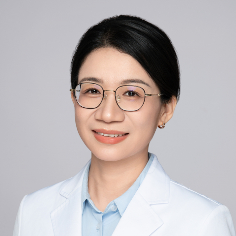

<!-- AUTO-GENERATED-BY: work/generate_obsidian_profiles.py -->

<!-- TEMPLATE: D:\workspace\信息收集整理\医生画像仓库\模板\医生画像模板.md -->

# 喻爽

## 基础信息

| 字段 | 内容 |
|---|---|
| 姓名 | 喻爽 |
| 医院 | 中山大学附属第一医院 |
| 科室 | 内分泌内科 |
| 职称/身份 | 主任医师 |
| 来源链接 | [官网原文](https://www.fahsysu.org.cn/node/844) |
| 采集日期 | 2026-08-13 |

## 简介/擅长

糖尿病、甲状腺疾病（如甲亢、甲减、甲状腺炎、甲状腺结节）、肾上腺疾病（如肾上腺肿瘤、原发性醛固酮增多症、嗜铬细胞瘤）、垂体疾病、肥胖症、继发性高血压、骨质疏松等内分泌代谢疾病的诊治，尤其在糖尿病、甲状腺疾病、肾上腺疾病、肥胖症领域具有丰富的临床经验。 工作经历： 本科毕业于中南大学湘雅医学院，硕士研究生阶段就读于中国科学院，博士就读于中山大学，博士毕业后留院至今，长期工作于临床一线，先后担任住院医师、主治医师、副主任医师及主任医师，积累了丰富的内分泌疾病诊疗经验。 学术任职： 广东省医学会内分泌学分会常委 广东省健康管理学会代谢与内分泌学专业委员会常委 广东省健康管理学会甲状腺病学专业委员会常委 广东省医学教育协会糖尿病专业委员会常委、秘书 中华医学会内分泌学分会肾上腺学组组员 中国医师协会内分泌代谢分会肾上腺学组委员 研究方向： 糖尿病、甲状腺疾病和肾上腺肿瘤的综合管理和发病机制研究，在该研究方向发表多篇高水平学术论文，相关研究成果在权威杂志Engineering、Oncogene、JCEM和Thyroid等发表。

## 教育与进修经历

- 工作经历： 本科毕业于中南大学湘雅医学院，硕士研究生阶段就读于中国科学院，博士就读于中山大学，博士毕业后留院至今，长期工作于临床一线，先后担任住院医师、主治医师、副主任医师及主任医师，积累了丰富的内分泌疾病诊疗经验。

## 科研项目与成果

- 学术任职： 广东省医学会内分泌学分会常委 广东省健康管理学会代谢与内分泌学专业委员会常委 广东省健康管理学会甲状腺病学专业委员会常委 广东省医学教育协会糖尿病专业委员会常委、秘书 中华医学会内分泌学分会肾上腺学组组员 中国医师协会内分泌代谢分会肾上腺学组委员 研究方向： 糖尿病、甲状腺疾病和肾上腺肿瘤的综合管理和发病机制研究，在该研究方向发表多篇高水平学术论文，相关研究成果在权威杂志Engineering、Oncogene、JCEM和Thyroid等发表。

## 论文与学术产出

- 学术任职： 广东省医学会内分泌学分会常委 广东省健康管理学会代谢与内分泌学专业委员会常委 广东省健康管理学会甲状腺病学专业委员会常委 广东省医学教育协会糖尿病专业委员会常委、秘书 中华医学会内分泌学分会肾上腺学组组员 中国医师协会内分泌代谢分会肾上腺学组委员 研究方向： 糖尿病、甲状腺疾病和肾上腺肿瘤的综合管理和发病机制研究，在该研究方向发表多篇高水平学术论文，相关研究成果在权威杂志Engineering、Oncogene、JCEM和Thyroid等发表。

## 可包装亮点

- 工作经历： 本科毕业于中南大学湘雅医学院，硕士研究生阶段就读于中国科学院，博士就读于中山大学，博士毕业后留院至今，长期工作于临床一线，先后担任住院医师、主治医师、副主任医师及主任医师，积累了丰富的内分泌疾病诊疗经验。
- 学术任职： 广东省医学会内分泌学分会常委 广东省健康管理学会代谢与内分泌学专业委员会常委 广东省健康管理学会甲状腺病学专业委员会常委 广东省医学教育协会糖尿病专业委员会常委、秘书 中华医学会内分泌学分会肾上腺学组组员 中国医师协会内分泌代谢分会肾上腺学组委员 研究方向： 糖尿病、甲状腺疾病和肾上腺肿瘤的综合管理和发病机制研究，在该研究方向发表多篇高水平学术…

## 重点疾病/人群标签

- 慢性病：高血压、糖尿病、代谢、肿瘤、瘤
- 肿瘤：高血压、糖尿病、代谢、肿瘤、瘤
- 生殖疾病：
- 免疫/风湿：
- 术后恢复/康复：
- 疑难重症：

## 证据摘录

> 只摘录官网公开信息中的短句或关键字段，不复制大段原文。

- 官网身份字段：主任医师
- 官网简介/擅长：糖尿病、甲状腺疾病（如甲亢、甲减、甲状腺炎、甲状腺结节）、肾上腺疾病（如肾上腺肿瘤、原发性醛固酮增多症、嗜铬细胞瘤）、垂体疾病、肥胖症、继发性高血压、骨质疏松等内分泌代谢疾病的诊治，尤其在糖尿病、甲状腺疾病、肾上腺疾病、肥胖症领域具有丰富的临床经验。 工作经历： 本科毕业于中南大学湘雅医学院，硕士研究生阶段就读于中国科学院，博士就读于中山大学，博士毕业后留院至今，长期工作于临床一线，先后担任住院医师、主治医师、副主任医师及主任医师，积…
- 官网亮眼经历线索：工作经历： 本科毕业于中南大学湘雅医学院，硕士研究生阶段就读于中国科学院，博士就读于中山大学，博士毕业后留院至今，长期工作于临床一线，先后担任住院医师、主治医师、副主任医师及主任医师，积累了丰富的内分泌疾病诊疗经验。 学术任职： 广东省医学会内分泌学分会常委 广东省健康管理学会代谢与内分泌学专业委员会常委 广东省健康管理学会甲状腺病学专业委员会常委 广东省医学教育协会糖尿病专业委员会常委、秘书 中华医学会内分泌学分会肾上腺学组组员 中…
- 来源链接：https://www.fahsysu.org.cn/node/844

## BD 画像摘要

喻爽医生可作为慢性病、肿瘤方向的基础画像候选。后续 BD 使用应继续以官网来源和人工复核为准，不添加疗效承诺或无来源包装。

## 合规边界

- 仅使用医院官网、官方公众号、官方小程序等公开渠道。
- 不采集私人电话、私人微信、家庭住址、患者隐私或非公开排班信息。
- 不写“保证治愈”“疗效第一”“包治疑难杂症”等无法由官网证明的表述。
