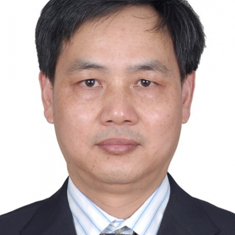

<!-- AUTO-GENERATED-BY: work/generate_obsidian_profiles.py -->

<!-- TEMPLATE: D:\workspace\信息收集整理\医生画像仓库\模板\医生画像模板.md -->

# 夏之柏

## 基础信息

| 字段 | 内容 |
|---|---|
| 姓名 | 夏之柏 |
| 医院 | 中山大学附属第一医院 |
| 科室 | 神经外科 |
| 职称/身份 | 主任医师 |
| 来源链接 | [官网原文](https://www.fahsysu.org.cn/node/637) |
| 采集日期 | 2026-08-13 |

## 简介/擅长

一直从事神经外科医教研工作，熟练掌握神经外科常见病和多发病的诊断和治疗，处理各类神经外科疑难疾病的能力强，熟练掌握神经外科显微(微创)手术技术，并将熟练的显微手术技巧常规应用到临床手术，独立完成各类高中难度神经外科(显微)手术2000余例，手术效果佳。 以各类脑肿瘤、先天性颅内疾病等的诊断和治疗为主攻方向，尤其擅长各类脑肿瘤如脑胶质瘤(星形细胞瘤、室管膜瘤和髓母细胞瘤等)、脑膜瘤、(听)神经鞘瘤及胆脂瘤等的显微(微创)手术治疗。 教育经历： 1985年安徽医科大学临床医学系本科毕业，获学士学位，1992、2001年分别于东南大学、天津医科大学获神经外科硕士、博士学位，2001-2003年中山大学附属第一医院神经外科临床博士后。 研究方向： 1、脑肿瘤显微(微创)手术技术与技巧的临床研究 2、脑胶质瘤分子诊断与基因治疗的研究 社会兼职： 卫生部医学人才评价专家，广东省医学会神经外科学会委员兼秘书，国家自然科学基金评议专家，广东省和广州市科技评议专家，广东省和广州市伤残鉴定专家，《中华实验外科杂志》《中华临床医师杂志》特约编委。 论著： 已发表论文100余篇，其中第一作者、通讯作者发表论著30余篇，SCI、PubMed等收...

## 教育与进修经历

- 教育经历：1985年安徽医科大学临床医学系本科毕业，获学士学位，1992、2001年分别于东南大学、天津医科大学获神经外科硕士、博士学位，2001-2003年中山大学附属第一医院神经外科临床博士后。

## 科研项目与成果

- 研究方向： 1、脑肿瘤显微(微创)手术技术与技巧的临床研究 2、脑胶质瘤分子诊断与基因治疗的研究 社会兼职： 卫生部医学人才评价专家，广东省医学会神经外科学会委员兼秘书，国家自然科学基金评议专家，广东省和广州市科技评议专家，广东省和广州市伤残鉴定专家，《中华实验外科杂志》《中华临床医师杂志》特约编委。

## 论文与学术产出

- 论著： 已发表论文100余篇，其中第一作者、通讯作者发表论著30余篇，SCI、PubMed等收录论文12篇，近年来发表论著：(仅列出近5年第一作者、通讯作者) 1. AURKA maintains self-renewal in glioma-initiating cells through the stabilization of β-catenin and activation of Wnt signaling. Mol Cancer Res. 2013 Jun 12. [Epub ahead of prin…
- 23(3):725-32. (SCI收录 ) 3. Clinical signi?cance of astrocyte elevated gene-1 expression in human oligodendrogliomas. Clin Neurol Neurosurg. 2010;
- 112(5):413-9. (SCI 收录) 4. Wild Type p53 Gene Sensitizes Rat C6 Glioma Cells to HSV-TK/ACV Treatment In Vitro and In Vivo. Pathol Oncol Res. 2010;
- 16(4):509-14 (SCI 收录 ) 5. 敲低Aurora A基因增强替莫唑胺抗人脑胶质瘤U87细胞的作用. 中国神经精神疾病杂志 2012，05：284-288 6. 脑室引流术后化脓性脑室炎继发脑性耗盐综合征. 中国神经精神疾病杂志 2011，06：374-276 7. 泡膜蛋白-1在星形细胞肿瘤中的表达以及预后关系的研究.中华显微外科杂志, 2009,32（6）:59-61 8. 少支胶质细胞肿瘤的分子遗传学特征及其临床意义. 国际神经病学神经外科学杂志，2008，01：25-28 9. 不同级别…

## 可包装亮点

- 一直从事神经外科医教研工作，熟练掌握神经外科常见病和多发病的诊断和治疗，处理各类神经外科疑难疾病的能力强，熟练掌握神经外科显微(微创)手术技术，并将熟练的显微手术技巧常规应用到临床手术，独立完成各类高中难度神经外科(显微)手术2000余例，手术效果佳。
- 医疗特长： 一直从事神经外科医教研工作，熟练掌握神经外科常见病和多发病的诊断和治疗，处理各类神经外科疑难疾病的能力强，熟练掌握神经外科显微(微创)手术技术，并将熟练的显微手术技巧常规应用到临床手术，独立完成各类高中难度神经外科(显微)手术2000余例，手术效果佳。
- 研究方向： 1、脑肿瘤显微(微创)手术技术与技巧的临床研究 2、脑胶质瘤分子诊断与基因治疗的研究 社会兼职： 卫生部医学人才评价专家，广东省医学会神经外科学会委员兼秘书，国家自然科学基金评议专家，广东省和广州市科技评议专家，广东省和广州市伤残鉴定专家，《中华实验外科杂志》《中华临床医师杂志》特约编委。
- 论著： 已...

## 重点疾病/人群标签

- 慢性病：
- 肿瘤：肿瘤、癌、瘤、淋巴瘤、术后、疑难、复杂
- 生殖疾病：
- 免疫/风湿：
- 术后恢复/康复：肿瘤、癌、瘤、淋巴瘤、术后、疑难、复杂
- 疑难重症：肿瘤、癌、瘤、淋巴瘤、术后、疑难、复杂

## 证据摘录

> 只摘录官网公开信息中的短句或关键字段，不复制大段原文。

- 官网身份字段：主任医师
- 官网简介/擅长：一直从事神经外科医教研工作，熟练掌握神经外科常见病和多发病的诊断和治疗，处理各类神经外科疑难疾病的能力强，熟练掌握神经外科显微(微创)手术技术，并将熟练的显微手术技巧常规应用到临床手术，独立完成各类高中难度神经外科(显微)手术2000余例，手术效果佳。 以各类脑肿瘤、先天性颅内疾病等的诊断和治疗为主攻方向，尤其擅长各类脑肿瘤如脑胶质瘤(星形细胞瘤、室管膜瘤和髓母细胞瘤等)、脑膜瘤、(听)神经鞘瘤及胆脂瘤等的显微(微创)手术治疗。 教育…
- 官网亮眼经历线索：一直从事神经外科医教研工作，熟练掌握神经外科常见病和多发病的诊断和治疗，处理各类神经外科疑难疾病的能力强，熟练掌握神经外科显微(微创)手术技术，并将熟练的显微手术技巧常规应用到临床手术，独立完成各类高中难度神经外科(显微)手术2000余例，手术效果佳。 医疗特长： 一直从事神经外科医教研工作，熟练掌握神经外科常见病和多发病的诊断和治疗，处理各类神经外科疑难疾病的能力强，熟练掌握神经外科显微(微创)手术技术，并将熟练的显微手术技巧常规应…
- 来源链接：https://www.fahsysu.org.cn/node/637

## BD 画像摘要

夏之柏医生可作为肿瘤、术后恢复/康复、疑难重症方向的基础画像候选。后续 BD 使用应继续以官网来源和人工复核为准，不添加疗效承诺或无来源包装。

## 合规边界

- 仅使用医院官网、官方公众号、官方小程序等公开渠道。
- 不采集私人电话、私人微信、家庭住址、患者隐私或非公开排班信息。
- 不写“保证治愈”“疗效第一”“包治疑难杂症”等无法由官网证明的表述。
