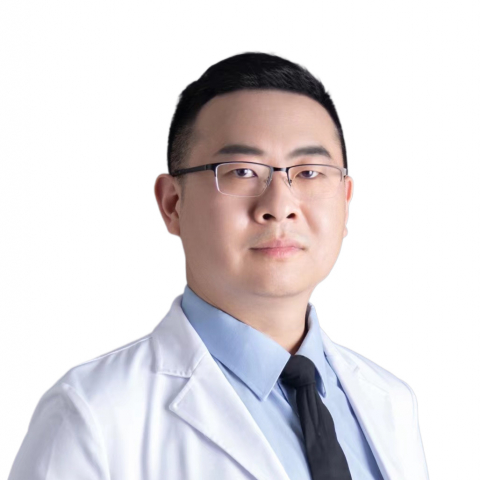

<!-- AUTO-GENERATED-BY: work/generate_obsidian_profiles.py -->

<!-- TEMPLATE: D:\workspace\信息收集整理\医生画像仓库\模板\医生画像模板.md -->

# 夏延哲

## 基础信息

| 字段 | 内容 |
|---|---|
| 姓名 | 夏延哲 |
| 医院 | 中山大学附属第一医院 |
| 科室 | 药学部 |
| 职称/身份 | 副主任药师 |
| 来源链接 | [官网原文](https://www.fahsysu.org.cn/node/33213) |
| 采集日期 | 2026-08-13 |

## 简介/擅长

1.胃肠间质瘤靶向药物治疗管理，靶向药物浓度监测及个体化给药； 2.胃肠间质瘤靶向药物不良反应，皮疹、腹泻、高血压、手足皮肤反应等治疗； 3.感染性疾病抗菌药物治疗及个体化给药。 研究方向：临床药理学及临床药学，药物代谢与基因组学，胃肠间质瘤靶向药物及抗菌药物精准用药 教育经历： 2005.9-2009.7 中山大学，药学，学士 2009.9-2012.7 中山大学，药理学，硕士 工作经历： 2012.7-2015.12 中山大学附属第一医院，药师，临床药师 2016.1-2022.12中山大学附属第一医院，主管药师，临床药师 2023.1-至今 中山大学附属第一医院，副主任药师，临床药师 社会兼职：中国抗癌协会中西医整合胃肠间质瘤专委会委员，广东省药学会重症医学用药专家委员会委员，广东省药学会肿瘤用药专家委员会委员，广东省药学会免疫抑制剂专家委员会委员，广东省药学会临床药学服务与实践专家委员会委员，广东省药理学会家庭药师专业委员会委员。 科研：发表SCI论文15篇，中文核心10篇，主持广东省卫健委基金及横向课题3项。

## 科研项目与成果

- 科研：发表SCI论文15篇，中文核心10篇，主持广东省卫健委基金及横向课题3项。

## 论文与学术产出

- 科研：发表SCI论文15篇，中文核心10篇，主持广东省卫健委基金及横向课题3项。

## 可包装亮点

- 研究方向：临床药理学及临床药学，药物代谢与基因组学，胃肠间质瘤靶向药物及抗菌药物精准用药 教育经历： 2005.9-2009.7 中山大学，药学，学士 2009.9-2012.7 中山大学，药理学，硕士 工作经历： 2012.7-2015.12 中山大学附属第一医院，药师，临床药师 2016.1-2022.12中山大学附属第一医院，主管药师，临床药师 20…
- 科研：发表SCI论文15篇，中文核心10篇，主持广东省卫健委基金及横向课题3项。

## 重点疾病/人群标签

- 慢性病：高血压、代谢、肿瘤、癌、瘤、靶向、免疫、感染、重症
- 肿瘤：高血压、代谢、肿瘤、癌、瘤、靶向、免疫、感染、重症
- 生殖疾病：
- 免疫/风湿：高血压、代谢、肿瘤、癌、瘤、靶向、免疫、感染、重症
- 术后恢复/康复：
- 疑难重症：高血压、代谢、肿瘤、癌、瘤、靶向、免疫、感染、重症

## 证据摘录

> 只摘录官网公开信息中的短句或关键字段，不复制大段原文。

- 官网身份字段：副主任药师
- 官网简介/擅长：1.胃肠间质瘤靶向药物治疗管理，靶向药物浓度监测及个体化给药； 2.胃肠间质瘤靶向药物不良反应，皮疹、腹泻、高血压、手足皮肤反应等治疗； 3.感染性疾病抗菌药物治疗及个体化给药。 研究方向：临床药理学及临床药学，药物代谢与基因组学，胃肠间质瘤靶向药物及抗菌药物精准用药 教育经历： 2005.9-2009.7 中山大学，药学，学士 2009.9-2012.7 中山大学，药理学，硕士 工作经历： 2012.7-2015.12 中山大学附属…
- 官网亮眼经历线索：研究方向：临床药理学及临床药学，药物代谢与基因组学，胃肠间质瘤靶向药物及抗菌药物精准用药 教育经历： 2005.9-2009.7 中山大学，药学，学士 2009.9-2012.7 中山大学，药理学，硕士 工作经历： 2012.7-2015.12 中山大学附属第一医院，药师，临床药师 2016.1-2022.12中山大学附属第一医院，主管药师，临床药师 2023.1-至今 中山大学附属第一医院，副主任药师，临床药师 社会兼职：中国抗癌协…
- 来源链接：https://www.fahsysu.org.cn/node/33213

## BD 画像摘要

夏延哲医生可作为慢性病、肿瘤、免疫/风湿/感染、疑难重症方向的基础画像候选。后续 BD 使用应继续以官网来源和人工复核为准，不添加疗效承诺或无来源包装。

## 合规边界

- 仅使用医院官网、官方公众号、官方小程序等公开渠道。
- 不采集私人电话、私人微信、家庭住址、患者隐私或非公开排班信息。
- 不写“保证治愈”“疗效第一”“包治疑难杂症”等无法由官网证明的表述。
