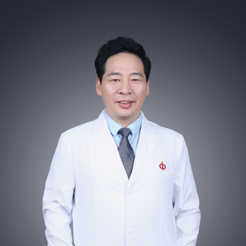

<!-- AUTO-GENERATED-BY: work/generate_obsidian_profiles.py -->

<!-- TEMPLATE: D:\workspace\信息收集整理\医生画像仓库\模板\医生画像模板.md -->

# 姚书忠

## 基础信息

| 字段 | 内容 |
|---|---|
| 姓名 | 姚书忠 |
| 医院 | 中山大学附属第一医院 |
| 科室 | 妇科 |
| 职称/身份 | 主任医师/教授 |
| 来源链接 | [官网原文](https://www.fahsysu.org.cn/node/577) |
| 采集日期 | 2026-08-13 |

## 简介/擅长

专注于妇科内镜手术治疗良、恶性妇科肿瘤，特别是对子宫恶性肿瘤及深部浸润型子宫内膜异位症的腹腔镜手术治疗有独特的经验，可开展腹腔镜下广泛子宫切除、盆腔及腹主动脉旁淋巴结清扫、肠道子宫内膜异位症切除及肠管吻合、泌尿系子宫内膜异位症病灶切除、输尿管端端吻合、输尿管膀胱种植等复杂手术。 是国内率先开展腹腔镜子宫峡部环扎术治疗宫颈机能不全的专家之一。

## 可包装亮点

- 是国内率先开展腹腔镜子宫峡部环扎术治疗宫颈机能不全的专家之一。

## 重点疾病/人群标签

- 慢性病：
- 肿瘤：肿瘤、复杂
- 生殖疾病：
- 免疫/风湿：
- 术后恢复/康复：
- 疑难重症：肿瘤、复杂

## 证据摘录

> 只摘录官网公开信息中的短句或关键字段，不复制大段原文。

- 官网身份字段：主任医师/教授
- 官网简介/擅长：专注于妇科内镜手术治疗良、恶性妇科肿瘤，特别是对子宫恶性肿瘤及深部浸润型子宫内膜异位症的腹腔镜手术治疗有独特的经验，可开展腹腔镜下广泛子宫切除、盆腔及腹主动脉旁淋巴结清扫、肠道子宫内膜异位症切除及肠管吻合、泌尿系子宫内膜异位症病灶切除、输尿管端端吻合、输尿管膀胱种植等复杂手术。 是国内率先开展腹腔镜子宫峡部环扎术治疗宫颈机能不全的专家之一。
- 官网亮眼经历线索：是国内率先开展腹腔镜子宫峡部环扎术治疗宫颈机能不全的专家之一。 是国内率先开展腹腔镜子宫峡部环扎术治疗宫颈机能不全的专家之一。
- 来源链接：https://www.fahsysu.org.cn/node/577

## BD 画像摘要

姚书忠医生可作为肿瘤、疑难重症方向的基础画像候选。后续 BD 使用应继续以官网来源和人工复核为准，不添加疗效承诺或无来源包装。

## 合规边界

- 仅使用医院官网、官方公众号、官方小程序等公开渠道。
- 不采集私人电话、私人微信、家庭住址、患者隐私或非公开排班信息。
- 不写“保证治愈”“疗效第一”“包治疑难杂症”等无法由官网证明的表述。
