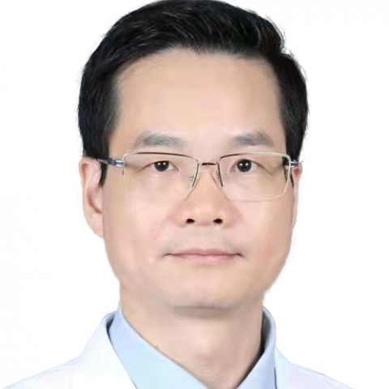

<!-- AUTO-GENERATED-BY: work/generate_obsidian_profiles.py -->

<!-- TEMPLATE: D:\workspace\信息收集整理\医生画像仓库\模板\医生画像模板.md -->

# 姚尖平

## 基础信息

| 字段 | 内容 |
|---|---|
| 姓名 | 姚尖平 |
| 医院 | 中山大学附属第一医院 |
| 科室 | 心脏外科 |
| 职称/身份 | 主任医师 |
| 来源链接 | [官网原文](https://www.fahsysu.org.cn/node/951) |
| 采集日期 | 2026-08-13 |

## 简介/擅长

在心脏外科临床工作30年，拥有丰 富 手术经验 。 擅长心脏瓣膜病、冠心病、主动脉夹层、主动脉根部大血管疾病 等多种心血管疾病的 外科治疗 ， 手术治愈率>98%。 学术任职： 广东省生理学会心血管专业委员会主任委员 广东省医学会心血管外科分会常务委员 广东省医师协会心血管外科医师分会常务委员、秘书

## 可包装亮点

- 学术任职： 广东省生理学会心血管专业委员会主任委员 广东省医学会心血管外科分会常务委员 广东省医师协会心血管外科医师分会常务委员、秘书

## 重点疾病/人群标签

- 慢性病：冠心病
- 肿瘤：
- 生殖疾病：
- 免疫/风湿：
- 术后恢复/康复：
- 疑难重症：

## 证据摘录

> 只摘录官网公开信息中的短句或关键字段，不复制大段原文。

- 官网身份字段：主任医师
- 官网简介/擅长：在心脏外科临床工作30年，拥有丰 富 手术经验 。 擅长心脏瓣膜病、冠心病、主动脉夹层、主动脉根部大血管疾病 等多种心血管疾病的 外科治疗 ， 手术治愈率>98%。 学术任职： 广东省生理学会心血管专业委员会主任委员 广东省医学会心血管外科分会常务委员 广东省医师协会心血管外科医师分会常务委员、秘书
- 官网亮眼经历线索：学术任职： 广东省生理学会心血管专业委员会主任委员 广东省医学会心血管外科分会常务委员 广东省医师协会心血管外科医师分会常务委员、秘书
- 来源链接：https://www.fahsysu.org.cn/node/951

## BD 画像摘要

姚尖平医生可作为慢性病方向的基础画像候选。后续 BD 使用应继续以官网来源和人工复核为准，不添加疗效承诺或无来源包装。

## 合规边界

- 仅使用医院官网、官方公众号、官方小程序等公开渠道。
- 不采集私人电话、私人微信、家庭住址、患者隐私或非公开排班信息。
- 不写“保证治愈”“疗效第一”“包治疑难杂症”等无法由官网证明的表述。
