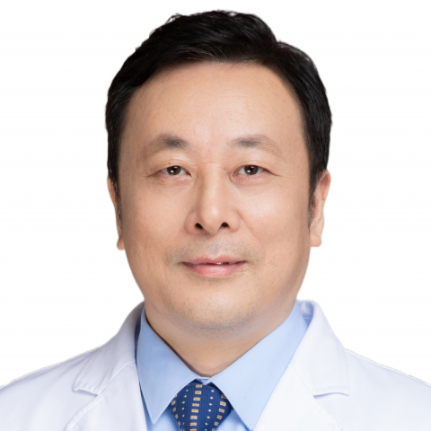

<!-- AUTO-GENERATED-BY: work/generate_obsidian_profiles.py -->

<!-- TEMPLATE: D:\workspace\信息收集整理\医生画像仓库\模板\医生画像模板.md -->

# 孙灿辉

## 基础信息

| 字段 | 内容 |
|---|---|
| 姓名 | 孙灿辉 |
| 医院 | 中山大学附属第一医院 |
| 科室 | 放射诊断专科 |
| 职称/身份 | 主任医师 |
| 来源链接 | [官网原文](https://www.fahsysu.org.cn/node/5567) |
| 采集日期 | 2026-08-13 |

## 简介/擅长

腹部疾病的影像学诊断，尤其在肝胆、胰腺及胃肠道先天性发育畸形、肿瘤和炎症性疾病CT、MRI诊断、肝移植术前和术后影像学评估方面积累了丰富的临床经验。 从事临床、教学和科研工作约30年。 研究方向是消化系统疾病影像诊断与影像新技术的临床应用。 吴阶平医学基金会炎症性肠病联盟影像学专业委员会委员，中华医学会消化病学分会第十届委员会消化影像协作组委员、副组长。 以第一作者或通讯作者在中文核心期刊及SCI收录期刊发表论文40余篇。 副主编、参编及参译著作5本。 主持国家自然科学基金、省部级基金4项。 美国哈佛医学院麻省总医院及Martinos生物医学中心访问学者。 曾获中华放射学杂志创刊60周年特殊贡献奖。

## 教育与进修经历

- 美国哈佛医学院麻省总医院及Martinos生物医学中心访问学者。

## 科研项目与成果

- 从事临床、教学和科研工作约30年。
- 吴阶平医学基金会炎症性肠病联盟影像学专业委员会委员，中华医学会消化病学分会第十届委员会消化影像协作组委员、副组长。
- 主持国家自然科学基金、省部级基金4项。

## 论文与学术产出

- 以第一作者或通讯作者在中文核心期刊及SCI收录期刊发表论文40余篇。
- 副主编、参编及参译著作5本。

## 可包装亮点

- 吴阶平医学基金会炎症性肠病联盟影像学专业委员会委员，中华医学会消化病学分会第十届委员会消化影像协作组委员、副组长。
- 以第一作者或通讯作者在中文核心期刊及SCI收录期刊发表论文40余篇。
- 主持国家自然科学基金、省部级基金4项。
- 美国哈佛医学院麻省总医院及Martinos生物医学中心访问学者。

## 重点疾病/人群标签

- 慢性病：
- 肿瘤：肿瘤、术后
- 生殖疾病：
- 免疫/风湿：
- 术后恢复/康复：肿瘤、术后
- 疑难重症：

## 证据摘录

> 只摘录官网公开信息中的短句或关键字段，不复制大段原文。

- 官网身份字段：主任医师
- 官网简介/擅长：腹部疾病的影像学诊断，尤其在肝胆、胰腺及胃肠道先天性发育畸形、肿瘤和炎症性疾病CT、MRI诊断、肝移植术前和术后影像学评估方面积累了丰富的临床经验。 从事临床、教学和科研工作约30年。 研究方向是消化系统疾病影像诊断与影像新技术的临床应用。 吴阶平医学基金会炎症性肠病联盟影像学专业委员会委员，中华医学会消化病学分会第十届委员会消化影像协作组委员、副组长。 以第一作者或通讯作者在中文核心期刊及SCI收录期刊发表论文40余篇。 副主编、参…
- 官网亮眼经历线索：吴阶平医学基金会炎症性肠病联盟影像学专业委员会委员，中华医学会消化病学分会第十届委员会消化影像协作组委员、副组长。 以第一作者或通讯作者在中文核心期刊及SCI收录期刊发表论文40余篇。 主持国家自然科学基金、省部级基金4项。 美国哈佛医学院麻省总医院及Martinos生物医学中心访问学者。
- 来源链接：https://www.fahsysu.org.cn/node/5567

## BD 画像摘要

孙灿辉医生可作为肿瘤、术后恢复/康复方向的基础画像候选。后续 BD 使用应继续以官网来源和人工复核为准，不添加疗效承诺或无来源包装。

## 合规边界

- 仅使用医院官网、官方公众号、官方小程序等公开渠道。
- 不采集私人电话、私人微信、家庭住址、患者隐私或非公开排班信息。
- 不写“保证治愈”“疗效第一”“包治疑难杂症”等无法由官网证明的表述。
