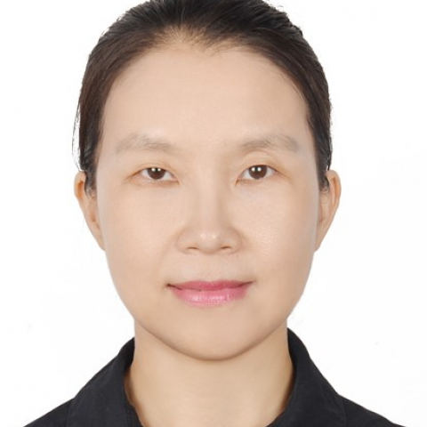

<!-- AUTO-GENERATED-BY: work/generate_obsidian_profiles.py -->

<!-- TEMPLATE: D:\workspace\信息收集整理\医生画像仓库\模板\医生画像模板.md -->

# 孟君

## 基础信息

| 字段 | 内容 |
|---|---|
| 姓名 | 孟君 |
| 医院 | 中山大学附属第一医院 |
| 科室 | 中医科 |
| 职称/身份 | 副主任医师 |
| 来源链接 | [官网原文](https://www.fahsysu.org.cn/node/5727) |
| 采集日期 | 2026-08-13 |

## 简介/擅长

①.脾胃为后天之本：擅长从脾胃入手解决消化系统疾病、小儿咳嗽、消化不良和高尿酸血症、高脂血症等代谢性疾病及心脑血管疾病②.女子肝为先天，人过四十阴气自半：擅长从肝肾论治月经不调、失眠及更年期综合征 研究方向： ①中医心脑血管：冠心病、高血压、心脏术后心律失常、体能下降等 ②胃胀、嗳气、反酸等消化不良、 胃炎、溃疡③失眠、月经不调、更年期综合征④咳嗽、湿疹、上热下寒等其他杂症 主要教育和工作经历： 教育经历：2000-2003中山大学附属第一医院，硕士; 1990-1995新疆医科大学，本科。 工作经历：2003-至今 中山大学附属第一医院，临床医师; 1995-2000，新疆医科大学附属第一医院，临床医师 社会兼职：广东省中西医结合学会心脑血管病专业委员会，委员 论著：参与编著《中医养生文化与方法》 专著：无 其他主要工作成绩（比如获奖情况）：

## 可包装亮点

- 1995-2000，新疆医科大学附属第一医院，临床医师 社会兼职：广东省中西医结合学会心脑血管病专业委员会，委员 论著：参与编著《中医养生文化与方法》 专著：无 其他主要工作成绩（比如获奖情况）：

## 重点疾病/人群标签

- 慢性病：高血压、冠心病、高脂血症、代谢、月经、术后
- 肿瘤：
- 生殖疾病：高血压、冠心病、高脂血症、代谢、月经、术后
- 免疫/风湿：
- 术后恢复/康复：高血压、冠心病、高脂血症、代谢、月经、术后
- 疑难重症：

## 证据摘录

> 只摘录官网公开信息中的短句或关键字段，不复制大段原文。

- 官网身份字段：副主任医师
- 官网简介/擅长：①.脾胃为后天之本：擅长从脾胃入手解决消化系统疾病、小儿咳嗽、消化不良和高尿酸血症、高脂血症等代谢性疾病及心脑血管疾病②.女子肝为先天，人过四十阴气自半：擅长从肝肾论治月经不调、失眠及更年期综合征 研究方向： ①中医心脑血管：冠心病、高血压、心脏术后心律失常、体能下降等 ②胃胀、嗳气、反酸等消化不良、 胃炎、溃疡③失眠、月经不调、更年期综合征④咳嗽、湿疹、上热下寒等其他杂症 主要教育和工作经历： 教育经历：2000-2003中山大学附…
- 官网亮眼经历线索：1995-2000，新疆医科大学附属第一医院，临床医师 社会兼职：广东省中西医结合学会心脑血管病专业委员会，委员 论著：参与编著《中医养生文化与方法》 专著：无 其他主要工作成绩（比如获奖情况）：
- 来源链接：https://www.fahsysu.org.cn/node/5727

## BD 画像摘要

孟君医生可作为慢性病、生殖疾病、术后恢复/康复方向的基础画像候选。后续 BD 使用应继续以官网来源和人工复核为准，不添加疗效承诺或无来源包装。

## 合规边界

- 仅使用医院官网、官方公众号、官方小程序等公开渠道。
- 不采集私人电话、私人微信、家庭住址、患者隐私或非公开排班信息。
- 不写“保证治愈”“疗效第一”“包治疑难杂症”等无法由官网证明的表述。
