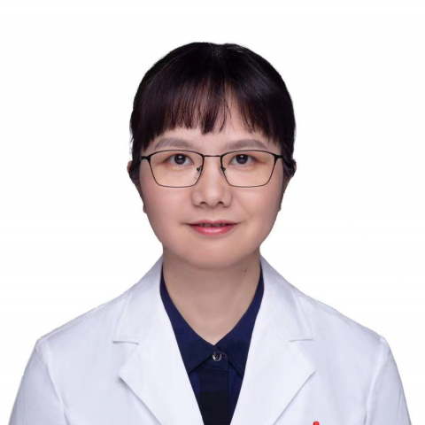

<!-- AUTO-GENERATED-BY: work/generate_obsidian_profiles.py -->

<!-- TEMPLATE: D:\workspace\信息收集整理\医生画像仓库\模板\医生画像模板.md -->

# 岳智慧

## 基础信息

| 字段 | 内容 |
|---|---|
| 姓名 | 岳智慧 |
| 医院 | 中山大学附属第一医院 |
| 科室 | 儿科一科 |
| 职称/身份 | 副主任医师 |
| 来源链接 | [官网原文](https://www.fahsysu.org.cn/node/856) |
| 采集日期 | 2026-08-13 |

## 简介/擅长

长期在儿科临床工作，熟练掌握儿童呼吸系统常见病、多发性诊治，擅长小儿呼吸系统感染、过敏及睡眠相关呼吸障碍等疾病诊治：包括哮喘、肺炎、鼻炎、睡眠呼吸暂停、肺含铁血黄素沉着症、慢性咳嗽、上呼吸道感染、鼻窦炎、气管炎、支气管炎、毛细支气管炎等疾病及小儿基础疾病如肾脏病等呼吸系统受累诊治。 熟练掌握儿童肺功能评估。 中山医科大学临床医学系毕业后一直在本院工作，曾至美国华盛顿大学圣路易斯儿童医院进修。 社会兼职：广东省医学会变态反应学分会委员，广东省妇幼保健协会儿科专业委员会副主任委员，中国医药教育协会儿科专业委员会委员，中国妇幼保健协会儿童疾病和保健分会委员，广东省医学会儿科学分会感染学组副组长，广东省健康科普促进会委员会副主任委员、广东和谐医患纠纷人民调解委员会医学专家顾问等。 参与数项国家及省级科研基金工作，发表论文数十篇。

## 教育与进修经历

- 中山医科大学临床医学系毕业后一直在本院工作，曾至美国华盛顿大学圣路易斯儿童医院进修。

## 科研项目与成果

- 参与数项国家及省级科研基金工作，发表论文数十篇。

## 论文与学术产出

- 参与数项国家及省级科研基金工作，发表论文数十篇。

## 可包装亮点

- 中山医科大学临床医学系毕业后一直在本院工作，曾至美国华盛顿大学圣路易斯儿童医院进修。
- 社会兼职：广东省医学会变态反应学分会委员，广东省妇幼保健协会儿科专业委员会副主任委员，中国医药教育协会儿科专业委员会委员，中国妇幼保健协会儿童疾病和保健分会委员，广东省医学会儿科学分会感染学组副组长，广东省健康科普促进会委员会副主任委员、广东和谐医患纠纷人民调解委员会医学专家顾问等。
- 参与数项国家及省级科研基金工作，发表论文数十篇。

## 重点疾病/人群标签

- 慢性病：慢性、感染
- 肿瘤：
- 生殖疾病：
- 免疫/风湿：慢性、感染
- 术后恢复/康复：
- 疑难重症：

## 证据摘录

> 只摘录官网公开信息中的短句或关键字段，不复制大段原文。

- 官网身份字段：副主任医师
- 官网简介/擅长：长期在儿科临床工作，熟练掌握儿童呼吸系统常见病、多发性诊治，擅长小儿呼吸系统感染、过敏及睡眠相关呼吸障碍等疾病诊治：包括哮喘、肺炎、鼻炎、睡眠呼吸暂停、肺含铁血黄素沉着症、慢性咳嗽、上呼吸道感染、鼻窦炎、气管炎、支气管炎、毛细支气管炎等疾病及小儿基础疾病如肾脏病等呼吸系统受累诊治。 熟练掌握儿童肺功能评估。 中山医科大学临床医学系毕业后一直在本院工作，曾至美国华盛顿大学圣路易斯儿童医院进修。 社会兼职：广东省医学会变态反应学分会委员…
- 官网亮眼经历线索：中山医科大学临床医学系毕业后一直在本院工作，曾至美国华盛顿大学圣路易斯儿童医院进修。 社会兼职：广东省医学会变态反应学分会委员，广东省妇幼保健协会儿科专业委员会副主任委员，中国医药教育协会儿科专业委员会委员，中国妇幼保健协会儿童疾病和保健分会委员，广东省医学会儿科学分会感染学组副组长，广东省健康科普促进会委员会副主任委员、广东和谐医患纠纷人民调解委员会医学专家顾问等。 参与数项国家及省级科研基金工作，发表论文数十篇。
- 来源链接：https://www.fahsysu.org.cn/node/856

## BD 画像摘要

岳智慧医生可作为慢性病、免疫/风湿/感染方向的基础画像候选。后续 BD 使用应继续以官网来源和人工复核为准，不添加疗效承诺或无来源包装。

## 合规边界

- 仅使用医院官网、官方公众号、官方小程序等公开渠道。
- 不采集私人电话、私人微信、家庭住址、患者隐私或非公开排班信息。
- 不写“保证治愈”“疗效第一”“包治疑难杂症”等无法由官网证明的表述。
