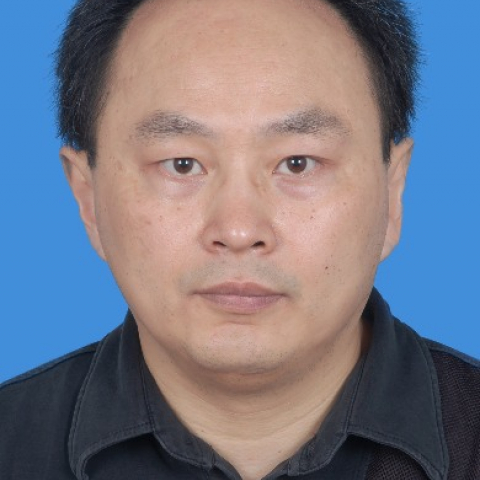

<!-- AUTO-GENERATED-BY: work/generate_obsidian_profiles.py -->

<!-- TEMPLATE: D:\workspace\信息收集整理\医生画像仓库\模板\医生画像模板.md -->

# 岳殿超

## 基础信息

| 字段 | 内容 |
|---|---|
| 姓名 | 岳殿超 |
| 医院 | 中山大学附属第一医院 |
| 科室 | 核医学科 |
| 职称/身份 | 副主任医师 |
| 来源链接 | [官网原文](https://www.fahsysu.org.cn/node/5553) |
| 采集日期 | 2026-08-13 |

## 简介/擅长

甲状腺疾病（甲亢、甲状腺癌等）、皮肤血管瘤及瘢痕增生的核素治疗。 SPECT、PET图像诊断。 研究方向 ：放射性核素（同位素）的诊断和治疗（甲亢、甲状腺癌、皮肤血管瘤和疤痕增生等） 主要教育和工作经历 ：1990年本科毕业，1992年考入中山医科大学（现中山大学）附属第一医院硕士研究生，2002年攻读博士学位。 社会兼职 ：广东省医学会核医学分会委员 论著 ： 1. 岳殿超 ,徐辉雄,吕明德,汤庆 声诺维( SonoVue) 增强超声辐照对HepG2 细胞膜通透性的影响 中国医学影像技术 2005； 21(4):510-2 2. Yue DC ,Schiepper C Comparison of lung volume by PET and CT European Journal of Nuclear Medicine 2001； 28: (8) :1064 3. 雷勇, 岳殿超 ,王吉甫 红霉素对Billiroth II 术后胃肠动力的影响 中国实用外科杂志2001，21：371 4. Zhang Xiangsong, Yue Dianchao Dynamic 13N-Ammonia PET: A New Imag...

## 教育与进修经历

- 研究方向 ：放射性核素（同位素）的诊断和治疗（甲亢、甲状腺癌、皮肤血管瘤和疤痕增生等） 主要教育和工作经历 ：1990年本科毕业，1992年考入中山医科大学（现中山大学）附属第一医院硕士研究生，2002年攻读博士学位。

## 论文与学术产出

- 23:29-32 6. 李惟， 胡平， 岳殿超 ， 邓怀福 99mTc-methoxyisobutylisonitrile SPECT显像评估脑肿瘤治疗后复发与坏死中山大学学报(医学科学版) 2005 Vol.26 No.2 P.封2,240-封 专著：参与多部著作和教科书的编写。

## 可包装亮点

- 社会兼职 ：广东省医学会核医学分会委员 论著 ： 1. 岳殿超 ,徐辉雄,吕明德,汤庆 声诺维( SonoVue) 增强超声辐照对HepG2 细胞膜通透性的影响 中国医学影像技术 2005；
- 其他主要工作成绩（比如获奖情况） ： SPECT验收测试方法研究与应用（ 广东省科学技术奖励 三等 证书号：2002-医-3-48-R05 ）

## 重点疾病/人群标签

- 慢性病：
- 肿瘤：肿瘤、癌、瘤、术后
- 生殖疾病：
- 免疫/风湿：
- 术后恢复/康复：肿瘤、癌、瘤、术后
- 疑难重症：

## 证据摘录

> 只摘录官网公开信息中的短句或关键字段，不复制大段原文。

- 官网身份字段：副主任医师
- 官网简介/擅长：甲状腺疾病（甲亢、甲状腺癌等）、皮肤血管瘤及瘢痕增生的核素治疗。 SPECT、PET图像诊断。 研究方向 ：放射性核素（同位素）的诊断和治疗（甲亢、甲状腺癌、皮肤血管瘤和疤痕增生等） 主要教育和工作经历 ：1990年本科毕业，1992年考入中山医科大学（现中山大学）附属第一医院硕士研究生，2002年攻读博士学位。 社会兼职 ：广东省医学会核医学分会委员 论著 ： 1. 岳殿超 ,徐辉雄,吕明德,汤庆 声诺维( SonoVue) 增强超…
- 官网亮眼经历线索：社会兼职 ：广东省医学会核医学分会委员 论著 ： 1. 岳殿超 ,徐辉雄,吕明德,汤庆 声诺维( SonoVue) 增强超声辐照对HepG2 细胞膜通透性的影响 中国医学影像技术 2005； 其他主要工作成绩（比如获奖情况） ： SPECT验收测试方法研究与应用（ 广东省科学技术奖励 三等 证书号：2002-医-3-48-R05 ）
- 来源链接：https://www.fahsysu.org.cn/node/5553

## BD 画像摘要

岳殿超医生可作为肿瘤、术后恢复/康复方向的基础画像候选。后续 BD 使用应继续以官网来源和人工复核为准，不添加疗效承诺或无来源包装。

## 合规边界

- 仅使用医院官网、官方公众号、官方小程序等公开渠道。
- 不采集私人电话、私人微信、家庭住址、患者隐私或非公开排班信息。
- 不写“保证治愈”“疗效第一”“包治疑难杂症”等无法由官网证明的表述。
