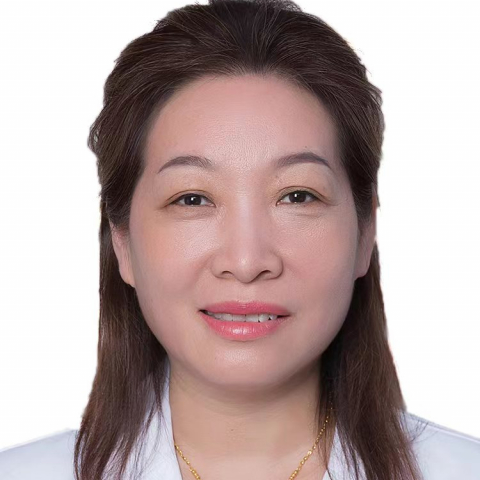

<!-- AUTO-GENERATED-BY: work/generate_obsidian_profiles.py -->

<!-- TEMPLATE: D:\workspace\信息收集整理\医生画像仓库\模板\医生画像模板.md -->

# 崔卫玲

## 基础信息

| 字段 | 内容 |
|---|---|
| 姓名 | 崔卫玲 |
| 医院 | 中山大学附属第一医院 |
| 科室 | 内分泌内科 |
| 职称/身份 | 副主任医师 |
| 来源链接 | [官网原文](https://www.fahsysu.org.cn/node/29409) |
| 采集日期 | 2026-08-13 |

## 简介/擅长

从事内科临床、教学、科研工作近30年，擅长内分泌代谢疾病的诊治，尤其在糖尿病及其急慢性并发症、甲亢、甲状腺功能减退、甲状腺炎、肾上腺疾病、垂体疾病及痛风的诊治方面有一定的临床经验。 研究方向：糖尿病及其急慢性并发症的诊治； 甲状腺疾病的诊治。 主要教育和工作经历：2005年中山大学内科学硕士研究生毕业后留在中山大学附属第一医院东院普通内科工作，长期从事内科常见病及内分泌代谢疾病的诊治。 社会兼职：无 论著：已在本专业国内多个核心期刊及国外SCI杂志发表专业论文20余篇。 专著：参加编写本专业专著2本。 其他主要工作成绩（比如获奖情况）：无

## 教育与进修经历

- 主要教育和工作经历：2005年中山大学内科学硕士研究生毕业后留在中山大学附属第一医院东院普通内科工作，长期从事内科常见病及内分泌代谢疾病的诊治。

## 科研项目与成果

- 从事内科临床、教学、科研工作近30年，擅长内分泌代谢疾病的诊治，尤其在糖尿病及其急慢性并发症、甲亢、甲状腺功能减退、甲状腺炎、肾上腺疾病、垂体疾病及痛风的诊治方面有一定的临床经验。
- 医疗特长：从事内科临床、教学、科研工作近30年，擅长内分泌代谢疾病的诊治，尤其在糖尿病及其急慢性并发症、甲亢、甲状腺功能减退、甲状腺炎、肾上腺疾病、垂体疾病及痛风的诊治方面有一定的临床经验。

## 论文与学术产出

- 社会兼职：无 论著：已在本专业国内多个核心期刊及国外SCI杂志发表专业论文20余篇。

## 可包装亮点

- 社会兼职：无 论著：已在本专业国内多个核心期刊及国外SCI杂志发表专业论文20余篇。
- 其他主要工作成绩（比如获奖情况）：无

## 重点疾病/人群标签

- 慢性病：糖尿病、慢性、代谢
- 肿瘤：
- 生殖疾病：
- 免疫/风湿：
- 术后恢复/康复：
- 疑难重症：

## 证据摘录

> 只摘录官网公开信息中的短句或关键字段，不复制大段原文。

- 官网身份字段：副主任医师
- 官网简介/擅长：从事内科临床、教学、科研工作近30年，擅长内分泌代谢疾病的诊治，尤其在糖尿病及其急慢性并发症、甲亢、甲状腺功能减退、甲状腺炎、肾上腺疾病、垂体疾病及痛风的诊治方面有一定的临床经验。 研究方向：糖尿病及其急慢性并发症的诊治； 甲状腺疾病的诊治。 主要教育和工作经历：2005年中山大学内科学硕士研究生毕业后留在中山大学附属第一医院东院普通内科工作，长期从事内科常见病及内分泌代谢疾病的诊治。 社会兼职：无 论著：已在本专业国内多个核心期刊及…
- 官网亮眼经历线索：社会兼职：无 论著：已在本专业国内多个核心期刊及国外SCI杂志发表专业论文20余篇。 其他主要工作成绩（比如获奖情况）：无
- 来源链接：https://www.fahsysu.org.cn/node/29409

## BD 画像摘要

崔卫玲医生可作为慢性病方向的基础画像候选。后续 BD 使用应继续以官网来源和人工复核为准，不添加疗效承诺或无来源包装。

## 合规边界

- 仅使用医院官网、官方公众号、官方小程序等公开渠道。
- 不采集私人电话、私人微信、家庭住址、患者隐私或非公开排班信息。
- 不写“保证治愈”“疗效第一”“包治疑难杂症”等无法由官网证明的表述。
