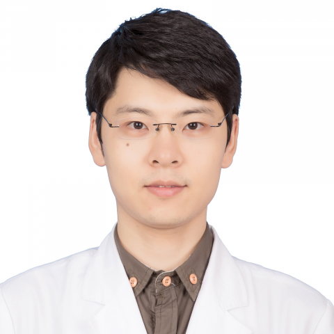

<!-- AUTO-GENERATED-BY: work/generate_obsidian_profiles.py -->

<!-- TEMPLATE: D:\workspace\信息收集整理\医生画像仓库\模板\医生画像模板.md -->

# 庄博文

## 基础信息

| 字段 | 内容 |
|---|---|
| 姓名 | 庄博文 |
| 医院 | 中山大学附属第一医院 |
| 科室 | 超声医学科、介入超声专科 |
| 职称/身份 | 副主任医师 |
| 来源链接 | [官网原文](https://www.fahsysu.org.cn/node/29158) |
| 采集日期 | 2026-08-13 |

## 简介/擅长

1）肿瘤的消融治疗，包括肝癌、肾癌、甲状腺良恶性结节消融治疗、乳腺良性病灶的旋切治疗。 2）超声引导下介入治疗，包括各器官穿刺活检，置管引流，硬化治疗等。 3）肝癌综合治疗，包括原发性和转移性肝癌的化疗，靶向及免疫治疗等。 4）肝、肾移植术后超声监测等。 主要教育和工作经历： 工作经历： 2021-至今，中山大学附属第一医院，超声医学科，副主任医师 2016-2020，中山大学附属第一医院，超声医学科，主治医师 2013-2016，中山大学附属第一医院，超声医学科，住院医师 教育经历： 2018-2021，中山大学附属第一医院，影像医学与核医学，博士 2018.08，日本顺天堂大学医学院，肿瘤消融研修 2010-2013，中山大学附属第三医院，外科学，硕士 2005-2010，中山大学中山医学院，临床医学，学士 社会兼职： 广东省超声医学质控中心 秘书 广东省器官医学与技术学会胰岛功能医学专委会 副主委 广东省医学教育协会超声医学分会 常委 论著： 以第一作者、通讯作者在Gastroenterology、Radiology、European radiology、 International journal of hyp...

## 可包装亮点

- 主要教育和工作经历： 工作经历： 2021-至今，中山大学附属第一医院，超声医学科，副主任医师 2016-2020，中山大学附属第一医院，超声医学科，主治医师 2013-2016，中山大学附属第一医院，超声医学科，住院医师 教育经历： 2018-2021，中山大学附属第一医院，影像医学与核医学，博士 2018.08，日本顺天堂大学医学院，肿瘤消融研修 20…

## 重点疾病/人群标签

- 慢性病：
- 肿瘤：肿瘤、癌、化疗、靶向、肝癌、免疫、术后
- 生殖疾病：
- 免疫/风湿：肿瘤、癌、化疗、靶向、肝癌、免疫、术后
- 术后恢复/康复：肿瘤、癌、化疗、靶向、肝癌、免疫、术后
- 疑难重症：

## 证据摘录

> 只摘录官网公开信息中的短句或关键字段，不复制大段原文。

- 官网身份字段：副主任医师
- 官网简介/擅长：1）肿瘤的消融治疗，包括肝癌、肾癌、甲状腺良恶性结节消融治疗、乳腺良性病灶的旋切治疗。 2）超声引导下介入治疗，包括各器官穿刺活检，置管引流，硬化治疗等。 3）肝癌综合治疗，包括原发性和转移性肝癌的化疗，靶向及免疫治疗等。 4）肝、肾移植术后超声监测等。 主要教育和工作经历： 工作经历： 2021-至今，中山大学附属第一医院，超声医学科，副主任医师 2016-2020，中山大学附属第一医院，超声医学科，主治医师 2013-2016，中…
- 官网亮眼经历线索：主要教育和工作经历： 工作经历： 2021-至今，中山大学附属第一医院，超声医学科，副主任医师 2016-2020，中山大学附属第一医院，超声医学科，主治医师 2013-2016，中山大学附属第一医院，超声医学科，住院医师 教育经历： 2018-2021，中山大学附属第一医院，影像医学与核医学，博士 2018.08，日本顺天堂大学医学院，肿瘤消融研修 2010-2013，中山大学附属第三医院，外科学，硕士 2005-2010，中山大学…
- 来源链接：https://www.fahsysu.org.cn/node/29158

## BD 画像摘要

庄博文医生可作为肿瘤、免疫/风湿/感染、术后恢复/康复方向的基础画像候选。后续 BD 使用应继续以官网来源和人工复核为准，不添加疗效承诺或无来源包装。

## 合规边界

- 仅使用医院官网、官方公众号、官方小程序等公开渠道。
- 不采集私人电话、私人微信、家庭住址、患者隐私或非公开排班信息。
- 不写“保证治愈”“疗效第一”“包治疑难杂症”等无法由官网证明的表述。
