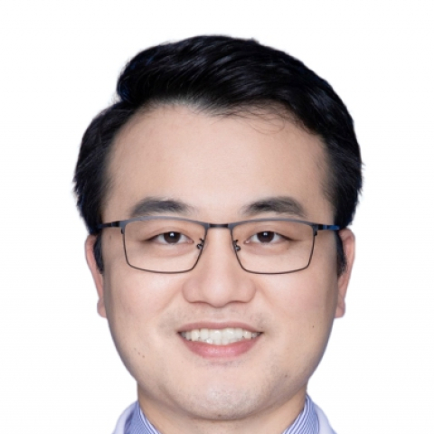

<!-- AUTO-GENERATED-BY: work/generate_obsidian_profiles.py -->

<!-- TEMPLATE: D:\workspace\信息收集整理\医生画像仓库\模板\医生画像模板.md -->

# 庄晓东

## 基础信息

| 字段 | 内容 |
|---|---|
| 姓名 | 庄晓东 |
| 医院 | 中山大学附属第一医院 |
| 科室 | 心内一科 |
| 职称/身份 | 主任医师 |
| 来源链接 | [官网原文](https://www.fahsysu.org.cn/node/929) |
| 采集日期 | 2026-08-13 |

## 简介/擅长

主要研究方向：冠心病、心力衰竭、高血压病、代谢性心血管病和退行性心脏瓣膜疾病的诊治，擅长复杂冠脉病变、重度主动脉瓣狭窄/关闭不全、二尖瓣关闭不全等微创介入治疗 工作经历： 中山大学附属第一医院心内科从事临床工作，兼任南沙院区心内科执行主任。 在省内率先开展Shockwave冲击波球囊、经导管主动脉瓣置换术（TAVR）、经导管二尖瓣缘对缘钳夹术和心房分流器植入等介入新技术，2022年完成全国首例经股静脉“瓣中瓣中瓣”TMVR手术、华南首例二尖瓣生物瓣衰败瓣中瓣TMVR手术手术和华南首例MitraClip+ LAAC一站式手术。 应邀到国内20多家中心开展TAVR手术带教交流，学术声誉良好。 社会任职： 美国心脏病学院Fellow（FACC） 亚太结构性心脏病俱乐部会员 中国康复医学会心脏介入治疗与康复专业委员会 委员 中国医药信息学会心力衰竭专业委员会 委员 中国大湾区心脏协会结构性心脏病分会 副主任委员 中国大湾区心脏协会泛血管医学分会 常委 广东省精准应用学会心脏康复分会 副主任委员 广东省医学会心血管病学分会 青委副主任委员 广东省生理学会心血管专业委员会 青委主任委员 广东省病理生理学会理事，心血管专委会青委副主...

## 科研项目与成果

- 获国家自然科学基金青年项目、广东省自然科学基金项目、广东省科技计划项目等多项基金资助，作为骨干成员参与国家重点研发计划课题《重编程化学小分子诱导心肌细胞去分化的分子机制及其在心脏再生修复中的应用》。
- 获得发明专利1项（一种糖尿病前期心血管疾病风险的预测方法及系统，专利号CN202210334081.3）。
- 多次受邀在美国心脏病学院年会和欧洲心脏病学会年会分享在糖尿病心肌病的机制研究和新型代谢药物治疗方面的研究成果。

## 可包装亮点

- 在省内率先开展Shockwave冲击波球囊、经导管主动脉瓣置换术（TAVR）、经导管二尖瓣缘对缘钳夹术和心房分流器植入等介入新技术，2022年完成全国首例经股静脉“瓣中瓣中瓣”TMVR手术、华南首例二尖瓣生物瓣衰败瓣中瓣TMVR手术手术和华南首例MitraClip+ LAAC一站式手术。
- 社会任职： 美国心脏病学院Fellow（FACC） 亚太结构性心脏病俱乐部会员 中国康复医学会心脏介入治疗与康复专业委员会 委员 中国医药信息学会心力衰竭专业委员会 委员 中国大湾区心脏协会结构性心脏病分会 副主任委员 中国大湾区心脏协会泛血管医学分会 常委 广东省精准应用学会心脏康复分会 副主任委员 广东省医学会心血管病学分会 青委副主任委员 广东省生理…

## 重点疾病/人群标签

- 慢性病：高血压、糖尿病、冠心病、心力衰竭、代谢、康复、复杂
- 肿瘤：
- 生殖疾病：
- 免疫/风湿：
- 术后恢复/康复：高血压、糖尿病、冠心病、心力衰竭、代谢、康复、复杂
- 疑难重症：高血压、糖尿病、冠心病、心力衰竭、代谢、康复、复杂

## 证据摘录

> 只摘录官网公开信息中的短句或关键字段，不复制大段原文。

- 官网身份字段：主任医师
- 官网简介/擅长：主要研究方向：冠心病、心力衰竭、高血压病、代谢性心血管病和退行性心脏瓣膜疾病的诊治，擅长复杂冠脉病变、重度主动脉瓣狭窄/关闭不全、二尖瓣关闭不全等微创介入治疗 工作经历： 中山大学附属第一医院心内科从事临床工作，兼任南沙院区心内科执行主任。 在省内率先开展Shockwave冲击波球囊、经导管主动脉瓣置换术（TAVR）、经导管二尖瓣缘对缘钳夹术和心房分流器植入等介入新技术，2022年完成全国首例经股静脉“瓣中瓣中瓣”TMVR手术、华南首…
- 官网亮眼经历线索：在省内率先开展Shockwave冲击波球囊、经导管主动脉瓣置换术（TAVR）、经导管二尖瓣缘对缘钳夹术和心房分流器植入等介入新技术，2022年完成全国首例经股静脉“瓣中瓣中瓣”TMVR手术、华南首例二尖瓣生物瓣衰败瓣中瓣TMVR手术手术和华南首例MitraClip+ LAAC一站式手术。 社会任职： 美国心脏病学院Fellow（FACC） 亚太结构性心脏病俱乐部会员 中国康复医学会心脏介入治疗与康复专业委员会 委员 中国医药信息学会心…
- 来源链接：https://www.fahsysu.org.cn/node/929

## BD 画像摘要

庄晓东医生可作为慢性病、术后恢复/康复、疑难重症方向的基础画像候选。后续 BD 使用应继续以官网来源和人工复核为准，不添加疗效承诺或无来源包装。

## 合规边界

- 仅使用医院官网、官方公众号、官方小程序等公开渠道。
- 不采集私人电话、私人微信、家庭住址、患者隐私或非公开排班信息。
- 不写“保证治愈”“疗效第一”“包治疑难杂症”等无法由官网证明的表述。
