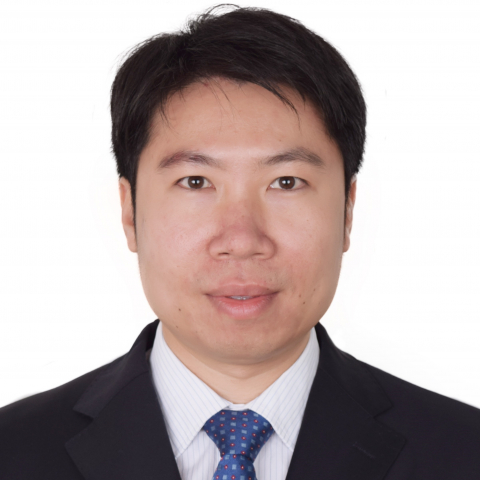

<!-- AUTO-GENERATED-BY: work/generate_obsidian_profiles.py -->

<!-- TEMPLATE: D:\workspace\信息收集整理\医生画像仓库\模板\医生画像模板.md -->

# 庄锦涛

## 基础信息

| 字段 | 内容 |
|---|---|
| 姓名 | 庄锦涛 |
| 医院 | 中山大学附属第一医院 |
| 科室 | 生殖男科专科 |
| 职称/身份 | 副主任医师 |
| 来源链接 | [官网原文](https://www.fahsysu.org.cn/node/31480) |
| 采集日期 | 2026-08-13 |

## 简介/擅长

显微男科手术治疗男性不育症和精索静脉曲张，精囊镜手术及性功能障碍的诊治。 2017年赴美国康奈尔大学纽约长老会医院学习显微男科技术。 擅长各种显微男科手术治疗男性不育症（显微精索静脉结扎术、显微输精管附睾吻合术、显微输精管吻合术、显微精索去神经术、显微睾丸取精术）、精囊镜手术及性功能障碍的诊治。 现任广州市医学会男科学分会副主任委员，广东省医学会男科学分会青年委员兼显微微创学组秘书，广东省临床医学学会男性健康专业委员会常务委员兼秘书，广东省医师协会男科医师分会委员，广东省泌尿生殖协会泌尿微创学分会委员，广东省泌尿生殖学会男性健康管理学分会委员。 发表论文20余篇，其中SCI收录10余篇。 参编《包茎和包皮过长及包皮相关疾病中国专家共识》、《电生理适宜技术在男科疾病诊疗中的应用中国专家共识》。 《显微男科手术学》及《泌尿男科罕少见病》主编助理与编者。 主持二项省部级科研基金。

## 科研项目与成果

- 主持二项省部级科研基金。

## 论文与学术产出

- 发表论文20余篇，其中SCI收录10余篇。
- 参编《包茎和包皮过长及包皮相关疾病中国专家共识》、《电生理适宜技术在男科疾病诊疗中的应用中国专家共识》。
- 《显微男科手术学》及《泌尿男科罕少见病》主编助理与编者。

## 可包装亮点

- 2017年赴美国康奈尔大学纽约长老会医院学习显微男科技术。
- 现任广州市医学会男科学分会副主任委员，广东省医学会男科学分会青年委员兼显微微创学组秘书，广东省临床医学学会男性健康专业委员会常务委员兼秘书，广东省医师协会男科医师分会委员，广东省泌尿生殖协会泌尿微创学分会委员，广东省泌尿生殖学会男性健康管理学分会委员。
- 发表论文20余篇，其中SCI收录10余篇。

## 重点疾病/人群标签

- 慢性病：
- 肿瘤：
- 生殖疾病：
- 免疫/风湿：
- 术后恢复/康复：
- 疑难重症：

## 证据摘录

> 只摘录官网公开信息中的短句或关键字段，不复制大段原文。

- 官网身份字段：副主任医师
- 官网简介/擅长：显微男科手术治疗男性不育症和精索静脉曲张，精囊镜手术及性功能障碍的诊治。 2017年赴美国康奈尔大学纽约长老会医院学习显微男科技术。 擅长各种显微男科手术治疗男性不育症（显微精索静脉结扎术、显微输精管附睾吻合术、显微输精管吻合术、显微精索去神经术、显微睾丸取精术）、精囊镜手术及性功能障碍的诊治。 现任广州市医学会男科学分会副主任委员，广东省医学会男科学分会青年委员兼显微微创学组秘书，广东省临床医学学会男性健康专业委员会常务委员兼秘书…
- 官网亮眼经历线索：2017年赴美国康奈尔大学纽约长老会医院学习显微男科技术。 现任广州市医学会男科学分会副主任委员，广东省医学会男科学分会青年委员兼显微微创学组秘书，广东省临床医学学会男性健康专业委员会常务委员兼秘书，广东省医师协会男科医师分会委员，广东省泌尿生殖协会泌尿微创学分会委员，广东省泌尿生殖学会男性健康管理学分会委员。 发表论文20余篇，其中SCI收录10余篇。
- 异常提示：同名待甄别
- 来源链接：https://www.fahsysu.org.cn/node/31480

## BD 画像摘要

庄锦涛医生可作为中山大学附属第一医院生殖男科专科的基础医生资料入库。当前重点方向以总底表标签为准，官网未展示的信息保持空白。

## 合规边界

- 仅使用医院官网、官方公众号、官方小程序等公开渠道。
- 不采集私人电话、私人微信、家庭住址、患者隐私或非公开排班信息。
- 不写“保证治愈”“疗效第一”“包治疑难杂症”等无法由官网证明的表述。
