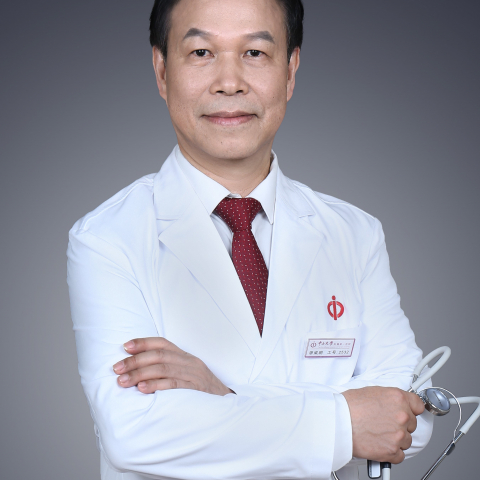

<!-- AUTO-GENERATED-BY: work/generate_obsidian_profiles.py -->

<!-- TEMPLATE: D:\workspace\信息收集整理\医生画像仓库\模板\医生画像模板.md -->

# 廖威明

## 基础信息

| 字段 | 内容 |
|---|---|
| 姓名 | 廖威明 |
| 医院 | 中山大学附属第一医院 |
| 科室 | 关节外科 |
| 职称/身份 | 主任医师/教授 |
| 来源链接 | [官网原文](https://www.fahsysu.org.cn/node/5621) |
| 采集日期 | 2026-08-13 |

## 简介/擅长

骨科知名专家，医学博士学位，教授，主任医师，硕士生和博士生导师，现任中山大学附属第一医院骨科主任。 从事骨科、关节外科临床工作近30年，专长于各种关节炎和关节疾病的诊断与外科治疗，特别在股骨头坏死、骨关节炎、类风湿性关节炎、髋关节发育不良、关节畸形、运动损伤、各类骨折方面具有丰富临床经验，在人工髋、膝关节初次置换和翻修手术、各类骨骼矫形手术、骨折复位固定技术达到与国际先进技术同步，精益求精，微创安全，并取得满意疗效。 始终坚持病人生命安全至上、技术一流、服务优质的行医宗旨，为患者提供最合适的治疗方案。 曾经在香港大学骨科、德国科隆大学医院创伤与重建外科接受培训。 主持国家自然科学基金项目3项，省部级科研基金项目10项，主要参与国家重大基金项目3项，发表在国外杂志论文11篇，国内专业杂志56篇，以主要参与者获得教育部、广东省科技进步奖3项。 已培养博士生15名，硕士生17名，博士后2名。 研究方向：1.各种髋、膝关节炎的诊断与外科治疗，包括股骨头坏死、骨关节炎、类风湿关节炎、髋发育不良、关节畸形、各种骨折的治疗； 2.人工髋、膝关节置换初次手术与翻修手术治疗。 3.关节内骨折，关节软骨修复。 主要教育和工作经历：博士毕业...

## 教育与进修经历

- 骨科知名专家，医学博士学位，教授，主任医师，硕士生和博士生导师，现任中山大学附属第一医院骨科主任。
- 曾经在香港大学骨科、德国科隆大学医院创伤与重建外科接受培训。
- 已培养博士生15名，硕士生17名，博士后2名。
- 医疗特长： 骨科知名专家，医学博士学位，教授，主任医师，硕士生和博士生导师，现任中山大学附属第一医院骨科主任。

## 科研项目与成果

- 主持国家自然科学基金项目3项，省部级科研基金项目10项，主要参与国家重大基金项目3项，发表在国外杂志论文11篇，国内专业杂志56篇，以主要参与者获得教育部、广东省科技进步奖3项。

## 论文与学术产出

- 主持国家自然科学基金项目3项，省部级科研基金项目10项，主要参与国家重大基金项目3项，发表在国外杂志论文11篇，国内专业杂志56篇，以主要参与者获得教育部、广东省科技进步奖3项。
- 担任《中华关节外科杂志》副主编，《中国骨与关节外科》、《国际骨科学杂志》、《中国骨科临床与基础研究杂志》常务编委，《中华骨科杂志》、《中华生物医学工程杂志》编委。
- 论著：已发表论文56篇，发表国际杂志英文论文11篇。

## 可包装亮点

- 骨科知名专家，医学博士学位，教授，主任医师，硕士生和博士生导师，现任中山大学附属第一医院骨科主任。
- 曾经在香港大学骨科、德国科隆大学医院创伤与重建外科接受培训。
- 主持国家自然科学基金项目3项，省部级科研基金项目10项，主要参与国家重大基金项目3项，发表在国外杂志论文11篇，国内专业杂志56篇，以主要参与者获得教育部、广东省科技进步奖3项。
- 医疗特长： 骨科知名专家，医学博士学位，教授，主任医师，硕士生和博士生导师，现任中山大学附属第一医院骨科主任。

## 重点疾病/人群标签

- 慢性病：
- 肿瘤：
- 生殖疾病：
- 免疫/风湿：类风湿
- 术后恢复/康复：
- 疑难重症：

## 证据摘录

> 只摘录官网公开信息中的短句或关键字段，不复制大段原文。

- 官网身份字段：主任医师/教授
- 官网简介/擅长：骨科知名专家，医学博士学位，教授，主任医师，硕士生和博士生导师，现任中山大学附属第一医院骨科主任。 从事骨科、关节外科临床工作近30年，专长于各种关节炎和关节疾病的诊断与外科治疗，特别在股骨头坏死、骨关节炎、类风湿性关节炎、髋关节发育不良、关节畸形、运动损伤、各类骨折方面具有丰富临床经验，在人工髋、膝关节初次置换和翻修手术、各类骨骼矫形手术、骨折复位固定技术达到与国际先进技术同步，精益求精，微创安全，并取得满意疗效。 始终坚持病人生命…
- 官网亮眼经历线索：骨科知名专家，医学博士学位，教授，主任医师，硕士生和博士生导师，现任中山大学附属第一医院骨科主任。 曾经在香港大学骨科、德国科隆大学医院创伤与重建外科接受培训。 主持国家自然科学基金项目3项，省部级科研基金项目10项，主要参与国家重大基金项目3项，发表在国外杂志论文11篇，国内专业杂志56篇，以主要参与者获得教育部、广东省科技进步奖3项。 医疗特长： 骨科知名专家，医学博士学位，教授，主任医师，硕士生和博士生导师，现任中山大学附属第一…
- 来源链接：https://www.fahsysu.org.cn/node/5621

## BD 画像摘要

廖威明医生可作为免疫/风湿/感染方向的基础画像候选。后续 BD 使用应继续以官网来源和人工复核为准，不添加疗效承诺或无来源包装。

## 合规边界

- 仅使用医院官网、官方公众号、官方小程序等公开渠道。
- 不采集私人电话、私人微信、家庭住址、患者隐私或非公开排班信息。
- 不写“保证治愈”“疗效第一”“包治疑难杂症”等无法由官网证明的表述。
