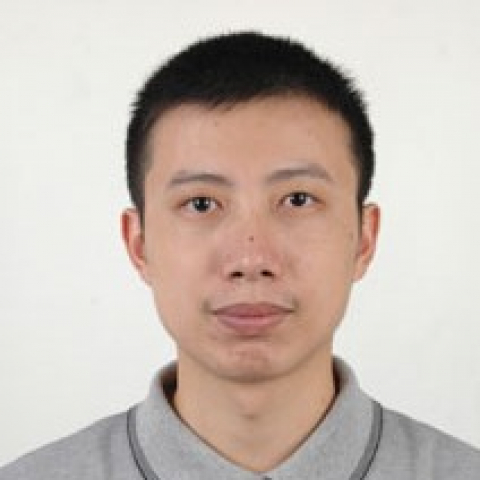

<!-- AUTO-GENERATED-BY: work/generate_obsidian_profiles.py -->

<!-- TEMPLATE: D:\workspace\信息收集整理\医生画像仓库\模板\医生画像模板.md -->

# 廖槐

## 基础信息

| 字段 | 内容 |
|---|---|
| 姓名 | 廖槐 |
| 医院 | 中山大学附属第一医院 |
| 科室 | 呼吸与危重症医学科 |
| 职称/身份 | 主任医师 |
| 来源链接 | [官网原文](https://www.fahsysu.org.cn/node/806) |
| 采集日期 | 2026-08-13 |

## 简介/擅长

肺癌、胸膜疾病、肺炎、慢阻肺、哮喘、支扩、间质性肺病、肺栓塞等呼吸疾病诊治。 亚专业：介入呼吸病学、胸膜疾病。 1997年7月中山医科大学临床医学本科毕业留中山大学附属第一医院内科工作至今，中山大学内科学硕士，硕士研究生导师。 长期在呼吸科普通病房、内科ICU、呼吸诊断与介入治疗中心等临床一线工作。 2005年2月至2006年7月，美国Vanderbilt大学访问学者，2012、2016、2018年先后三次赴德国杜塞尔多夫和海德堡大学胸科医院短期学习呼吸内镜技术。 研究方向：介入呼吸病学，胸膜疾病。 学术任职：中华医学会呼吸分会介入呼吸病学组委员、中华医学会呼吸胸膜与纵隔疾病学组（筹）委员、广东省医学会呼吸内镜与呼吸介入学分会副主任委员、广东省医学会内科学分会常委及学术秘书、广东省医学会呼吸病学分会委员及介入学组副组长、广东省医师协会呼吸科医师分会委员、广东省医师协会医学机器人医师分会委员。

## 教育与进修经历

- 1997年7月中山医科大学临床医学本科毕业留中山大学附属第一医院内科工作至今，中山大学内科学硕士，硕士研究生导师。
- 2005年2月至2006年7月，美国Vanderbilt大学访问学者，2012、2016、2018年先后三次赴德国杜塞尔多夫和海德堡大学胸科医院短期学习呼吸内镜技术。

## 可包装亮点

- 2005年2月至2006年7月，美国Vanderbilt大学访问学者，2012、2016、2018年先后三次赴德国杜塞尔多夫和海德堡大学胸科医院短期学习呼吸内镜技术。
- 学术任职：中华医学会呼吸分会介入呼吸病学组委员、中华医学会呼吸胸膜与纵隔疾病学组（筹）委员、广东省医学会呼吸内镜与呼吸介入学分会副主任委员、广东省医学会内科学分会常委及学术秘书、广东省医学会呼吸病学分会委员及介入学组副组长、广东省医师协会呼吸科医师分会委员、广东省医师协会医学机器人医师分会委员。

## 重点疾病/人群标签

- 慢性病：
- 肿瘤：肺癌、危重
- 生殖疾病：
- 免疫/风湿：
- 术后恢复/康复：
- 疑难重症：肺癌、危重

## 证据摘录

> 只摘录官网公开信息中的短句或关键字段，不复制大段原文。

- 官网身份字段：主任医师
- 官网简介/擅长：肺癌、胸膜疾病、肺炎、慢阻肺、哮喘、支扩、间质性肺病、肺栓塞等呼吸疾病诊治。 亚专业：介入呼吸病学、胸膜疾病。 1997年7月中山医科大学临床医学本科毕业留中山大学附属第一医院内科工作至今，中山大学内科学硕士，硕士研究生导师。 长期在呼吸科普通病房、内科ICU、呼吸诊断与介入治疗中心等临床一线工作。 2005年2月至2006年7月，美国Vanderbilt大学访问学者，2012、2016、2018年先后三次赴德国杜塞尔多夫和海德堡大学…
- 官网亮眼经历线索：2005年2月至2006年7月，美国Vanderbilt大学访问学者，2012、2016、2018年先后三次赴德国杜塞尔多夫和海德堡大学胸科医院短期学习呼吸内镜技术。 学术任职：中华医学会呼吸分会介入呼吸病学组委员、中华医学会呼吸胸膜与纵隔疾病学组（筹）委员、广东省医学会呼吸内镜与呼吸介入学分会副主任委员、广东省医学会内科学分会常委及学术秘书、广东省医学会呼吸病学分会委员及介入学组副组长、广东省医师协会呼吸科医师分会委员、广东省医师协…
- 来源链接：https://www.fahsysu.org.cn/node/806

## BD 画像摘要

廖槐医生可作为肿瘤、疑难重症方向的基础画像候选。后续 BD 使用应继续以官网来源和人工复核为准，不添加疗效承诺或无来源包装。

## 合规边界

- 仅使用医院官网、官方公众号、官方小程序等公开渠道。
- 不采集私人电话、私人微信、家庭住址、患者隐私或非公开排班信息。
- 不写“保证治愈”“疗效第一”“包治疑难杂症”等无法由官网证明的表述。
