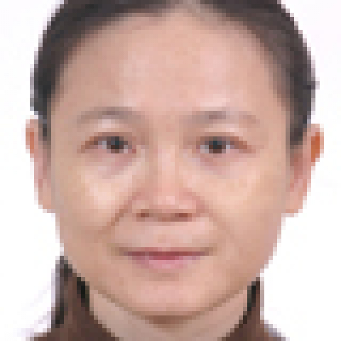

<!-- AUTO-GENERATED-BY: work/generate_obsidian_profiles.py -->

<!-- TEMPLATE: D:\workspace\信息收集整理\医生画像仓库\模板\医生画像模板.md -->

# 廖绮曼

## 基础信息

| 字段 | 内容 |
|---|---|
| 姓名 | 廖绮曼 |
| 医院 | 中山大学附属第一医院 |
| 科室 | 皮肤科 |
| 职称/身份 | 副主任医师 |
| 来源链接 | [官网原文](https://www.fahsysu.org.cn/node/5744) |
| 采集日期 | 2026-08-13 |

## 简介/擅长

1989年中山医科大学皮肤性病学专业硕士研究生毕。 从事皮肤科临床医教研工作二十多年，擅长皮肤病与性病的诊断与治疗。 主持手部和真菌专科，在手部皮炎和真菌性皮肤病的诊治方面有丰富的经验。 能熟练运用激光技术治疗痣、疣、血管瘤等皮肤病。

## 教育与进修经历

- 毕业时间： 研究方向： 1．变态反应性皮肤病 2．真菌性皮肤病 科研基金： 1999年广东省自然科学基金98重点科技攻关项目：表皮细胞移植治疗烧伤后瘢痕的研究 社会兼职： 获奖情况： 论著： 专著： 复发性外阴阴道念珠菌病的危险因素分析和治疗研究. 廖绮曼等，岭南皮肤性病科杂志，2005. 12 (2):85 ~87 遗传过敏性皮炎致敏因素分析. 廖绮曼等，岭南皮肤性病科杂志, 2001. 8(2):19~21 药疹治疗中抗生素的应用—附133例临床分析. 廖绮曼等，中国抗生素杂志，1999. 24 (4):30…

## 科研项目与成果

- 毕业时间： 研究方向： 1．变态反应性皮肤病 2．真菌性皮肤病 科研基金： 1999年广东省自然科学基金98重点科技攻关项目：表皮细胞移植治疗烧伤后瘢痕的研究 社会兼职： 获奖情况： 论著： 专著： 复发性外阴阴道念珠菌病的危险因素分析和治疗研究. 廖绮曼等，岭南皮肤性病科杂志，2005. 12 (2):85 ~87 遗传过敏性皮炎致敏因素分析. 廖绮曼等，岭南皮肤性病科杂志, 2001. 8(2):19~21 药疹治疗中抗生素的应用—附133例临床分析. 廖绮曼等，中国抗生素杂志，1999. 24 (4):30…

## 可包装亮点

- 毕业时间： 研究方向： 1．变态反应性皮肤病 2．真菌性皮肤病 科研基金： 1999年广东省自然科学基金98重点科技攻关项目：表皮细胞移植治疗烧伤后瘢痕的研究 社会兼职： 获奖情况： 论著： 专著： 复发性外阴阴道念珠菌病的危险因素分析和治疗研究. 廖绮曼等，岭南皮肤性病科杂志，2005. 12 (2):85 ~87 遗传过敏性皮炎致敏因素分析. 廖绮曼等…

## 重点疾病/人群标签

- 慢性病：
- 肿瘤：瘤、感染、烧伤
- 生殖疾病：
- 免疫/风湿：瘤、感染、烧伤
- 术后恢复/康复：瘤、感染、烧伤
- 疑难重症：

## 证据摘录

> 只摘录官网公开信息中的短句或关键字段，不复制大段原文。

- 官网身份字段：副主任医师
- 官网简介/擅长：1989年中山医科大学皮肤性病学专业硕士研究生毕。 从事皮肤科临床医教研工作二十多年，擅长皮肤病与性病的诊断与治疗。 主持手部和真菌专科，在手部皮炎和真菌性皮肤病的诊治方面有丰富的经验。 能熟练运用激光技术治疗痣、疣、血管瘤等皮肤病。
- 官网亮眼经历线索：毕业时间： 研究方向： 1．变态反应性皮肤病 2．真菌性皮肤病 科研基金： 1999年广东省自然科学基金98重点科技攻关项目：表皮细胞移植治疗烧伤后瘢痕的研究 社会兼职： 获奖情况： 论著： 专著： 复发性外阴阴道念珠菌病的危险因素分析和治疗研究. 廖绮曼等，岭南皮肤性病科杂志，2005. 12 (2):85 ~87 遗传过敏性皮炎致敏因素分析. 廖绮曼等，岭南皮肤性病科杂志, 2001. 8(2):19~21 药疹治疗中抗生素的应用…
- 来源链接：https://www.fahsysu.org.cn/node/5744

## BD 画像摘要

廖绮曼医生可作为肿瘤、免疫/风湿/感染、术后恢复/康复方向的基础画像候选。后续 BD 使用应继续以官网来源和人工复核为准，不添加疗效承诺或无来源包装。

## 合规边界

- 仅使用医院官网、官方公众号、官方小程序等公开渠道。
- 不采集私人电话、私人微信、家庭住址、患者隐私或非公开排班信息。
- 不写“保证治愈”“疗效第一”“包治疑难杂症”等无法由官网证明的表述。
