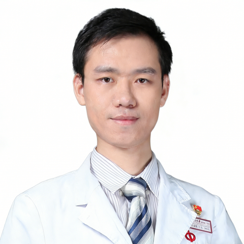

<!-- AUTO-GENERATED-BY: work/generate_obsidian_profiles.py -->

<!-- TEMPLATE: D:\workspace\信息收集整理\医生画像仓库\模板\医生画像模板.md -->

# 张俊隆

## 基础信息

| 字段 | 内容 |
|---|---|
| 姓名 | 张俊隆 |
| 医院 | 中山大学附属第一医院 |
| 科室 | 泌尿外科 |
| 职称/身份 | 副主任医师 |
| 来源链接 | [官网原文](https://www.fahsysu.org.cn/node/38124) |
| 采集日期 | 2026-08-13 |

## 简介/擅长

长期于中山一院从事医教研工作，熟练开展泌尿外科常见病的诊疗及泌尿微创手术，擅长处理泌尿系结石和泌尿系肿瘤，对下尿路疾病（前列腺增生、尿频）和女性泌尿疾病具有丰富的经验。 研究方向：良性前列腺增生、下尿路功能障碍、女性泌尿疾病和泌尿系肿瘤（肾错构瘤为主）等 教育和工作经历：2010年本科毕业于中山大学中山医学院，2016年博士毕业于中山大学后留院工作至今。 社会兼职： 中华志愿者协会中西医结合专家志愿者委员会泌尿外科专业组 青年委员； 广东省泌尿生殖协会尿控学分会第二、三届 委员； 广东省健康管理学会泌尿及男科学专业委员会第二届委员会 委员； 广东省器官医学与技术学会泌尿外科技术与转化专业委员会第一届委员会 委员； 欧洲医学教育联盟（AMEE） Associate Fellows 科研情况：发表SCI文章10余篇，中文核心期刊多篇。 参与国自然基金项目两项。 其他主要业绩（比如获奖情况）： 长期从事泌尿外科临床诊疗、教学及科研工作。 擅长模拟教学、人工智能辅助教学等。 近年来专注于本科医学教育改革及毕业后教学，参与编写专著1部。 多次获得院级、校级及省级教学奖励及优秀教师称号； 获广东省教学成果奖一等奖1项，校级教学成果...

## 教育与进修经历

- 研究方向：良性前列腺增生、下尿路功能障碍、女性泌尿疾病和泌尿系肿瘤（肾错构瘤为主）等 教育和工作经历：2010年本科毕业于中山大学中山医学院，2016年博士毕业于中山大学后留院工作至今。
- 近年来专注于本科医学教育改革及毕业后教学，参与编写专著1部。

## 科研项目与成果

- 欧洲医学教育联盟（AMEE） Associate Fellows 科研情况：发表SCI文章10余篇，中文核心期刊多篇。
- 参与国自然基金项目两项。
- 其他主要业绩（比如获奖情况）： 长期从事泌尿外科临床诊疗、教学及科研工作。
- 获广东省教学成果奖一等奖1项，校级教学成果奖二等奖1项；

## 论文与学术产出

- 欧洲医学教育联盟（AMEE） Associate Fellows 科研情况：发表SCI文章10余篇，中文核心期刊多篇。

## 可包装亮点

- 社会兼职： 中华志愿者协会中西医结合专家志愿者委员会泌尿外科专业组 青年委员；
- 广东省泌尿生殖协会尿控学分会第二、三届 委员；
- 广东省健康管理学会泌尿及男科学专业委员会第二届委员会 委员；
- 广东省器官医学与技术学会泌尿外科技术与转化专业委员会第一届委员会 委员；

## 重点疾病/人群标签

- 慢性病：
- 肿瘤：肿瘤、瘤、生殖、功能障碍
- 生殖疾病：肿瘤、瘤、生殖、功能障碍
- 免疫/风湿：
- 术后恢复/康复：肿瘤、瘤、生殖、功能障碍
- 疑难重症：

## 证据摘录

> 只摘录官网公开信息中的短句或关键字段，不复制大段原文。

- 官网身份字段：副主任医师
- 官网简介/擅长：长期于中山一院从事医教研工作，熟练开展泌尿外科常见病的诊疗及泌尿微创手术，擅长处理泌尿系结石和泌尿系肿瘤，对下尿路疾病（前列腺增生、尿频）和女性泌尿疾病具有丰富的经验。 研究方向：良性前列腺增生、下尿路功能障碍、女性泌尿疾病和泌尿系肿瘤（肾错构瘤为主）等 教育和工作经历：2010年本科毕业于中山大学中山医学院，2016年博士毕业于中山大学后留院工作至今。 社会兼职： 中华志愿者协会中西医结合专家志愿者委员会泌尿外科专业组 青年委员…
- 官网亮眼经历线索：社会兼职： 中华志愿者协会中西医结合专家志愿者委员会泌尿外科专业组 青年委员； 广东省泌尿生殖协会尿控学分会第二、三届 委员； 广东省健康管理学会泌尿及男科学专业委员会第二届委员会 委员； 广东省器官医学与技术学会泌尿外科技术与转化专业委员会第一届委员会 委员；
- 来源链接：https://www.fahsysu.org.cn/node/38124

## BD 画像摘要

张俊隆医生可作为肿瘤、生殖疾病、术后恢复/康复方向的基础画像候选。后续 BD 使用应继续以官网来源和人工复核为准，不添加疗效承诺或无来源包装。

## 合规边界

- 仅使用医院官网、官方公众号、官方小程序等公开渠道。
- 不采集私人电话、私人微信、家庭住址、患者隐私或非公开排班信息。
- 不写“保证治愈”“疗效第一”“包治疑难杂症”等无法由官网证明的表述。
