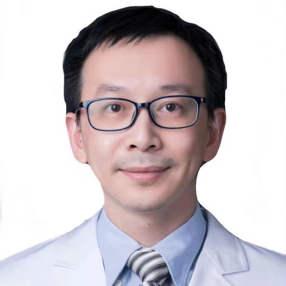

<!-- AUTO-GENERATED-BY: work/generate_obsidian_profiles.py -->

<!-- TEMPLATE: D:\workspace\信息收集整理\医生画像仓库\模板\医生画像模板.md -->

# 张宁

## 基础信息

| 字段 | 内容 |
|---|---|
| 姓名 | 张宁 |
| 医院 | 中山大学附属第一医院 |
| 科室 | 消化内科 |
| 职称/身份 | 主任医师 |
| 来源链接 | [官网原文](https://www.fahsysu.org.cn/node/796) |
| 采集日期 | 2026-08-13 |

## 简介/擅长

从事消化内科临床工作十余年，对消化系统疾病的诊断与治疗有丰富的临床经验，擅长胃肠胰神经内分泌肿瘤的诊治，以及各种消化系统疑难、危重疾病的内镜诊断和内镜微创手术治疗。 研究方向： 神经内分泌肿瘤； 消化内镜。 主要教育和工作经历： 2005年本科毕业留校工作至今； 2011年至2013年在香港中文大学威尔斯亲王医院担任访问学者，从事消化系统肿瘤研究； 2019年至2020年在日本国立癌症研究中心担任访问学者，进行消化内镜的训练。 社会兼职： 中华医学会消化病分会心身协作组委员，中华医学会内镜分会消化道癌筛查协作组委员，广东省医学会肝病分会委员，广东省医师协会消化内镜分会委员。 论著： 专著： 其他主要工作成绩（比如获奖情况）：

## 教育与进修经历

- 主要教育和工作经历： 2005年本科毕业留校工作至今；
- 2011年至2013年在香港中文大学威尔斯亲王医院担任访问学者，从事消化系统肿瘤研究；
- 2019年至2020年在日本国立癌症研究中心担任访问学者，进行消化内镜的训练。

## 可包装亮点

- 从事消化内科临床工作十余年，对消化系统疾病的诊断与治疗有丰富的临床经验，擅长胃肠胰神经内分泌肿瘤的诊治，以及各种消化系统疑难、危重疾病的内镜诊断和内镜微创手术治疗。
- 医疗特长： 从事消化内科临床工作十余年，对消化系统疾病的诊断与治疗有丰富的临床经验，擅长胃肠胰神经内分泌肿瘤的诊治，以及各种消化系统疑难、危重疾病的内镜诊断和内镜微创手术治疗。
- 2011年至2013年在香港中文大学威尔斯亲王医院担任访问学者，从事消化系统肿瘤研究；
- 2019年至2020年在日本国立癌症研究中心担任访问学者，进行消化内镜的训练。

## 重点疾病/人群标签

- 慢性病：
- 肿瘤：肿瘤、癌、疑难、危重
- 生殖疾病：
- 免疫/风湿：
- 术后恢复/康复：
- 疑难重症：肿瘤、癌、疑难、危重

## 证据摘录

> 只摘录官网公开信息中的短句或关键字段，不复制大段原文。

- 官网身份字段：主任医师
- 官网简介/擅长：从事消化内科临床工作十余年，对消化系统疾病的诊断与治疗有丰富的临床经验，擅长胃肠胰神经内分泌肿瘤的诊治，以及各种消化系统疑难、危重疾病的内镜诊断和内镜微创手术治疗。 研究方向： 神经内分泌肿瘤； 消化内镜。 主要教育和工作经历： 2005年本科毕业留校工作至今； 2011年至2013年在香港中文大学威尔斯亲王医院担任访问学者，从事消化系统肿瘤研究； 2019年至2020年在日本国立癌症研究中心担任访问学者，进行消化内镜的训练。 社会兼…
- 官网亮眼经历线索：从事消化内科临床工作十余年，对消化系统疾病的诊断与治疗有丰富的临床经验，擅长胃肠胰神经内分泌肿瘤的诊治，以及各种消化系统疑难、危重疾病的内镜诊断和内镜微创手术治疗。 医疗特长： 从事消化内科临床工作十余年，对消化系统疾病的诊断与治疗有丰富的临床经验，擅长胃肠胰神经内分泌肿瘤的诊治，以及各种消化系统疑难、危重疾病的内镜诊断和内镜微创手术治疗。 2011年至2013年在香港中文大学威尔斯亲王医院担任访问学者，从事消化系统肿瘤研究； 201…
- 来源链接：https://www.fahsysu.org.cn/node/796

## BD 画像摘要

张宁医生可作为肿瘤、疑难重症方向的基础画像候选。后续 BD 使用应继续以官网来源和人工复核为准，不添加疗效承诺或无来源包装。

## 合规边界

- 仅使用医院官网、官方公众号、官方小程序等公开渠道。
- 不采集私人电话、私人微信、家庭住址、患者隐私或非公开排班信息。
- 不写“保证治愈”“疗效第一”“包治疑难杂症”等无法由官网证明的表述。
