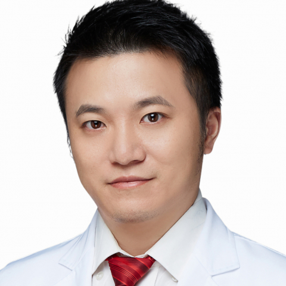

<!-- AUTO-GENERATED-BY: work/generate_obsidian_profiles.py -->

<!-- TEMPLATE: D:\workspace\信息收集整理\医生画像仓库\模板\医生画像模板.md -->

# 张家兴

## 基础信息

| 字段 | 内容 |
|---|---|
| 姓名 | 张家兴 |
| 医院 | 中山大学附属第一医院 |
| 科室 | 肿瘤科 |
| 职称/身份 | 主任医师 |
| 来源链接 | [官网原文](https://www.fahsysu.org.cn/node/5829) |
| 采集日期 | 2026-08-13 |

## 简介/擅长

从事肿瘤综合诊疗的临床工作、科研及教学工作数十年，具有丰富的临床工作经验。 擅长泌尿生殖肿瘤、妇科肿瘤、肺癌、结直肠癌、胃癌，乳腺癌、头颈部肿瘤及淋巴瘤等常见恶性肿瘤的临床诊断、全面病情评估以及化疗、分子靶向精准治疗、生物免疫治疗等综合治疗手段； 对晚期恶性肿瘤患者的姑息止痛治疗，营养支持治疗以及肿瘤治疗并发症的处理，尤其在减轻化疗毒副反应等方面有丰富的经验。 以第一\通讯作者身份发表高水平SCI论著数十篇，多篇论著发表在国际著名肿瘤学刊物如Lancet Oncology、Cancer Research、Annals of Oncology、Clinical Cancer Research等。 主持多项国家自然科学基金以及广东省自然科学基金杰出青年项目，入选了国家级青年人才项目，广东省青年珠江学者，广州市珠江科技新星。

## 科研项目与成果

- 从事肿瘤综合诊疗的临床工作、科研及教学工作数十年，具有丰富的临床工作经验。
- 医疗特长： 从事肿瘤综合诊疗的临床工作、科研及教学工作数十年，具有丰富的临床工作经验。
- 主持多项国家自然科学基金以及广东省自然科学基金杰出青年项目，入选了国家级青年人才项目，广东省青年珠江学者，广州市珠江科技新星。

## 论文与学术产出

- 以第一\通讯作者身份发表高水平SCI论著数十篇，多篇论著发表在国际著名肿瘤学刊物如Lancet Oncology、Cancer Research、Annals of Oncology、Clinical Cancer Research等。

## 可包装亮点

- 擅长泌尿生殖肿瘤、妇科肿瘤、肺癌、结直肠癌、胃癌，乳腺癌、头颈部肿瘤及淋巴瘤等常见恶性肿瘤的临床诊断、全面病情评估以及化疗、分子靶向精准治疗、生物免疫治疗等综合治疗手段；
- 以第一\通讯作者身份发表高水平SCI论著数十篇，多篇论著发表在国际著名肿瘤学刊物如Lancet Oncology、Cancer Research、Annals of Oncology、Clinical Cancer Research等。
- 主持多项国家自然科学基金以及广东省自然科学基金杰出青年项目，入选了国家级青年人才项目，广东省青年珠江学者，广州市珠江科技新星。

## 重点疾病/人群标签

- 慢性病：
- 肿瘤：肿瘤、淋巴瘤、化疗、靶向、肺癌、胃癌、肠癌、乳腺癌、生殖、免疫、营养、姑息
- 生殖疾病：肿瘤、淋巴瘤、化疗、靶向、肺癌、胃癌、肠癌、乳腺癌、生殖、免疫、营养、姑息
- 免疫/风湿：肿瘤、淋巴瘤、化疗、靶向、肺癌、胃癌、肠癌、乳腺癌、生殖、免疫、营养、姑息
- 术后恢复/康复：肿瘤、淋巴瘤、化疗、靶向、肺癌、胃癌、肠癌、乳腺癌、生殖、免疫、营养、姑息
- 疑难重症：

## 证据摘录

> 只摘录官网公开信息中的短句或关键字段，不复制大段原文。

- 官网身份字段：主任医师
- 官网简介/擅长：从事肿瘤综合诊疗的临床工作、科研及教学工作数十年，具有丰富的临床工作经验。 擅长泌尿生殖肿瘤、妇科肿瘤、肺癌、结直肠癌、胃癌，乳腺癌、头颈部肿瘤及淋巴瘤等常见恶性肿瘤的临床诊断、全面病情评估以及化疗、分子靶向精准治疗、生物免疫治疗等综合治疗手段； 对晚期恶性肿瘤患者的姑息止痛治疗，营养支持治疗以及肿瘤治疗并发症的处理，尤其在减轻化疗毒副反应等方面有丰富的经验。 以第一\通讯作者身份发表高水平SCI论著数十篇，多篇论著发表在国际著名肿瘤…
- 官网亮眼经历线索：擅长泌尿生殖肿瘤、妇科肿瘤、肺癌、结直肠癌、胃癌，乳腺癌、头颈部肿瘤及淋巴瘤等常见恶性肿瘤的临床诊断、全面病情评估以及化疗、分子靶向精准治疗、生物免疫治疗等综合治疗手段； 擅长泌尿生殖肿瘤、妇科肿瘤、肺癌、结直肠癌、胃癌，乳腺癌、头颈部肿瘤及淋巴瘤等常见恶性肿瘤的临床诊断、全面病情评估以及化疗、分子靶向精准治疗、生物免疫治疗等综合治疗手段； 以第一\通讯作者身份发表高水平SCI论著数十篇，多篇论著发表在国际著名肿瘤学刊物如Lancet…
- 来源链接：https://www.fahsysu.org.cn/node/5829

## BD 画像摘要

张家兴医生可作为肿瘤、生殖疾病、免疫/风湿/感染、术后恢复/康复方向的基础画像候选。后续 BD 使用应继续以官网来源和人工复核为准，不添加疗效承诺或无来源包装。

## 合规边界

- 仅使用医院官网、官方公众号、官方小程序等公开渠道。
- 不采集私人电话、私人微信、家庭住址、患者隐私或非公开排班信息。
- 不写“保证治愈”“疗效第一”“包治疑难杂症”等无法由官网证明的表述。
