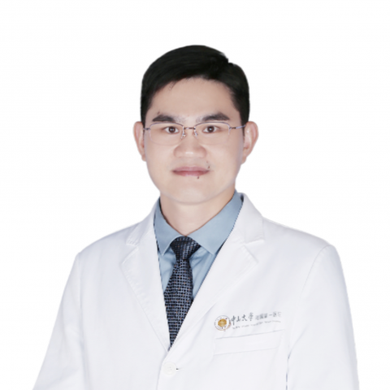

<!-- AUTO-GENERATED-BY: work/generate_obsidian_profiles.py -->

<!-- TEMPLATE: D:\workspace\信息收集整理\医生画像仓库\模板\医生画像模板.md -->

# 张志奇

## 基础信息

| 字段 | 内容 |
|---|---|
| 姓名 | 张志奇 |
| 医院 | 中山大学附属第一医院 |
| 科室 | 关节外科 |
| 职称/身份 | 主任医师/教授 |
| 来源链接 | [官网原文](https://www.fahsysu.org.cn/node/5628) |
| 采集日期 | 2026-08-13 |

## 简介/擅长

## 教育与进修经历

- 3. 创新性发现阻遏关节软骨和半月板退变和促进修复机理，筛选出早期治疗药物。

## 科研项目与成果

- 特别是对髋和膝关节置换和矫形有系统的深入研究，对复杂髋关节置换的手术优化和膝关节置换个体化生理性重建有系列创新性成果。
- 研究成果： 主要从事骨关节疾病的诊治和研究工作，长期致力于关节组织损伤退变的修复与重建。
- 聚焦骨关节炎，相关成果以第一/通讯作者在国际专业领域顶刊发表，包括中华医学杂志、Annals of the Rheumatic Diseases、Advanced Science、Molecular Therapy、Advanced Functional Materials、Arthritis Rheumatology、Osteoarthritis Cartilage、Bone Joint Research、Journal of Arthroplasty、Journal of Knee Surgery等权威期刊发…
- 主持国家自然科学基金等项目10余项；

## 论文与学术产出

- 聚焦骨关节炎，相关成果以第一/通讯作者在国际专业领域顶刊发表，包括中华医学杂志、Annals of the Rheumatic Diseases、Advanced Science、Molecular Therapy、Advanced Functional Materials、Arthritis Rheumatology、Osteoarthritis Cartilage、Bone Joint Research、Journal of Arthroplasty、Journal of Knee Surgery等权威期刊发…

## 可包装亮点

- 聚焦骨关节炎，相关成果以第一/通讯作者在国际专业领域顶刊发表，包括中华医学杂志、Annals of the Rheumatic Diseases、Advanced Science、Molecular Therapy、Advanced Functional Materials、Arthritis Rheumatology、Osteoarthritis Car…
- 主持国家自然科学基金等项目10余项；
- 以第一发明人获得国家专利3项。
- 2. 系统性提出髋臼假体精准有限量化放置的理论和技术，优化了复杂髋关节的手术方案。

## 重点疾病/人群标签

- 慢性病：
- 肿瘤：
- 生殖疾病：
- 免疫/风湿：
- 术后恢复/康复：
- 疑难重症：复杂

## 证据摘录

> 只摘录官网公开信息中的短句或关键字段，不复制大段原文。

- 官网身份字段：主任医师/教授
- 官网亮眼经历线索：聚焦骨关节炎，相关成果以第一/通讯作者在国际专业领域顶刊发表，包括中华医学杂志、Annals of the Rheumatic Diseases、Advanced Science、Molecular Therapy、Advanced Functional Materials、Arthritis Rheumatology、Osteoarthritis Cartilage、Bone Joint Research、Journal of Ar…
- 来源链接：https://www.fahsysu.org.cn/node/5628

## BD 画像摘要

张志奇医生可作为疑难重症方向的基础画像候选。后续 BD 使用应继续以官网来源和人工复核为准，不添加疗效承诺或无来源包装。

## 合规边界

- 仅使用医院官网、官方公众号、官方小程序等公开渠道。
- 不采集私人电话、私人微信、家庭住址、患者隐私或非公开排班信息。
- 不写“保证治愈”“疗效第一”“包治疑难杂症”等无法由官网证明的表述。
