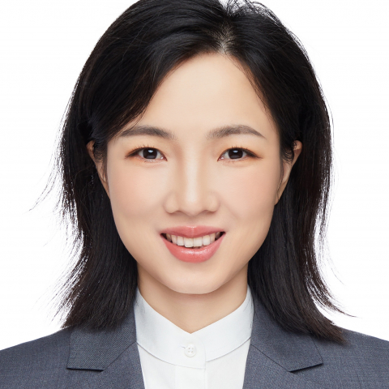

<!-- AUTO-GENERATED-BY: work/generate_obsidian_profiles.py -->

<!-- TEMPLATE: D:\workspace\信息收集整理\医生画像仓库\模板\医生画像模板.md -->

# 张桂芳

## 基础信息

| 字段 | 内容 |
|---|---|
| 姓名 | 张桂芳 |
| 医院 | 中山大学附属第一医院 |
| 科室 | 康复医学科 |
| 职称/身份 | 副主任技师 |
| 来源链接 | [官网原文](https://www.fahsysu.org.cn/node/36204) |
| 采集日期 | 2026-08-13 |

## 简介/擅长

儿童青少年脊柱侧弯、扁平足、O/X型腿、驼背等姿势不良的矫治； 上肢损伤及疼痛，如肩周炎、网球肘、腕管综合征、上肢骨折/神经损伤/肌腱修补术后功能障碍等的康复治疗。 尤其擅长柔性支具在脊柱侧弯中的应用； 筋膜手法、神经动力学等技术在骨骼肌肉疼痛中的治疗等。 工作经历： 2011年毕业于中山大学，于中山大学附属第一医院工作至今，长期从事脊柱侧弯、上肢肌骨疾病的康复治疗。 研究方向： 脊柱侧弯及脊柱疼痛、上肢肌骨疼痛的临床康复与机制研究。 社会任职： 中国康复医学会颈椎病专委会少儿脊柱学组副组长； 中华治疗师协会脊柱侧弯与体态分会常务委员； 广东省康复医学会手功能康复分会常务理事； 广东省康复医学会脊柱康复分会理事； 广东省医学会物理医学与康复学分会秘书等。 获奖情况： 中国康复医学会优秀青年治疗师； 广东省康复医学会优秀个人； 中国康复医学会科技进步奖一等奖（主要完成人）； 广东省康复医学会科技进步奖一等奖（主要完成人）； 广东医学科技奖一等奖（主要完成人）等。

## 教育与进修经历

- 工作经历： 2011年毕业于中山大学，于中山大学附属第一医院工作至今，长期从事脊柱侧弯、上肢肌骨疾病的康复治疗。

## 可包装亮点

- 社会任职： 中国康复医学会颈椎病专委会少儿脊柱学组副组长；
- 中华治疗师协会脊柱侧弯与体态分会常务委员；
- 广东省康复医学会手功能康复分会常务理事；
- 广东省康复医学会脊柱康复分会理事；

## 重点疾病/人群标签

- 慢性病：
- 肿瘤：
- 生殖疾病：
- 免疫/风湿：
- 术后恢复/康复：术后、康复、疼痛、功能障碍
- 疑难重症：

## 证据摘录

> 只摘录官网公开信息中的短句或关键字段，不复制大段原文。

- 官网身份字段：副主任技师
- 官网简介/擅长：儿童青少年脊柱侧弯、扁平足、O/X型腿、驼背等姿势不良的矫治； 上肢损伤及疼痛，如肩周炎、网球肘、腕管综合征、上肢骨折/神经损伤/肌腱修补术后功能障碍等的康复治疗。 尤其擅长柔性支具在脊柱侧弯中的应用； 筋膜手法、神经动力学等技术在骨骼肌肉疼痛中的治疗等。 工作经历： 2011年毕业于中山大学，于中山大学附属第一医院工作至今，长期从事脊柱侧弯、上肢肌骨疾病的康复治疗。 研究方向： 脊柱侧弯及脊柱疼痛、上肢肌骨疼痛的临床康复与机制研究…
- 官网亮眼经历线索：社会任职： 中国康复医学会颈椎病专委会少儿脊柱学组副组长； 中华治疗师协会脊柱侧弯与体态分会常务委员； 广东省康复医学会手功能康复分会常务理事； 广东省康复医学会脊柱康复分会理事；
- 来源链接：https://www.fahsysu.org.cn/node/36204

## BD 画像摘要

张桂芳医生可作为术后恢复/康复方向的基础画像候选。后续 BD 使用应继续以官网来源和人工复核为准，不添加疗效承诺或无来源包装。

## 合规边界

- 仅使用医院官网、官方公众号、官方小程序等公开渠道。
- 不采集私人电话、私人微信、家庭住址、患者隐私或非公开排班信息。
- 不写“保证治愈”“疗效第一”“包治疑难杂症”等无法由官网证明的表述。
