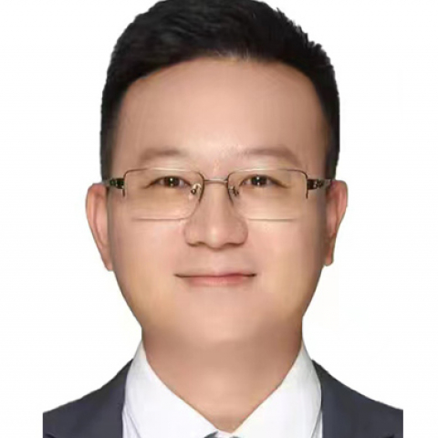

<!-- AUTO-GENERATED-BY: work/generate_obsidian_profiles.py -->

<!-- TEMPLATE: D:\workspace\信息收集整理\医生画像仓库\模板\医生画像模板.md -->

# 张水深

## 基础信息

| 字段 | 内容 |
|---|---|
| 姓名 | 张水深 |
| 医院 | 中山大学附属第一医院 |
| 科室 | 胸外科 |
| 职称/身份 | 副主任医师 |
| 来源链接 | [官网原文](https://www.fahsysu.org.cn/node/31149) |
| 采集日期 | 2026-08-13 |

## 简介/擅长

肺结节、肺癌、食管癌和胸腺瘤的胸腔镜微创手术。 专攻经气道肺结节诊断和消融治疗，食管癌、肺癌等胸部肿瘤以手术、免疫治疗和靶向治疗的多学科规范化综合治疗； 长期致力于食管癌和肺癌的临床以及基础转化性研究，主持多项国家和省级课题。 参与多项肺癌、食管癌新辅助免疫治疗等临床研究以及食管癌术后快速康复综合干预临床研究，助力提高肺癌和食管癌治疗疗效和术后生活质量 研究方向： 食管癌微创手术治疗、术后快速康复治疗以及基础研究 肺结节和肺癌微创手术治疗为主的多学科综合治疗 胸腺瘤及重症肌无力的微创手术治疗 经气道磁导航肺结节的诊断和消融治疗 主持国家自然科学青年基金2项、广东省自然科学基金面上2项以及多项其他省级课题。 广州市青年科技人才托举项目获得者，至今已发表国际SCI论著共28篇，其中第一/共一作者和通讯/共同通讯作者20篇，包括Immunity, 《自然》子刊Nature Communication、Nature structural & molecular biology, 《细胞》子刊Molecular Cell、Cell Reports, British Journal of Cancer等Q1区多篇。 担任Molec...

## 教育与进修经历

- 香港大学玛丽医院、香港伊丽莎伯医院心胸外科访问交流 社会兼职： 欧洲医学教育联盟（AMEE）Associate Fellow 广东省医师协会胸外科分会委员 广东省健康管理学会胸部肿瘤多学科协作组委员会秘书长 广东省医疗行业协会胸外科管理分会委员兼副秘书长 广东省医师协会肿瘤外科分会食管癌学组委员 广东省医师协会肿瘤外科分会肺癌学组委员 广东省医师协会胸外科分会毕业后教育专业组委员 广东省潮人海外联谊会会员及健康委员会副秘书长

## 科研项目与成果

- 长期致力于食管癌和肺癌的临床以及基础转化性研究，主持多项国家和省级课题。
- 参与多项肺癌、食管癌新辅助免疫治疗等临床研究以及食管癌术后快速康复综合干预临床研究，助力提高肺癌和食管癌治疗疗效和术后生活质量 研究方向： 食管癌微创手术治疗、术后快速康复治疗以及基础研究 肺结节和肺癌微创手术治疗为主的多学科综合治疗 胸腺瘤及重症肌无力的微创手术治疗 经气道磁导航肺结节的诊断和消融治疗 主持国家自然科学青年基金2项、广东省自然科学基金面上2项以及多项其他省级课题。
- 广州市青年科技人才托举项目获得者，至今已发表国际SCI论著共28篇，其中第一/共一作者和通讯/共同通讯作者20篇，包括Immunity, 《自然》子刊Nature Communication、Nature structural & molecular biology, 《细胞》子刊Molecular Cell、Cell Reports, British Journal of Cancer等Q1区多篇。
- 工作经历： 2017年 获聘主治医师 2020年 入选医院第二批“柯麟”菁英人才管理计划,兼人力资源处处长助理 2021年 荣获全国CSCO第四届35岁以下最具潜力优秀青年肿瘤医生、最佳人气奖 2022年 广州市青年科技人才托举项目获得者 2022年 晋升副主任医师 2024年12月-2025年12月 香港医院管理局-中山一院交流医生项目 香港中文大学威尔斯亲王医院、屯门医院心胸外科专科医生（香港执业资格）；

## 论文与学术产出

- 广州市青年科技人才托举项目获得者，至今已发表国际SCI论著共28篇，其中第一/共一作者和通讯/共同通讯作者20篇，包括Immunity, 《自然》子刊Nature Communication、Nature structural & molecular biology, 《细胞》子刊Molecular Cell、Cell Reports, British Journal of Cancer等Q1区多篇。
- 担任Molecular Therapy（Cell子刊）和Advanced Science等多个杂志审稿人。

## 可包装亮点

- 专攻经气道肺结节诊断和消融治疗，食管癌、肺癌等胸部肿瘤以手术、免疫治疗和靶向治疗的多学科规范化综合治疗；
- 参与多项肺癌、食管癌新辅助免疫治疗等临床研究以及食管癌术后快速康复综合干预临床研究，助力提高肺癌和食管癌治疗疗效和术后生活质量 研究方向： 食管癌微创手术治疗、术后快速康复治疗以及基础研究 肺结节和肺癌微创手术治疗为主的多学科综合治疗 胸腺瘤及重症肌无力的微创手术治疗 经气道磁导航肺结节的诊断和消融治疗 主持国家自然科学青年基金2项、广东省自然科学基金面上…
- 广州市青年科技人才托举项目获得者，至今已发表国际SCI论著共28篇，其中第一/共一作者和通讯/共同通讯作者20篇，包括Immunity, 《自然》子刊Nature Communication、Nature structural & mo...

## 重点疾病/人群标签

- 慢性病：
- 肿瘤：肿瘤、癌、瘤、靶向、肺癌、免疫、术后、康复、重症、多学科
- 生殖疾病：
- 免疫/风湿：肿瘤、癌、瘤、靶向、肺癌、免疫、术后、康复、重症、多学科
- 术后恢复/康复：肿瘤、癌、瘤、靶向、肺癌、免疫、术后、康复、重症、多学科
- 疑难重症：肿瘤、癌、瘤、靶向、肺癌、免疫、术后、康复、重症、多学科

## 证据摘录

> 只摘录官网公开信息中的短句或关键字段，不复制大段原文。

- 官网身份字段：副主任医师
- 官网简介/擅长：肺结节、肺癌、食管癌和胸腺瘤的胸腔镜微创手术。 专攻经气道肺结节诊断和消融治疗，食管癌、肺癌等胸部肿瘤以手术、免疫治疗和靶向治疗的多学科规范化综合治疗； 长期致力于食管癌和肺癌的临床以及基础转化性研究，主持多项国家和省级课题。 参与多项肺癌、食管癌新辅助免疫治疗等临床研究以及食管癌术后快速康复综合干预临床研究，助力提高肺癌和食管癌治疗疗效和术后生活质量 研究方向： 食管癌微创手术治疗、术后快速康复治疗以及基础研究 肺结节和肺癌微创手术…
- 官网亮眼经历线索：专攻经气道肺结节诊断和消融治疗，食管癌、肺癌等胸部肿瘤以手术、免疫治疗和靶向治疗的多学科规范化综合治疗； 专攻经气道肺结节诊断和消融治疗，食管癌、肺癌等胸部肿瘤以手术、免疫治疗和靶向治疗的多学科规范化综合治疗； 参与多项肺癌、食管癌新辅助免疫治疗等临床研究以及食管癌术后快速康复综合干预临床研究，助力提高肺癌和食管癌治疗疗效和术后生活质量 研究方向： 食管癌微创手术治疗、术后快速康复治疗以及基础研究 肺结节和肺癌微创手术治疗为主的多学科…
- 来源链接：https://www.fahsysu.org.cn/node/31149

## BD 画像摘要

张水深医生可作为肿瘤、免疫/风湿/感染、术后恢复/康复、疑难重症方向的基础画像候选。后续 BD 使用应继续以官网来源和人工复核为准，不添加疗效承诺或无来源包装。

## 合规边界

- 仅使用医院官网、官方公众号、官方小程序等公开渠道。
- 不采集私人电话、私人微信、家庭住址、患者隐私或非公开排班信息。
- 不写“保证治愈”“疗效第一”“包治疑难杂症”等无法由官网证明的表述。
