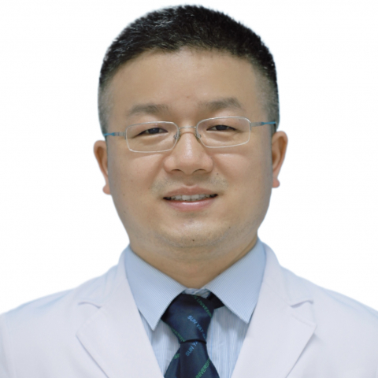

<!-- AUTO-GENERATED-BY: work/generate_obsidian_profiles.py -->

<!-- TEMPLATE: D:\workspace\信息收集整理\医生画像仓库\模板\医生画像模板.md -->

# 张洲

## 基础信息

| 字段 | 内容 |
|---|---|
| 姓名 | 张洲 |
| 医院 | 中山大学附属第一医院 |
| 科室 | 康复医学科 |
| 职称/身份 | 副主任技师 |
| 来源链接 | [官网原文](https://www.fahsysu.org.cn/node/33153) |
| 采集日期 | 2026-08-13 |

## 简介/擅长

自 2007 年开始从事康复治疗工作至今。 在脊柱及骨关节肌肉疾患的康复治疗有丰富的临床经验，尤其擅长脊柱相关疾病、骨关节运动损伤、骨骼肌肉疼痛康复治疗。 包括颈椎病、腰腿痛、骨骼肌肉疼痛、骨关节炎； 运动损伤、股骨头坏死（保守治疗）、骨关节疾患术后、关节置换术后； 脊柱侧弯、步态或姿势不良等。 同时擅长本领域的中西结合的手法治疗及运动治疗技术，包括中医正骨手法、澳式手法、美式整脊、神经动力学、 PNF 等技术。 研究方向：脊柱疾患、肌骨疼痛及运动损伤的生物力学和代谢组学研究。 主要教育和工作经历： 2007 毕业于中山大学中山医学院康复治疗学系， 2007 年 7 月开始在中山大学附属第一医院康复医学科工作至今，潜心脊柱疼痛及运动损伤的康复治疗。 于 2009 年 9 月 -2010 年 1 月前往香港理工大学交流学习。 社会兼职： 中国康复医学会物理治疗专业委员会委员，科普学组副组长 中国康复医学会康复医学教育专业委员会物理治疗学组委员 广东省医学会社区康复学分会手法治疗学组副组长 广东省康复医学会物理治疗师分会理事 广东省医师协会运动医学医师分会运动康复学组委员 广东省医学会物理医学与康复学分会脊柱疾患康复学组秘...

## 教育与进修经历

- 主要教育和工作经历： 2007 毕业于中山大学中山医学院康复治疗学系， 2007 年 7 月开始在中山大学附属第一医院康复医学科工作至今，潜心脊柱疼痛及运动损伤的康复治疗。

## 论文与学术产出

- 社会兼职： 中国康复医学会物理治疗专业委员会委员，科普学组副组长 中国康复医学会康复医学教育专业委员会物理治疗学组委员 广东省医学会社区康复学分会手法治疗学组副组长 广东省康复医学会物理治疗师分会理事 广东省医师协会运动医学医师分会运动康复学组委员 广东省医学会物理医学与康复学分会脊柱疾患康复学组秘书 论著：近几年发表论文二十多篇，其中以第一作者或通讯作者发表 SCI 论文 6 篇 专著：近几年参编国家“十三五”规划教材 1 部，参编及参译专著 7 部

## 可包装亮点

- 社会兼职： 中国康复医学会物理治疗专业委员会委员，科普学组副组长 中国康复医学会康复医学教育专业委员会物理治疗学组委员 广东省医学会社区康复学分会手法治疗学组副组长 广东省康复医学会物理治疗师分会理事 广东省医师协会运动医学医师分会运动康复学组委员 广东省医学会物理医学与康复学分会脊柱疾患康复学组秘书 论著：近几年发表论文二十多篇，其中以第一作者或通讯作者…

## 重点疾病/人群标签

- 慢性病：代谢、术后、康复、疼痛
- 肿瘤：
- 生殖疾病：
- 免疫/风湿：
- 术后恢复/康复：代谢、术后、康复、疼痛
- 疑难重症：

## 证据摘录

> 只摘录官网公开信息中的短句或关键字段，不复制大段原文。

- 官网身份字段：副主任技师
- 官网简介/擅长：自 2007 年开始从事康复治疗工作至今。 在脊柱及骨关节肌肉疾患的康复治疗有丰富的临床经验，尤其擅长脊柱相关疾病、骨关节运动损伤、骨骼肌肉疼痛康复治疗。 包括颈椎病、腰腿痛、骨骼肌肉疼痛、骨关节炎； 运动损伤、股骨头坏死（保守治疗）、骨关节疾患术后、关节置换术后； 脊柱侧弯、步态或姿势不良等。 同时擅长本领域的中西结合的手法治疗及运动治疗技术，包括中医正骨手法、澳式手法、美式整脊、神经动力学、 PNF 等技术。 研究方向：脊柱疾患…
- 官网亮眼经历线索：社会兼职： 中国康复医学会物理治疗专业委员会委员，科普学组副组长 中国康复医学会康复医学教育专业委员会物理治疗学组委员 广东省医学会社区康复学分会手法治疗学组副组长 广东省康复医学会物理治疗师分会理事 广东省医师协会运动医学医师分会运动康复学组委员 广东省医学会物理医学与康复学分会脊柱疾患康复学组秘书 论著：近几年发表论文二十多篇，其中以第一作者或通讯作者发表 SCI 论文 6 篇 专著：近几年参编国家“十三五”规划教材 1 部，参编…
- 来源链接：https://www.fahsysu.org.cn/node/33153

## BD 画像摘要

张洲医生可作为慢性病、术后恢复/康复方向的基础画像候选。后续 BD 使用应继续以官网来源和人工复核为准，不添加疗效承诺或无来源包装。

## 合规边界

- 仅使用医院官网、官方公众号、官方小程序等公开渠道。
- 不采集私人电话、私人微信、家庭住址、患者隐私或非公开排班信息。
- 不写“保证治愈”“疗效第一”“包治疑难杂症”等无法由官网证明的表述。
