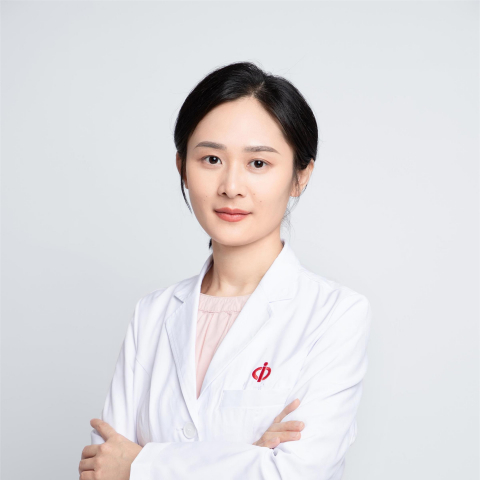

<!-- AUTO-GENERATED-BY: work/generate_obsidian_profiles.py -->

<!-- TEMPLATE: D:\workspace\信息收集整理\医生画像仓库\模板\医生画像模板.md -->

# 张玲

## 基础信息

| 字段 | 内容 |
|---|---|
| 姓名 | 张玲 |
| 医院 | 中山大学附属第一医院 |
| 科室 | 特需一科（老年病科） |
| 职称/身份 | 副主任医师 |
| 来源链接 | [官网原文](https://www.fahsysu.org.cn/node/29299) |
| 采集日期 | 2026-08-13 |

## 简介/擅长

## 教育与进修经历

- 研究方向： 老年肾病、老年肾移植、老年衰弱、肌少症及营养 主要教育和工作经历： 2004年-2012年，中山大学临床医学八年制本-博专业毕业，获得临床医学博士学位 2012年-2016年，中山大学附属第一医院肾内科，任住院医师、主治医师 2016年-至今，中山大学附属第一医院特需医疗中心/老年病科，任主治医师、副主任医师 社会兼职： 广东省保健协会老年医学与保健分会委员 广东省临床医学学会-中医自然医学专业委员会青年委员 广东省老年医学分会衰弱学组委员 论著： 主持及参与国家级、省部级自然科学基金多项，在国内、外…

## 科研项目与成果

- 研究方向： 老年肾病、老年肾移植、老年衰弱、肌少症及营养 主要教育和工作经历： 2004年-2012年，中山大学临床医学八年制本-博专业毕业，获得临床医学博士学位 2012年-2016年，中山大学附属第一医院肾内科，任住院医师、主治医师 2016年-至今，中山大学附属第一医院特需医疗中心/老年病科，任主治医师、副主任医师 社会兼职： 广东省保健协会老年医学与保健分会委员 广东省临床医学学会-中医自然医学专业委员会青年委员 广东省老年医学分会衰弱学组委员 论著： 主持及参与国家级、省部级自然科学基金多项，在国内、外…

## 可包装亮点

- 研究方向： 老年肾病、老年肾移植、老年衰弱、肌少症及营养 主要教育和工作经历： 2004年-2012年，中山大学临床医学八年制本-博专业毕业，获得临床医学博士学位 2012年-2016年，中山大学附属第一医院肾内科，任住院医师、主治医师 2016年-至今，中山大学附属第一医院特需医疗中心/老年病科，任主治医师、副主任医师 社会兼职： 广东省保健协会老年医学…

## 重点疾病/人群标签

- 慢性病：高血压、糖尿病、慢性、肿瘤、免疫、感染、术后、营养、复杂
- 肿瘤：高血压、糖尿病、慢性、肿瘤、免疫、感染、术后、营养、复杂
- 生殖疾病：
- 免疫/风湿：高血压、糖尿病、慢性、肿瘤、免疫、感染、术后、营养、复杂
- 术后恢复/康复：高血压、糖尿病、慢性、肿瘤、免疫、感染、术后、营养、复杂
- 疑难重症：高血压、糖尿病、慢性、肿瘤、免疫、感染、术后、营养、复杂

## 证据摘录

> 只摘录官网公开信息中的短句或关键字段，不复制大段原文。

- 官网身份字段：副主任医师
- 官网亮眼经历线索：研究方向： 老年肾病、老年肾移植、老年衰弱、肌少症及营养 主要教育和工作经历： 2004年-2012年，中山大学临床医学八年制本-博专业毕业，获得临床医学博士学位 2012年-2016年，中山大学附属第一医院肾内科，任住院医师、主治医师 2016年-至今，中山大学附属第一医院特需医疗中心/老年病科，任主治医师、副主任医师 社会兼职： 广东省保健协会老年医学与保健分会委员 广东省临床医学学会-中医自然医学专业委员会青年委员 广东省老年医…
- 来源链接：https://www.fahsysu.org.cn/node/29299

## BD 画像摘要

张玲医生可作为慢性病、肿瘤、免疫/风湿/感染、术后恢复/康复、疑难重症方向的基础画像候选。后续 BD 使用应继续以官网来源和人工复核为准，不添加疗效承诺或无来源包装。

## 合规边界

- 仅使用医院官网、官方公众号、官方小程序等公开渠道。
- 不采集私人电话、私人微信、家庭住址、患者隐私或非公开排班信息。
- 不写“保证治愈”“疗效第一”“包治疑难杂症”等无法由官网证明的表述。
